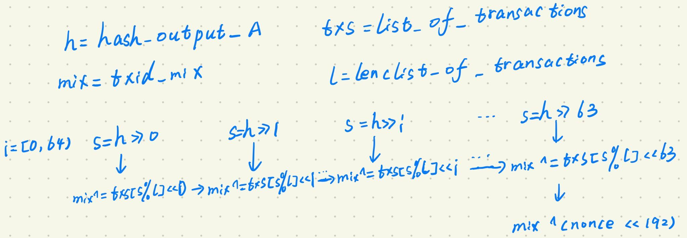
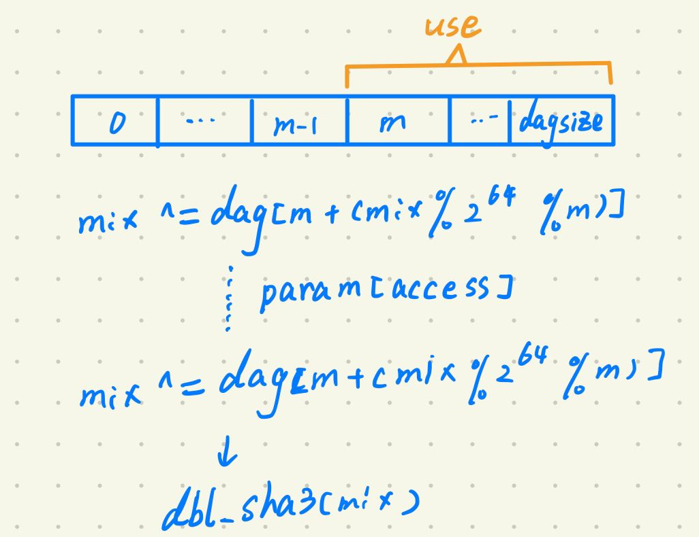

# Dagger Hashimoto

Dagger Hashimoto was a precursor research implementation and specification for the mining algorithm for Ethereum 1.0.

The difference between Dagger Hashimoto and Hashingmoto is that, instead of using the blockchain as a data source, Dagger Hashimoto uses a custom-generated 1GB data set, which updates based on block data every N blocks. The data set is generated using the Dagger algorithm, allowing for the efficient calculation of a subset specific to every nonce for the light client verification algorithm. The difference between Dagger Hashimoto and Dagger is that, unlike in the original Dagger, the dataset used to query the block is semi-permanet, only being updated at occasional intervals.

## DAG Generation

The code for the algorithm will be defined in Python below. First, we give encode_int for marshaling unsigned ints of specified precision to strings. Its inverse is also given:

```python
NUM_BITS = 512 // Size of the Element

def encode_int(x):
    "Encode an integer x as a string of 64 characters using a big-endian scheme"
    o = ''
    for _ in range(NUM_BITS / 8):
        o = chr(x % 256) + o
        x //= 256
    return o

def decode_int(s):
    "Unencode an integer x from a string using a big-endian scheme"
    x = 0
    for c in s:
        x *= 256
        x += ord(c)
    return x
```

We next assume that sha3 is a function that takes an integer, and dbl_sha3 is a double-sha3 function; if converting this reference code into an implementation use:

```python
from pyethereum import utils
def sha3(x):
    if isinstance(x, (int, long)):
        x = encode_int(x)
    return decode_int(utils.sha3(x))

def dbl_sha3(x):
    if isinstance(x, (int, long)):
        x = encode_int(x)
    return decode_int(utils.sha3(utils.sha3(x)))
```

### Parameters

The parameters used for the algorithm are:

```python
SAFE_PRIME_512 = 2**512 - 38117     # Largest Safe Prime less than 2**512

params = {
      "n": 4000055296 * 8 // NUM_BITS,  # Size of the dataset (4 Gigabytes); MUST BE MULTIPLE OF 65536
      "n_inc": 65536,                   # Increment in value of n per period; MUST BE MULTIPLE OF 65536
                                        # with epochtime=20000 gives 882 MB growth per year
      "cache_size": 2500,               # Size of the light client's cache (can be chosen by light
                                        # client; not part of the algo spec)
      "diff": 2**14,                    # Difficulty (adjusted during block evaluation)
      "epochtime": 100000,              # Length of an epoch in blocks (how often the dataset is updated)
      "k": 1,                           # Number of parents of a node
      "w": w,                          # Used for modular exponentiation hashing
      "accesses": 200,                  # Number of dataset accesses during hashimoto
      "P": SAFE_PRIME_512               # Safe Prime for hashing and random number generation
}
```

Note that only the latter half of the DAG actually needs to be stored, so the de-facto RAM requirement starts off at 1GB and grows by 441MB per year.

### Dagger graph building

```python
def produce_dag(params, seed, length):
    P = params["P"]
    picker = init = pow(sha3(seed), params["w"], P)
    o = [init]
    for i in range(1, length):
        x = picker = (picker * init) % P
        for _ in range(params["k"]):
            x ^= o[x % i]
        o.append(pow(x, params["w"], P))
    return o
```

Initially, the value of picker is equal to the value of init, so we can use the following table to describe the above algorithm.

| i from [1, length) | x = $init^2$=$h^{2w}$ | x = $init^3$=$h^{3w}$ | .... | x = $init^{length}$=$h^{length*w}$ |
| ------------------ | --------------------- | --------------------- | ---- | ---------------------------------- |
| _ = 0              | x ^= o[x % 1]         | x ^= o[x % 2]         |      | x ^= o[x % (length - 1)]           |
| _ = 1              | x ^= o[x % 1]         | x ^= o[x % 2]         |      | x ^= o[x % (length - 1)]           |
| ...                |                       |                       |      |                                    |
| _ = k-1            | x ^= o[x % 1]         | x ^= o[x % 2]         |      | x ^= o[x % (length - 1)]           |
|                    | o[1] = pow(x, w, P)   | o[2] = pow(x, w, P)   |      | o[length-1] = pow(x, w, P)         |

where the value of init = pow(sha3(seed), params['w'], P) = sha3(seed)^w mod P, let h = sha3(seed), then init = $h^w$

In each round, the value of picker and x are the product of picker and init, then XOR x with the element at x % i in the array o k times, a modular power of the final value of x is computed to form an array o.

### Light Client Evaluation

```python
def quick_calc(params, seed, p):
    w, P = params["w"], params["P"]
    cache = {}

    def quick_calc_cached(p):
        if p in cache:
            pass
        elif p == 0:
            cache[p] = pow(sha3(seed), w, P)
        else:
            x = pow(sha3(seed), (p + 1) * w, P)
            for _ in range(params["k"]):
                x ^= quick_calc_cached(x % p)
            cache[p] = pow(x, w, P)
        return cache[p]

    return quick_calc_cached(p)
```

Essentially, it is simply a rewrite of the above algorithm that removes the loop of computing the values for the entire DAG and replaces the earlier node lookup with a recursive call or a cache lookup.

| p from [1, length) | x=$h^{2w}$              | x=$h^{3w}$              | .... | x=$h^{length * w}$             |
| ------------------ | ----------------------- | ----------------------- | ---- | ------------------------------ |
| _ = 0              | x ^= cache[x % 1]       | x ^= cache[x % 2]       |      | x ^= cache[x % (length - 1)]   |
| _ = 1              | x ^= cache[x % 1]       | x ^= cache[x % 2]       |      | x ^= cache[x % (length - 1)]   |
| ...                |                         |                         |      |                                |
| _ = k-1            | x ^= cache[x % 1]       | x ^= cache[x % 2]       |      | x ^= cache[x % (length - 1)]   |
|                    | cache[1] = pow(x, w, P) | cache[2] = pow(x, w, P) |      | cache[length-1] = pow(x, w, P) |

## Double Buffer of DAGs

In a full client, a double buffer of 2 DAGs produced by the above formula is used. The idea is that DAGs are produced every epochtime number of blocks according to the params above. The client does not use the latest DAG produced, but the previous one.

```python
def get_prevhash(n):
    from pyethereum.blocks import GENESIS_PREVHASH
    from pyethreum import chain_manager
    if n <= 0:
        return hash_to_int(GENESIS_PREVHASH)
    else:
        prevhash = chain_manager.index.get_block_by_number(n - 1)
        return decode_int(prevhash)

def get_seedset(params, block):
    seedset = {}
    seedset["back_number"] = block.number - (block.number % params["epochtime"])
    seedset["back_hash"] = get_prevhash(seedset["back_number"])
    seedset["front_number"] = max(seedset["back_number"] - params["epochtime"], 0)
    seedset["front_hash"] = get_prevhash(seedset["front_number"])
    return seedset

def get_dagsize(params, block):
    return params["n"] + (block.number // params["epochtime"]) * params["n_inc"]

def get_daggerset(params, block):
    dagsz = get_dagsize(params, block)
    seedset = get_seedset(params, block)
    if seedset["front_hash"] <= 0:
        # No back buffer is possible, just make front buffer
        return {"front": {"dag": produce_dag(params, seedset["front_hash"], dagsz),
                          "block_number": 0}}
    else:
        return {"front": {"dag": produce_dag(params, seedset["front_hash"], dagsz),
                          "block_number": seedset["front_number"]},
                "back": {"dag": produce_dag(params, seedset["back_hash"], dagsz),
                         "block_number": seedset["back_number"]}}
```

Suppose the parameter n value of function is 100000, then we can calculae values as follows:

```python
seedset['back_number'] = 100000
seedset['back_hash'] = h(99999)
seedset['front_number'] = 0
seedset['font_hash'] = h(0)
```

## Hashimoto

The idea behind the original Hashimoto is to use the blockchain as a dataset, performing a computation which selects N indices from the blockchain, gathers the transaction at those indices, performs as XOR of this data, and returns the hash of the result.

```python
def orig_hashimoto(prev_hash, merkle_root, list_of_transactions, nonce):
    hash_output_A = sha256(prev_hash + merkle_root + nonce)
    txid_mix = 0
    for i in range(64):
        shifted_A = hash_output_A >> i
        transaction = shifted_A % len(list_of_transactions)
        txid_mix ^= list_of_transactions[transaction] << i
    return txid_max ^ (nonce << 192)
```



Unfortunately, while Hashimoto is considered RAM hard, it relies on 256-bit arithmetic, which has considerable computational overhead. To address this issue, dagger hashimoto only uses the least significant 64 bits when indexing its dataset.

```python
def hashimoto(dag, dagsize, params, header, nonce):
    m = dagsize / 2
    mix = sha3(encode_int(nonce) + header)
    for _ in range(params["accesses"]):
        mix ^= dag[m + (mix % 2**64) % m] //just use half of the dag
    return dbl_sha3(mix)
```



Here is the light-client version:

```python
def quick_hashimoto(seed, dagsize, params, header, nonce):
    m = dagsize // 2
    mix = sha3(nonce + header)
    for _ in range(params["accesses"]):
        mix ^= quick_calc(params, seed, m + (mix % 2**64) % m)
    return dbl_sha3(mix)
```

## Mining and Verifying

```python
def mine(daggerset, params, block):
    from random import randint
    nonce = randint(0, 2**64)
    while 1:
        result = hashimoto(daggerset, get_dagsize(params, block),
                           params, decode_int(block.prevhash), nonce)
        if result * params["diff"] < 2**256:
            break
        nonce += 1
        if nonce >= 2**64:
            nonce = 0
    return nonce
```

Here is the verification algorithm:

```python
def verify(daggerset, params, block, nonce):
    result = hashimoto(daggerset, get_dagsize(params, block),
                       params, decode_int(block.prevhash), nonce)
    return result * params["diff"] < 2**256
```

Light-client friendly verification:

```python
def light_verify(params, header, nonce):
    seedset = get_seedset(params, block)
    result = quick_hashimoto(seedset["front_hash"], get_dagsize(params, block),
                             params, decode_int(block.prevhash), nonce)
    return result * params["diff"] < 2**256
```

## 参考

[Dagger Hashimoto](https://eth.wiki/concepts/dagger-hashimoto)