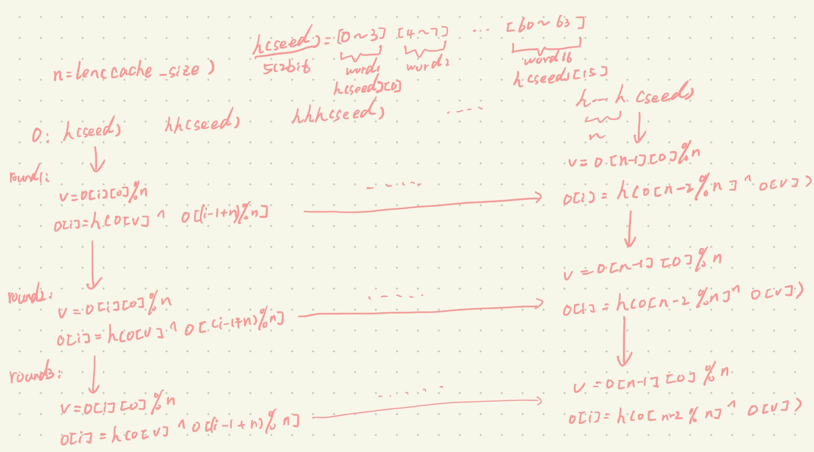
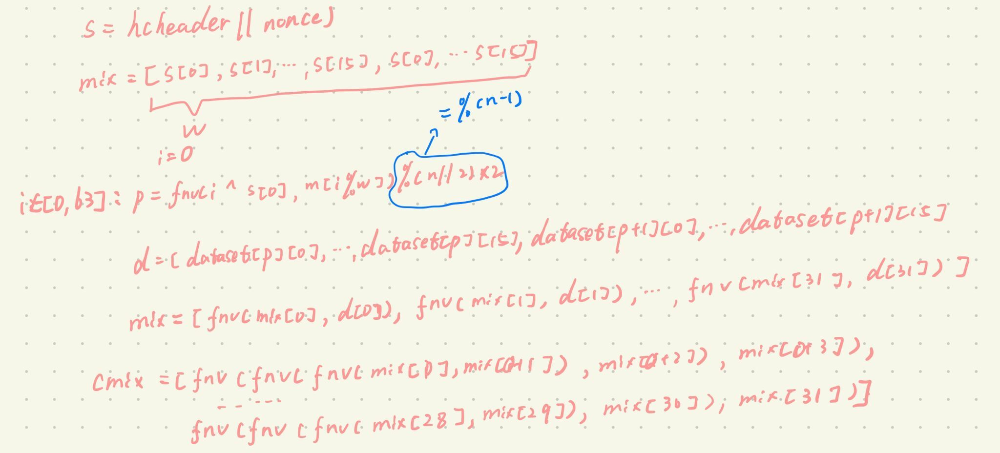

# Ethash

Ethash is the planned PoW algorithm for Ethereum 1.0. It is the latest version of Dagger-Hashimoto, although it can no longer appropriately be called that since many of the original features of both algorithms have benn drastically changed in the last month of research and development.

The general route that the algorithm takes is as follows:

1. There exists a seed which can be computed for each block by scanning through the block headers up until that point.
2. From the seed, one can compute a 16MB pseudorandom cache. Light clients store the cache.
3. From the cache, we can generate a 1 GB dataset, with the property that each item in the dataset depends on only a small number of items from the cache. Full clients and miners store the dataset.
4. Mining involves grabbing random slices of the dataset and hashing them together. Verification can be done with low memory by using the cache to generate the specific pieces of the dataset that you need.

## Definitions

```python
WORD_BYTES = 4                    # bytes in word
DATASET_BYTES_INIT = 2**30        # bytes in dataset at genesis
DATASET_BYTES_GROWTH = 2**23      # dataset growth per epoch
CACHE_BYTES_INIT = 2**24          # bytes in cache at genesis
CACHE_BYTES_GROWTH = 2**17        # cache growth per epoch
CACHE_MULTIPLIER=1024             # Size of the DAG relative to the cache
EPOCH_LENGTH = 30000              # blocks per epoch
MIX_BYTES = 128                   # width of mix
HASH_BYTES = 64                   # hash length in bytes
DATASET_PARENTS = 256             # number of parents of each dataset element
CACHE_ROUNDS = 3                  # number of rounds in cache production
ACCESSES = 64                     # number of accesses in hashimoto loop
```

## Parameters

The parameters for Ethash's cache and dataset depend on the block number. The cache size and dataset both grow linearly; however, we always take the highest prime below the linearly growing threshold in order to reduce the risk of accidental regularities leading to cyclic behavior.

```python
def get_cache_size(block_number):
    sz = CACHE_BYTES_INIT + CACHE_BYTES_GROWTH * (block_number // EPOCH_LENGTH)
    sz -= HASH_BYTES
    while not isprime(sz / HASH_BYTES):
        sz -= 2 * HASH_BYTES
    return sz

def get_full_size(block_number):
    sz = DATASET_BYTES_INIT + DATASET_BYTES_GROWTH * (block_number // EPOCH_LENGTH)
    sz -= MIX_BYTES
    while not isprime(sz / MIX_BYTES):
        sz -= 2 * MIX_BYTES
    return sz
```

The Cache consists of SHA3-512 output resullt, so the length of cache is size(cache) / Hash_BYTES. To make the length of Cache prime and get highest prime below the linearly growing threshold, first we use the sz minus HASH_BYTES(due sz is even multiple of HASH_BYTES, and even number cant not be prime numbers), then judge whether the length of Cache is prime, if not just make it reduce two length(keep it odd).

## Cache Generation

```python
def mkcache(cache_size, seed):
    n = cache_size // HASH_BYTES

    # Sequentially produce the initial dataset
    o = [sha3_512(seed)]
    for i in range(1, n):
        o.append(sha3_512(o[-1]))

    # Use a low-round version of randmemohash
    for _ in range(CACHE_ROUNDS):
        for i in range(n):
            v = o[i][0] % n
            o[i] = sha3_512(map(xor, o[(i-1+n) % n], o[v]))

    return o
```

The cache production process involves first sequentially filling up 32 MB of memory, then performing two passes of Sergio Demian Lerner's RandMemoHash algorithm. The output of function sha3_512 is 512 bits, and a word takes up 4 bytes, so these bits need 16 words to store. In the code above, o\[i\]\[0\] is the first word of the ith element in list o whost element is the output of sha3-512.



## Data aggregation function

```python
FNV_PRIME = 0x01000193

def fnv(v1, v2):
    return ((v1 * FNV_PRIME) ^ v2) % 2**32
```

We multiply the prime with the full 32-bit input, in contrast with the FNV-1 spec which multiplies the prime with one byte in turn.

## Full dataset calculation

```python
def calc_dataset_item(cache, i):
    n = len(cache)
    r = HASH_BYTES // WORD_BYTES
    # initialize the mix
    mix = copy.copy(cache[i % n])
    mix[0] ^= i
    mix = sha3_512(mix)
    # fnv it with a lot of random cache nodes based on i
    for j in range(DATASET_PARENTS):
        cache_index = fnv(i ^ j, mix[j % r])
        mix = map(fnv, mix, cache[cache_index % n])
    return sha3_512(mix)
```

Each 64-byte item in the full 1 GB dataset is computed as aboves. Essentially, we combine data from 256 pseudorandomly  selected cache nodes, and hash that to compute the dataset node. The entire dataset is then generated by:

```python
def calc_dataset(full_size, cache):
    return [calc_dataset_item(cache, i) for i in range(full_size // HASH_BYTES)]
```


## MainLoop

```python
def hashimoto(header, nonce, full_size, dataset_lookup):
    n = full_size / HASH_BYTES
    w = MIX_BYTES // WORD_BYTES
    mixhashes = MIX_BYTES / HASH_BYTES
    # combine header+nonce into a 64 byte seed
    s = sha3_512(header + nonce[::-1])
    # start the mix with replicated s
    mix = []
    for _ in range(MIX_BYTES / HASH_BYTES):
        mix.extend(s)
    # mix in random dataset nodes
    for i in range(ACCESSES):
        p = fnv(i ^ s[0], mix[i % w]) % (n // mixhashes) * mixhashes
        newdata = []
        for j in range(MIX_BYTES / HASH_BYTES):
            newdata.extend(dataset_lookup(p + j))
        mix = map(fnv, mix, newdata)
    # compress mix
    cmix = []
    for i in range(0, len(mix), 4):
        cmix.append(fnv(fnv(fnv(mix[i], mix[i+1]), mix[i+2]), mix[i+3]))
    return {
        "mix digest": serialize_hash(cmix),
        "result": serialize_hash(sha3_256(s+cmix))
    }

def hashimoto_light(full_size, cache, header, nonce):
    return hashimoto(header, nonce, full_size, lambda x: calc_dataset_item(cache, x))

def hashimoto_full(full_size, dataset, header, nonce):
    return hashimoto(header, nonce, full_size, lambda x: dataset[x])
```

Now, we specify main "hashimoto"-like loop, where we aggregate data from the full dataset in order to produce our final value for a paticular header and nonce.



## Mining

The mining algorithm is defined as follows:

```python
def mine(full_size, dataset, header, difficulty):
    # zero-pad target to compare with hash on the same digit
    target = zpad(encode_int(2**256 // difficulty), 64)[::-1]
    from random import randint
    nonce = randint(0, 2**64)
    while hashimoto_full(full_size, dataset, header, nonce) > target:
        nonce = (nonce + 1) % 2**64
    return nonce
```

## Defining the Seed Hash

```python
def get_seedhash(block):
    s = '\x00' * 32
    for i in range(block.number // EPOCH_LENGTH):
        s = serialize_hash(sha3_256(s))
    return s
```

## 参考

[Ethash](https://eth.wiki/en/concepts/ethash/ethash)

