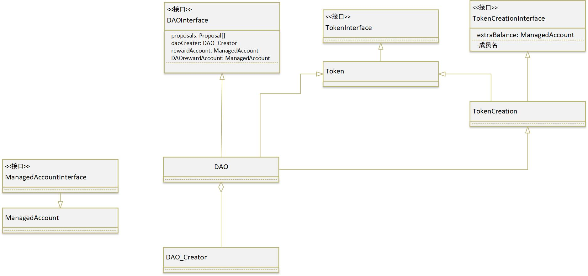
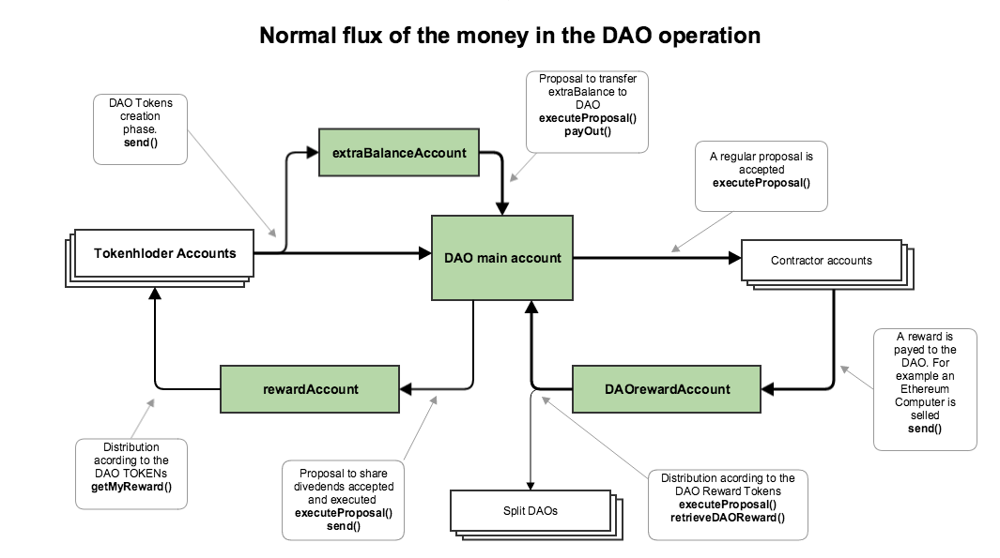

# DAO 分析

DAO一共有9个合约，分别是TokenInterface、Token、ManagedAccountInterface、ManagedAccount、TokenCreationInterface、TokenCreation、DAOInterface、DAO、DAO_Creator



## DAO中的Token类型

### DAO Tokens(Ð)

Ð代表了对DAO的所有权。如果你拥有Ð，则你就是"The DAO"的成员(DTH)，对DAO所有权的百分比由以下公式计算:
$$
Alice \; \% DAO \; ownership = \frac{Ð \; held \; by \; Alice }{totalSupply}
$$


其中totalSupply为DAO发行的token

### Reward Tokens(RT)

可以理解为DAO的投资金额，每当有1Wei被DAO用于投资，就生成1RT。

假如DAO对某个提议投资了140ether，DAO将会生成140 \* 10^18RT，如果Alice拥有DAO的10%的所有权，那么Alice隐士的拥有14 \* 10^18RT
$$
Alice \; \% \; DAO \; investment \; ownership = \frac{RT \; held \; by \; Alic}{totalRewardToken}
$$

## DAO中的账户

### Managed accounts

managed accounts由主DAO合约完全控制

### DAO Main Account

该账户ether的所有权由DAO token决定

### Extra Balance account

在发行token阶段，Token的发行价格不是固定的，其计算公式如下：
$$
token = ether * 20 / divisor \begin{cases}
								divisor=20,& \text{if t < closeTime - 2 weeks} \\\\
								divisor=20+(now - (closeTime-2weeks)),& \text{if t < closeTime-4 days} \\\\
								divisor=30,& \text{otherwise}
							 \end{cases}
$$
随着时间的增长，Token发行的价格会增长，DAO会将非1\:1发行的token的额外ether发送到Extra balance account

例如，如果你60ether只得到了40token，其中有20ether会发送到extra balance account中

### Reward Account

一旦投资得到回报，DHT同意瓜分这些利润，那么DAO会将盈利的这部分ether发往Reward Account，之后DHT可以从该账户得到属于自己的分红

### DAOrewardAccount

当DAO投资盈利后，这些盈利的ether会被先送往DAOrewardAccount。这些盈利是属于任意所有当初投资过该提议的DAO的，当该账户有ether时，会根据RewardToken进行分红将ether发往不同DAO

## 资金流向



## TokenInterface

```js
contract TokenInterface {
    mapping (address => uint256) balances; //token余额
    mapping (address => mapping (address => uint256)) allowed; //A允许B转账的token数

    uint256 public totalSupply; //发行的总token

    //获得token余额
    function balanceOf(address _owner) constant returns (uint256 balance);

    //msg.sender向to转amount数量的token
    function transfer(address _to, uint256 _amount) returns (bool success);

    //from向to转amount数量的token
    function transferFrom(address _from, address _to, uint256 _amount) returns (bool success);

    //msg.sender允许spender转账的token数
    function approve(address _spender, uint256 _amount) returns (bool success);

    //查询owner允许spender转账的token数
    function allowance(
        address _owner,
        address _spender
    ) constant returns (uint256 remaining);

    event Transfer(address indexed _from, address indexed _to, uint256 _amount);
    event Approval(
        address indexed _owner,
        address indexed _spender,
        uint256 _amount
    );
}
```

## ManagedAccountInterface

```js
contract ManagedAccountInterface {
    address public owner; //允许花该合约收钱的地址

    bool public payOwnerOnly; //是否只允许owner才能从该合约取钱

    uint public accumulatedInput; //该合约的收到的ether数

    // owner发起交易从该合约向recipient转账amount数量的token
    function payOut(address _recipient, uint _amount) returns (bool);

    event PayOut(address indexed _recipient, uint _amount);
}

```

## ManagedAccount

```js
contract ManagedAccount is ManagedAccountInterface{

    function ManagedAccount(address _owner, bool _payOwnerOnly) {
        owner = _owner;
        payOwnerOnly = _payOwnerOnly;
    }

    // 用于累加收到的ether数
    function() {
        accumulatedInput += msg.value;
    }
}
```

## TokenCreationInterface

```js
contract TokenCreationInterface {
    uint public closingTime; //创建token的截止时间

    uint public minTokensToCreate; //发行token的最低目标
    
    bool public isFueled; //发行的token数是否达到目标

    address public privateCreation; //

    ManagedAccount public extraBalance; //用于管理非1:1发行token所接收到的多余的ether

    mapping (address => uint256) weiGiven; //记录用户花费的ether

    //给地址创建token,将多余的ether转到extraBalance,更新balance余额，更新发行的总token数totalSupply,如果发行的token数达到最小目标,更新isFueled
    function createTokenProxy(address _tokenHolder) returns (bool success);

    //当发行token数没达到目标时用于返回用户ether
    function refund();

    //发行ether的速率
    function divisor() constant returns (uint divisor);

    event FuelingToDate(uint value);
    event CreatedToken(address indexed to, uint amount);
    event Refund(address indexed to, uint value);
}
```

## TokenCreation

```js
contract TokenCreation is TokenCreationInterface, Token {
    function TokenCreation(
        uint _minTokensToCreate,
        uint _closingTime,
        address _privateCreation) {
        closingTime = _closingTime;
        minTokensToCreate = _minTokensToCreate;
        privateCreation = _privateCreation;
        extraBalance = new ManagedAccount(address(this), true);
    }
}
```

## DAOInterface

```js
contract DAOInterface {

    uint constant creationGracePeriod = 40 days; //创建token阶段结束后的40天以内收到ether会返还给用户

    uint constant minProposalDebatePeriod = 2 weeks; //提议最小周期(投票)

    uint constant minSplitDebatePeriod = 1 weeks; //分割提议最小周期(投票)

    uint constant splitExecutionPeriod = 27 days; //分割提议执行周期

    uint constant quorumHalvingPeriod = 25 weeks;//

    uint constant executeProposalPeriod = 10 days; //提议执行周期

    uint constant maxDepositDivisor = 100;

    Proposal[] public proposals; //提议

    uint public minQuorumDivisor; //用于计算提议所需最少法人数

    uint  public lastTimeMinQuorumMet; //上次达到最少法人数的时间

    address public curator; //DAO合约管理人
    
    mapping (address => bool) public allowedRecipients; //允许从DAO合约中收钱的地址,初始化为dao合约以及dao合约的管理地址

    mapping (address => uint) public rewardToken; //合约投资(包括DAO和子DAO)

    uint public totalRewardToken; //所有合约的总投资

    ManagedAccount public rewardAccount; //用于给用户发放奖励的账户

    ManagedAccount public DAOrewardAccount; //用于DAO接收奖励的账户

    mapping (address => uint) public DAOpaidOut;//用于记录DAO从DAOrewardAccount收到的奖励

    mapping (address => uint) public paidOut;//用于记录用户已经从rewardAccount收到的奖励
    
    mapping (address => uint) public blocked; //用于锁定已投票用户的token

    uint public proposalDeposit; //提议所需的最低存款

    uint sumOfProposalDeposits; //所有提议的存款总额

    DAO_Creator public daoCreator; //用于创建子DAO的工具类

    struct Proposal {
        address recipient; //投资资金接收者

        uint amount; //投资金额

        string description; //提议描述

        uint votingDeadline; //提议投票截止时间

        bool open; //是否统计该提议的投票

        bool proposalPassed; //该提议是否通过

        bytes32 proposalHash; //提议hash

        uint proposalDeposit; //提议保证金

        bool newCurator; //是否分离dao的提议

        SplitData[] splitData;

        uint yea; //同意该提议用户的token总量

        uint nay; //否定该提议用户的token总量

        mapping (address => bool) votedYes; //记录赞成该提议的用户

        mapping (address => bool) votedNo; //记录否定该提议的用户

        address creator; //创建该提议的人
    }

    struct SplitData {
        uint splitBalance; //创建子dao时父dao的实际余额(减去提议的存款)

        uint totalSupply; //总的发行token

        uint rewardToken; //创建子dao时父dao的rewardToken

        DAO newDAO;
    }

    modifier onlyTokenholders {} //限制发起交易人为token holder

    function () returns (bool success);

    // 返回true
    function receiveEther() returns(bool);

    // 提出一个新提议
    function newProposal(
        address _recipient,
        uint _amount,
        string _description,
        bytes _transactionData,
        uint _debatingPeriod,
        bool _newCurator
    ) onlyTokenholders returns (uint _proposalID);

    // 校验提议
    function checkProposalCode(
        uint _proposalID,
        address _recipient,
        uint _amount,
        bytes _transactionData
    ) constant returns (bool _codeChecksOut);

    // 给对某个提议的赞成或者反对
    function vote(
        uint _proposalID,
        bool _supportsProposal
    ) onlyTokenholders returns (uint _voteID);

    // 执行提议,判断参与提议的人是否达到法定认数,如果是则投资金额发送到recipient账户上,并记录合约的投资金额
    function executeProposal(
        uint _proposalID,
        bytes _transactionData
    ) returns (bool _success);

    //在proposalID的提议中创建新DAO,将msg.sender的token迁移到新DAO,将DAO投资按照msg.sender的token比例迁移到新DAO,将DAO或得的投资收入按比例迁移到新DAO中,发送der获得的投资报酬,将DAO中msg.sender的token以及获得奖励清空
    function splitDAO(
        uint _proposalID,
        address _newCurator
    ) returns (bool _success);

    //迁移合约,将该合约的余额发送到新的合约,将该合约投资情况、获得奖励情况记录到新合约
    function newContract(address _newContract);

    //用于更改可以接收该合约ether的地址
    function changeAllowedRecipients(address _recipient, bool _allowed) external returns (bool _success);

    //更改提议所需最低存款
    function changeProposalDeposit(uint _proposalDeposit) external;
	
    //调用者也是合约,用于将投资获得的奖励发放到DAO中
    function retrieveDAOReward(bool _toMembers) external returns (bool _success);

    //调用了withdrawRewardFor
    function getMyReward() returns(bool _success);
	
    //用于发放用户投资所获奖励
    function withdrawRewardFor(address _account) internal returns (bool _success);

    //
    function transferWithoutReward(address _to, uint256 _amount) returns (bool success);

    function transferFromWithoutReward(
        address _from,
        address _to,
        uint256 _amount
    ) returns (bool success);

    function halveMinQuorum() returns (bool _success);

    function numberOfProposals() constant returns (uint _numberOfProposals);

    function getNewDAOAddress(uint _proposalID) constant returns (address _newDAO);

    function isBlocked(address _account) internal returns (bool);

    function unblockMe() returns (bool);

    event ProposalAdded(
        uint indexed proposalID,
        address recipient,
        uint amount,
        bool newCurator,
        string description
    );
    event Voted(uint indexed proposalID, bool position, address indexed voter);
    event ProposalTallied(uint indexed proposalID, bool result, uint quorum);
    event NewCurator(address indexed _newCurator);
    event AllowedRecipientChanged(address indexed _recipient, bool _allowed);
}
```

## DAO

```js
contract DAO is DAOInterface, Token, TokenCreation {

    function DAO(
        address _curator,
        DAO_Creator _daoCreator,
        uint _proposalDeposit,
        uint _minTokensToCreate,
        uint _closingTime,
        address _privateCreation
    ) TokenCreation(_minTokensToCreate, _closingTime, _privateCreation) {

        curator = _curator;
        daoCreator = _daoCreator;
        proposalDeposit = _proposalDeposit;
        rewardAccount = new ManagedAccount(address(this), false);
        DAOrewardAccount = new ManagedAccount(address(this), false);
        if (address(rewardAccount) == 0)
            throw;
        if (address(DAOrewardAccount) == 0)
            throw;
        lastTimeMinQuorumMet = now;
        minQuorumDivisor = 5; // sets the minimal quorum to 20%
        proposals.length = 1; // avoids a proposal with ID 0 because it is used

        allowedRecipients[address(this)] = true;
        allowedRecipients[curator] = true;
    }

    //如果在创建token结束后的40天以内如果收到ether将返回给用户，否则在创建token阶段收到ether将发行token
    function () returns (bool success) {
        if (now < closingTime + creationGracePeriod && msg.sender != address(extraBalance))
            return createTokenProxy(msg.sender);
        else
            return receiveEther();
    }
    
    // 将提议关闭计数并将当前收到的提议存款减去该提议的存款
    function closeProposal(uint _proposalID) internal {
        Proposal p = proposals[_proposalID];
        if (p.open)
            sumOfProposalDeposits -= p.proposalDeposit;
        p.open = false;
    }
    
    // 只有allowedRecipients中的地址才允许接收dao合约中的ether
    function isRecipientAllowed(address _recipient) internal returns (bool _isAllowed) {
        if (allowedRecipients[_recipient]
            || (_recipient == address(extraBalance)
                // only allowed when at least the amount held in the
                // extraBalance account has been spent from the DAO
                && totalRewardToken > extraBalance.accumulatedInput()))
            return true;
        else
            return false;
    }
    
    //DAO合约的ether余额
    function actualBalance() constant returns (uint _actualBalance) {
        return this.balance - sumOfProposalDeposits;
    }
    
    //计算一个提议所需的最少法人数
    function minQuorum(uint _value) internal constant returns (uint _minQuorum) {
        // minimum of 20% and maximum of 53.33%
        return totalSupply / minQuorumDivisor +
            (_value * totalSupply) / (3 * (actualBalance() + rewardToken[address(this)]));
    }
    
    // 创建dao
    function createNewDAO(address _newCurator) internal returns (DAO _newDAO) {
        NewCurator(_newCurator);
        return daoCreator.createDAO(_newCurator, 0, 0, now + splitExecutionPeriod);
    }
    
    // 发放用户奖励
    function withdrawRewardFor(address _account) noEther internal returns (bool _success) {
        if ((balanceOf(_account) * rewardAccount.accumulatedInput()) / totalSupply < paidOut[_account])
            throw;

        uint reward =
            (balanceOf(_account) * rewardAccount.accumulatedInput()) / totalSupply - paidOut[_account];
        if (!rewardAccount.payOut(_account, reward))
            throw;
        paidOut[_account] += reward;
        return true;
    }
    
    //msg.sender向to转value数量的token,并将已支付的投资盈利按比例转账给to
    function transfer(address _to, uint256 _value) returns (bool success);
    
    //from向to转value数量的token并将已支付的投资盈利按比例转账给to
    function transferFrom(address _from, address _to, uint256 _value) returns (bool success);
    
    //先将投资盈利取出在调用transfer
    function transferWithoutReward(address _to, uint256 _value) returns (bool success);
    
    //先将投资盈利取出再调用transferFrom
    function transferFromWithoutReward(
        address _from,
        address _to,
        uint256 _value
    ) returns (bool success);
    
    //from向to将已支付的投资盈利按比例转账给to
    function transferPaidOut(
        address _from,
        address _to,
        uint256 _value
    ) internal returns (bool success);
```

## 参考

[Understanding the DAO accounting](https://github.com/blockchainsllc/DAO/wiki/Understanding-the-DAO-accounting)

[WhitePaper](../../articles/blockchain/other/WhitePaper-1.pdf)

