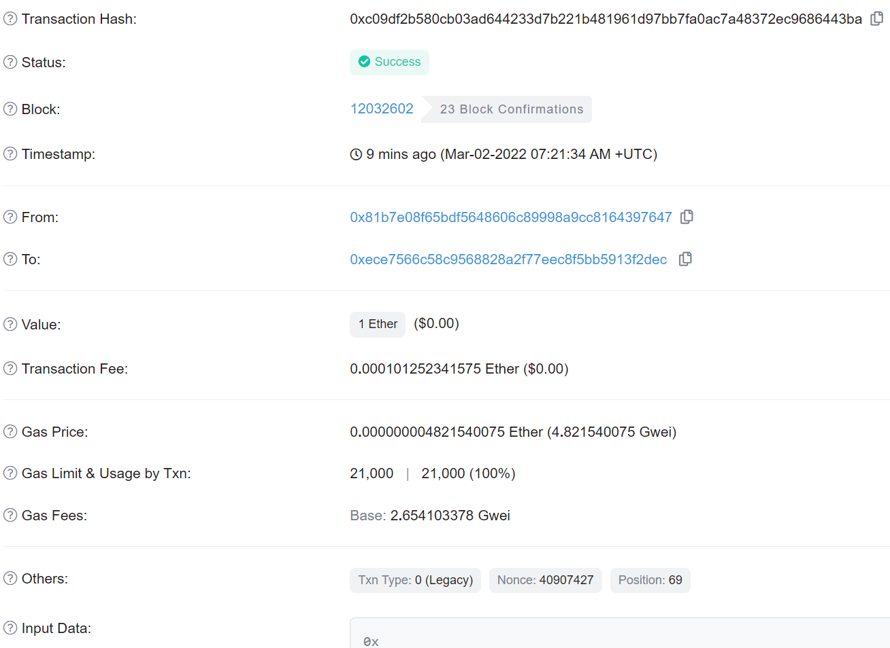
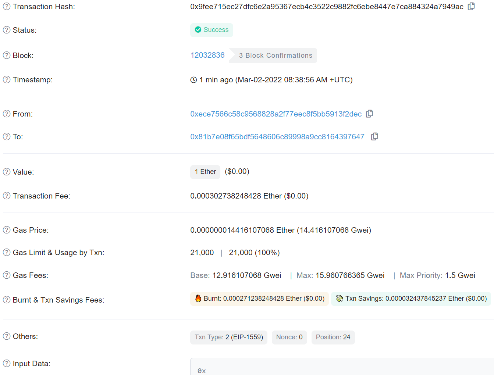
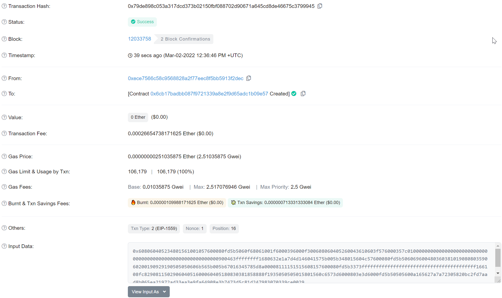
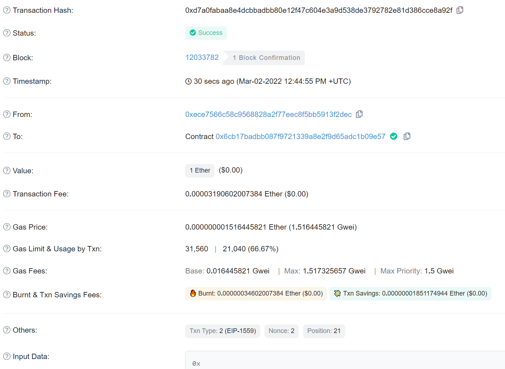

# 以太坊基本概念

## 以太币

以太币的货币单位为ether，最小的单位为wei
$$
1 \; ether = 10^{18}wei
$$

## MetaMask

收款交易，其中0xece7566c58c9568828a2f77eec8f5bb5913f2dec为我的账户地址，0xece7566c58c9568828a2f77eec8f5bb5913f2dec为水龙头地址



转账交易



## 账户

### 外部账户(EOA)

拥有私钥，可以触发交易

### 合约账户

具有合约代码，不能主动发起交易，可以发送和接收以太币，当交易目标地址是合约地址时会导致合约在EVM中执行

## 智能合约

构建智能合约

```c++
pragma solidity ^0.4.19;

contract Faucet{
    function withdraw(uint withdraw_amount) public{
        require(withdraw_amount <= 100000000000000000);
        msg.sender.transfer(withdraw_amount);
    }

    function() public payable{}
}
```

部署智能合约



向智能合约发送Ether



从智能合约提币

