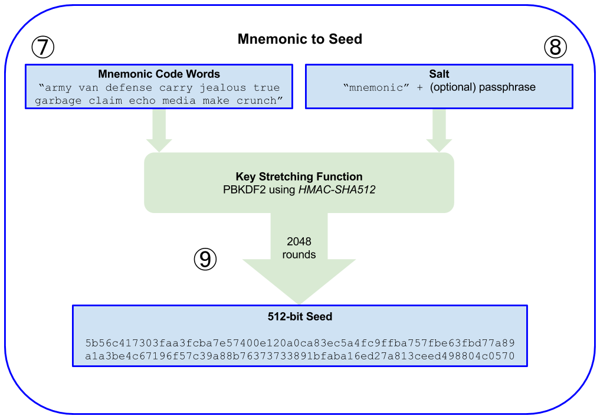

# 钱包

## 非确定性钱包

保存的每一个私钥都是通过不同随机数相互独立地生成的

## 确定性钱包

所有的密钥都是从主密钥(种子密钥)衍生而来

  

## 层级确定性钱包(HD钱包/BIP-32)

HD钱包可以保存用树状结构推导出的多个密钥，其有两个特点

* 子公钥可以由父公钥衍生而来，子私钥可以由父公钥衍生而来，子公钥和子私钥是一对公私钥
* 从父私钥衍生而来的自私钥是它们自己的主私钥

 

### 子私钥的派生 

#### 步骤

1.由父私钥计算得到父公钥

2.将父公钥、父链编码、索引号输入到HMAC-SHA512函数中得到512位输出

3.前256位则为自私钥，右256位则为子链编码


#### 算法

1.利用父私钥k计算父公钥K

2.将父公钥K和索引i连接K’

3.将K‘与父链码c输入到HMAC-SHA512中得到512bit，将其分为两半L，R各256bit

4.计算子私钥ck = (L + k) mod q、子链码cc = R


### 子公钥的派生

#### 步骤

1.将父公钥、父链编码、索引号输入到HMAC-SHA512函数中得到512位输出

2.前256位则为自私钥，右256位则为子链编码


#### 算法

1.将父公钥K和索引i连接K’

2.将K‘与父链码c输入到HMAC-SHA512中得到512bit，将其分为两半L，R各256bit

4.计算子公钥cK = (L * G + K) mod q、子链码cc = R


#### 对比

通过对比子公钥和自私钥的算法步骤，可以发现这两个算法的输入其实是相同的，只是针对HMAC-SHA512的结果进行了不同的处理，因此可以生成同一个私钥对

```python
子公钥 cK = (L * G + K) mod q
子私钥 ck = (L + k) mod q

父公私钥对有：K mod q= k*G mod q

子公钥有：(L * G + k * G) mod q = (L + k)*G mod q
子私钥有：(L + k) mod q
所以有：cK = ck * G
```

### 缺陷

1.当同时掌握父公钥和自私钥以及父链码时，可以反推出父私钥

由父公钥K、索引、父链码可以得到HMAC-SHA512的左半边输出L
子私钥k2由以下公式计算得到：k2 = (L + k1) mod q，因此可以反推出L

### 硬化子密钥衍生

将父私钥代替父公钥代入HMAC-SHA512函数中


#### 算法

1.将0x00、父私钥k、索引号拼接得到k’

2.将k‘和父链码输入到HMA-SHA512函数中得到L、R

3.计算得到自私钥ck = (L + k) mod q，子链码cc = R

  

### 扩展密钥

扩展密钥是256位密钥和256位链码所并联的512位序列，私钥与链码结合成为扩展的私钥，公钥和链码结合成为扩展的公钥

### 索引号码

用于衍生子密钥的索引号码是32位的整数，索引号在0-$2^{31} - 1$(0x7FFFFFFF)之间的用于正常衍生，索引号在$2^{31}$-$2^{32}-1$，也就是0x80000000-0xFFFFFFFF之间的用于硬化衍生中

## 识别路径(BIP-43/BIP-44)

从主私钥派生的私钥由m开头，从主公钥派生的公钥由M开头，第一个子私钥表示为m/0，第一个子公钥表示为M/0

| HD path     | Key described                                                |
| :---------- | :----------------------------------------------------------- |
| m/0         | The first (0) child private key from the master private key (m) |
| m/0/0       | The first grandchild private key of the first child (m/0)    |
| m/0’/0      | The first normal grandchild of the first *hardened* child (m/0’) |
| m/1/0       | The first grandchild private key of the second child (m/1)   |
| M/23/17/0/0 | The first great-great-grandchild public key of the first great-grandchild of the 18th grandchild of the 24th child |

### BIP-43

使用硬化子密钥衍生

## 助记词(BIP-39)

助记词中的单词用来生成钱包的种子密钥的内容

### 利用生成助记词步骤

1.创建128或者256bit的随机数S

2.取出S的SHA-256哈希的前(len(S) / 32)比特作为S的校验值c

3.将校验值拼接到S后，S’ = S || c

4.以11bit为单位，将S‘分成多个组

5.将每个组映射到预先定义好的单词

6.保持初始次序，书写出助记词

 

### 利用生成密钥步骤 

1.将助记词和盐输入到HMAC-SHA512中

2.进行2048轮哈希计算得到512bit种子

  

## 存储

很多钱包使用JSON格式的keystore文件保存私钥，该文件使用额外密码进行加密私钥，但并不是被直接加密，而是将密码通过连续的哈希计算进行扩展，重复262144轮，这可以极大降低暴力破解的速度

```python
{
    "address": "9e8cba34489eb977e60d3a70f51d9f03d7f7b2cd", 
    "crypto": {
        "cipher": "aes-128-ctr", 
        "ciphertext": "9a6be38f3b95c44b511441548434f1d249578059c97dc8502bb54648f3aa0f62", 
        "cipherparams": {
            "iv": "e8616f43e33c2206755f525a36e2f2b2"
        }, 
        "kdf": "scrypt", 
        "kdfparams": {
            "dklen": 32, 
            "n": 262144, 
            "p": 1, 
            "r": 8, 
            "salt": "9223e8343ba87d9f9c18f422201d23872e0da37c36332be09e0b98b552181507"
        }, 
        "mac": "00a1c1c9d26bc4ace9a822ce373ceb13b6239d2e0ad4dc1f920973f61c6eb8b8"
    }, 
    "id": "3381edb1-6fbd-4e31-ab94-22391e7d1a82", 
    "version": 3
}
```


