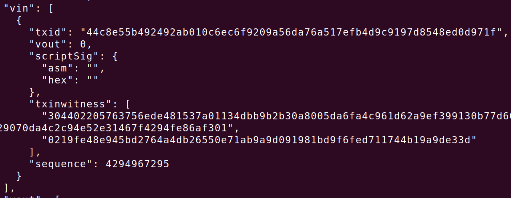

# 交易

交易的基本单位是未经使用的一个交易输出简称UTXO，当一个用户接收比特币时，金额被当作UTXO记录到区块链里

一个UTXO不能再被分割，如果一个UTXO比一笔交易所需量大，它仍会被当作一个整体消耗同时会在交易中生成零头，同样，也可以选取多个UTXO来拼凑出一个大于或等于一笔交易的所需比特币量

## 交易结构


locktime：定义了交易能被打包进区块的最早交易时间，值为0表示立即执行，如果0<locktime<500000000则被视为区块高度，如果locktime>500000000，则表示一个时间戳

## 交易输出


锁定脚本：锁定脚本会把输出锁在一个特定的比特币地址上，从而把一定数量的所有权转移到新的所有者上

## 交易输入




序列号：覆盖交易锁定时间之前的失效交易，如果设置成0xFFFFFFFF则被Bitcoin网络忽略，如果存在一次交易有非零的锁定时间，那么需将值设置成比0xFFFFFFFF低来激活锁定时间

## 交易费

交易费 = 总输入 - 总输出

## 交易链

由于UTXO的特性，交易是形成一条链，当一条交易链传输到网络时，如果节点先收到一个子交易，节点不会立即抛弃该子交易而是放到一个临时池中等待它的父交易并将它广播给所有节点，一旦接收到了父交易，所有与该父交易有关的UTXO都会从池中释放出来进行递归验证。

为了防止DOS攻击，临时池中的孤立交易数量是有限制的

## 脚本语言

交易验证依赖于锁定脚本和解锁脚本，在验证一笔交易时，会先验证交易中输入所指向的UTXO中的锁定脚本，然后读取本交易的解锁脚本并分别执行两个脚本，如果解锁脚本在执行过程中未报错，其数据将会被复制到锁定脚本中执行，锁定脚本执行后结果未真代表交易有效

**P2PKH(pay to public key hash)**

锁定脚本

```python
OP_DUP OP_HASH160 PubKey OP_EQUAL OP_CHECKSIG
```

解锁脚本

```python
Sign PubKey
```


**P2PK(pay to public key)**

主要用于coinbase交易中

锁定脚本

```python
PubKey OP_CHECKSIG
```

解锁脚本

```python
Sign
```

**多重签名**

假设记录在脚本中的公钥个数为N，则至少需要M个公钥才可以解锁

锁定脚本

```python
2 PubKeyA PubKeyB PubKeyC 3 OP_CHECKMULTISIG
```

解锁脚本

```python
OP_0 SignA SignB
```

之所以要加上OP_0是因为早期的CHECKMULTISIG有个漏洞，CHECKMULTISIG会自动忽略这个前缀

**数据输出**

OP_RETURN允许开发者在交易输出上增加40字节的非交易数据，但不能使用解锁花费，因此不会存储在UTXO集中，减少内存开销

锁定脚本

```python
OP_RETURN data
```

data被限制为40字节

**P2SH(pay to script hash)**

在P2SH交易中，锁定脚本由哈希取代，哈希指的是赎回脚本

多重签名锁定脚本

```python
2 PubKey1 PubKey2 PubKey3 PubKey4 PubKey5 5 OP_CHECKMULTISIG
```

多重签名解锁脚本

```python
Sig1 Sig2
```

当顾客向某公司A支付比特币时，由于公司原因，公司营收的比特币要花出去必须得使用多重签名，那么对于顾客来说支付比特币时得把上述的锁定脚本填写到交易的锁定脚本中，这对于顾客来说会增加打包费，因此产生了P2SH

P2SH锁定脚本

```python
OP_HASH160 <20 byte hash of redeem script> OP_EQUAL
```

P2SH解锁脚本

```python
Sig1 Sig2 <redeem script>
```

赎回脚本(redeem script)

```python
2 PubKey1 PubKey2 PubKey3 PubKey4 PubKey5 5 OP_CHECKMULTISIG
```

