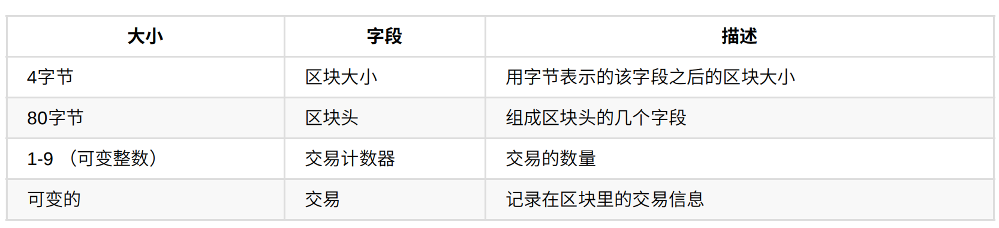
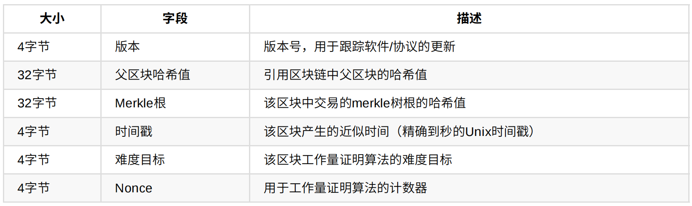
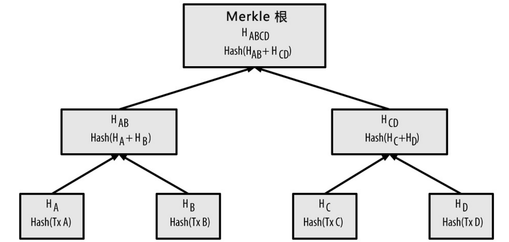
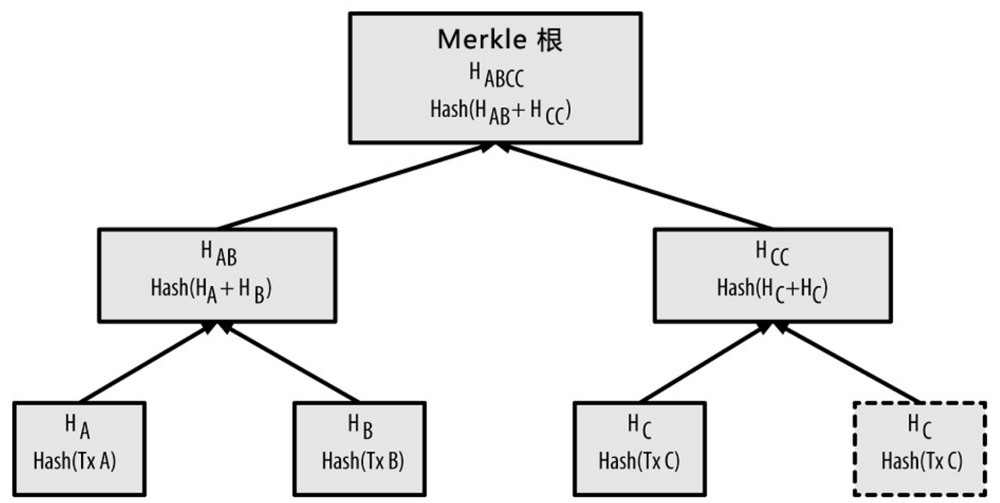
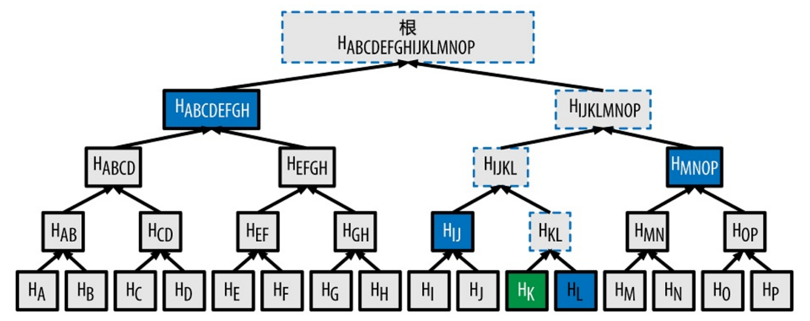

# 区块链

## 区块结构

区块由区块头和区块体组成，区块头是80字节，每一个区块都有区块头哈希标识和区块高度，区块头哈希可以唯一标识一个区块，但区块头哈希和区块高度实际不包含在区块的数据结构中，区块头哈希通过SHA256对区块头进行二次哈希计算得到



**区块头结构**



## 创世区块

创世区块被编入到客户端软件中，所以每一个节点都至少包含一个区块的区块链

```
0000000000 19d6689c085ae165831e934ff763ae46a2a6c172b3f1b60a8ce26f
```

## Merkle树

Merkle树是哈希二叉树，其使用两次SHA256计算哈希值



当元素为奇数个时，最后的元素会被赋值一份以构成偶数个叶子节点



当N个数据插入Merkle树时，最多计算2*log2(N)就能检查任意元素是否在树中



