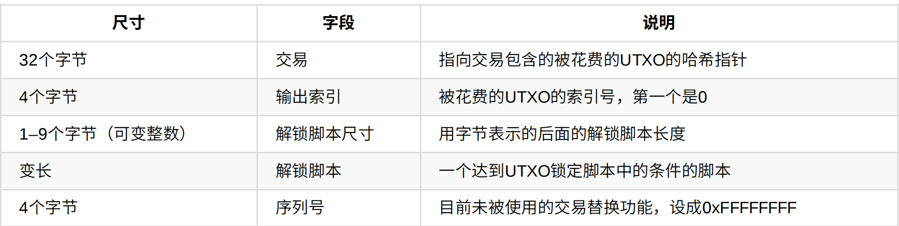
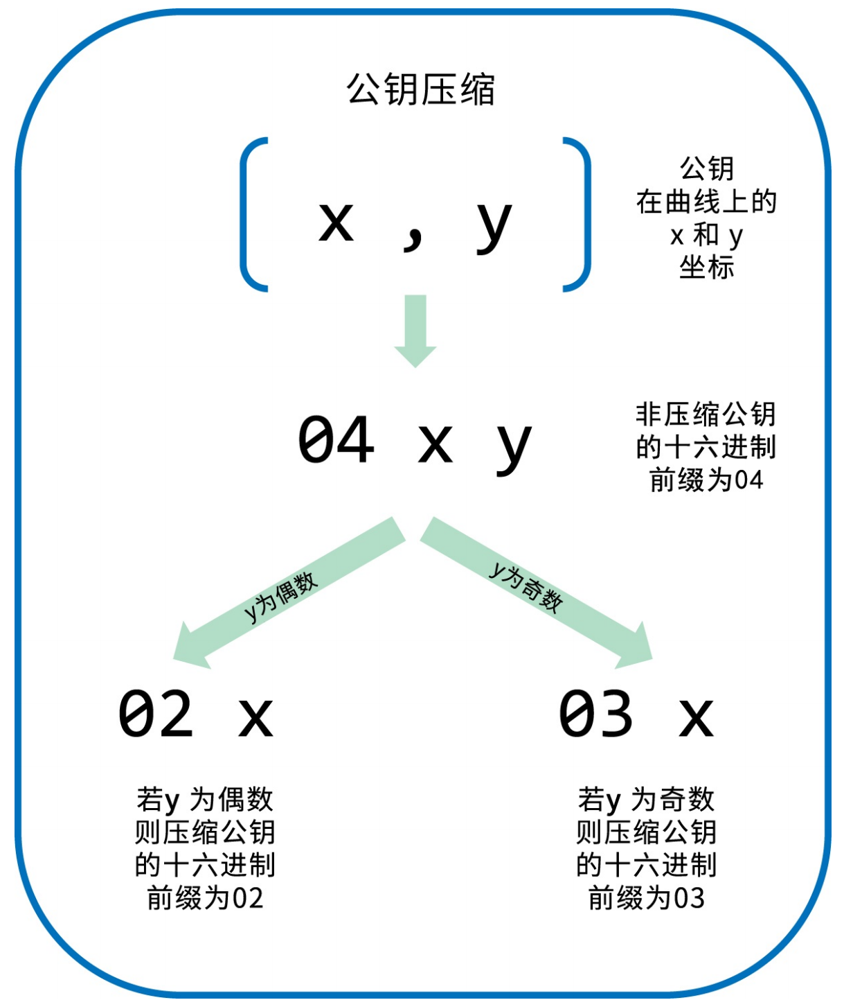
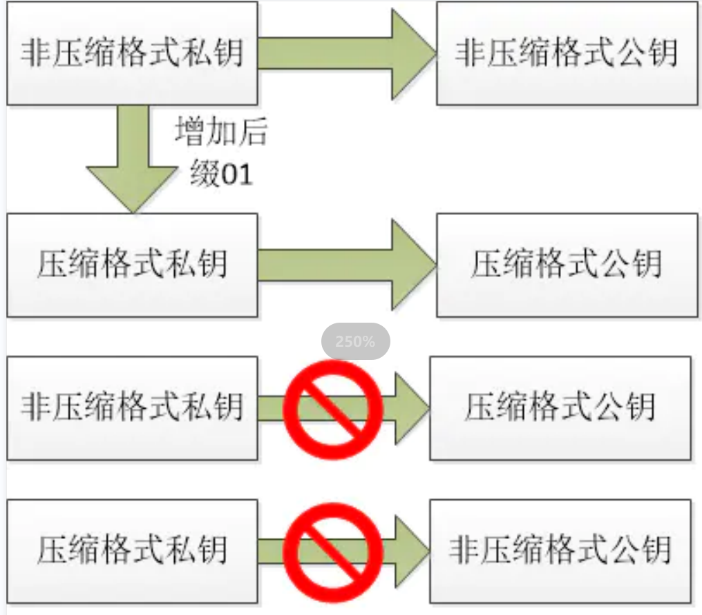

# 密钥、地址、钱包

## 私钥

私钥是一个256位的随机数，Bicoin使用OS底层的随机数来生成，例如

```python
1E99423A4ED27608A15A2616A2B0E9E52CED330AC530EDCC32C8FFC6A526AEDD
```

## 公钥

通过椭圆曲线算法可以从私钥计算得到公钥，K = k * G，其中k是私钥，G是生成点常数

Bitcoin使用secp256k1标准定义的椭圆曲线和一系列数字常数

      
$$
y^2 mod p \equiv (x^3 + 7) mod p \\
p = 2^{256} - 2^{32} - 2^9 - 2^8 - 2^7 - 2^6 - 2^4 - 1
$$
将私钥k与G相乘得到公钥K是一个点
$$
K = 1E99423A4ED27608A15A2616A2B0E9E52CED330AC530EDCC32C8FFC6A526AEDD * G \\
K = (x, y) \\
X = F028892BAD7ED57D2FB57BF33081D5CFCF6F9ED3D3D7F159C2E2FFF579DC341A \\
Y = 07CF33DA18BD734C600B96A72BBC4749D5141C90EC8AC328AE52DDFE2E505BDB \\
$$

## 地址

Bitcoin地址由公钥经过SHA256以及RIPEMD160得到，通常用户见到的比特币地址都是经过Base58Check编码得到，例如

```python
1J7mdg5rbQyUHENYdx39WVWK7fsLpEoXZy

adr = RIPEMD60(SHA256(K))
```



# 公钥格式

公钥是在椭圆曲线上的一个点(x, y)，通常会加上前缀0x04来表示公钥，例如

```python
K=04F028892BAD7ED57D2FB57BF33081D5CFCF6F9ED3D3D7F159C2E2FFF579DC341A07CF33DA18BD734C600B96A72BBC4749D5141C90EC8AC328AE52DDFE2E505BDB
```

为了将公钥长度缩减，Bitcoin将公钥进行压缩，略去了y点，通过方程已知x点可以求得y点，由于方程左边是y^2，因此y可能有两个解一个为y一个为-y，因此还需要记录y的奇偶性来区分y的正负性，当y为偶数，则使用0x02作为前缀，当y为奇数时，则使用03作为前缀


$$
y^2 mod p = (x^3 + 7) mod p
$$


> 假设a是y的一个解，则-a为y的另一个解，-a mod p = -a + p mod p，所以-a+p也是方程的一个解，由于-a + p +a = p，p为素数，那么这两个解其中一个必然是偶数，一定必然是奇数



## 私钥压缩

由于公钥有两种表示形式，一种为压缩形式，另一种为非压缩形式，因此对应就可能产生两个地址，Bitcoin使用Wallet Import Format(WIF)来解决该问题，WIF通过在私钥后面附加一个后缀01来表示公钥需要压缩，当一个私钥使用WIF压缩格式导出时，其生成的公钥是被压缩过的，当私钥以非WIF压缩格式表示，其生成的公钥是未被压缩过的



<script type="text/javascript" src="http://cdn.mathjax.org/mathjax/latest/MathJax.js?config=default"></script>  

