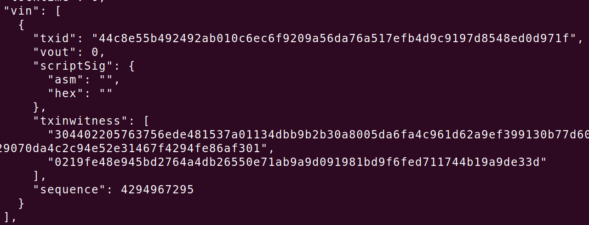
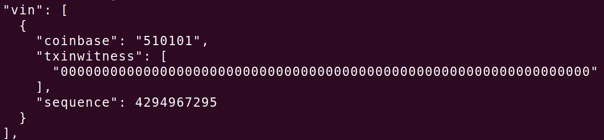
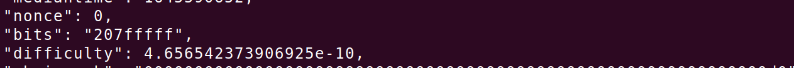

# 挖矿与共识

比特币大约每10分钟产生一个新区块，每开采210000个块，出块奖励减半，最终经过64次二等分(最后一次减半后出块奖励为1聪)，将不再有出块奖励，共发行20999999.9769个比特币

## 交易验证

交易在传递到对等节点后，收到交易的对等节点会先验证该交易，如果交易无效，对等节点将丢弃该交易

## 打包交易

验证交易后，节点会将交易放入交易池，如果此时出现一个新块，节点会将交易池中出现在新块中的交易删除，并使用这些交易立刻构建一个空区块

### 交易优先级

节点会为内存池中每笔交易分配一个优先级，区块存储交易的前50KB都是保留给较高优先级交易的而不考虑交易费

```
Priority = Sum(Sum(input) * Age) / Transaction_Size
```

其中**sum(input)**为交易的输入总和，**Age**为该交易的块龄

之后，节点会为每千字节交易费进行排序，优先选择高交易费的交易打包，如果区块仍有空间，节点可以选择不含有交易费的交易，区块被填满后，随着区块被加到链上，交易池中剩余的交易的块龄会增大，根据优先级公式，即使一个不含交易费的交易随着块龄的增长，其优先级增大，也可能被免费打包进区块

### 创币交易

区块中第一笔交易是coinbase交易，coinbase交易不消耗UTXO，由coinbase代替了解锁脚本(scriptSig)，coinbase字段除最开始的几个字节外，可以随即填充任何数据([2,100])，矿工可以使用coinbase作为extra nonce





## 工作量证明(POW)

节点构建一个区块，不断修改nonce值，计算区块头的哈希值是否小于当前目标值

### 难度表示

nonce用于增大搜索空间，bits用于计算目标值计算公式如下，difficulty用于难度调整

```shell
# 将bits划分为两部分:系数和指数,前1个字节为指数,后三个字节为系数
# 系数:0x7fffff 指数:0x20 target:区块头hash要小于target
target = coefficient * 2^(8 * (exponent - 3))
target = 01111111 11111111 11111111 << 232

# difficulty_1_target:挖矿难度为1的阈值
difficulty = difficulty_1_target / target
```



### 难度调整

每产生2016个区块，难度就会调整，由于每个区块的出块时间大约为10min，因此每2周会调整一次区块难度

```python
# actual_time:实际挖矿时间 expected_time:期望挖矿时间
_target = target * actual_time / expected_time

# 难度调整的比例不能太高也不能太低
if _target < target * 1/4:
	_target = target * 1/4
elif _target > target * 4:
    _target = target * 4
```


