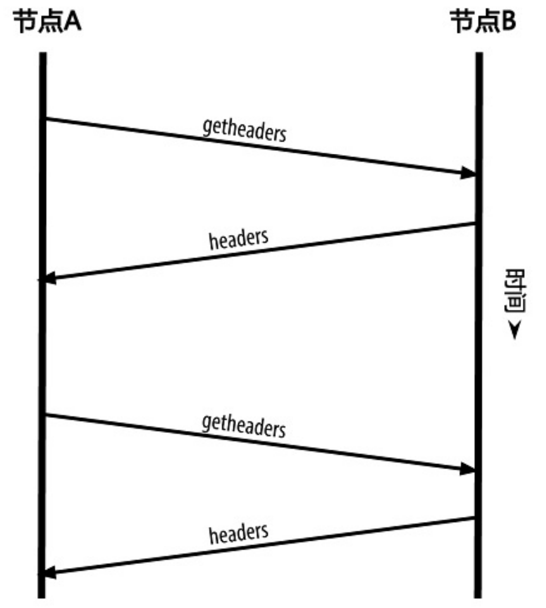

# 比特币网络

## P2P网络架构

比特币网络是按照比特币P2P协议运行的一系列节点的集合，除了P2P协议之外，还包含了其它协议例如挖矿协议Stratum

## 节点类型

**全节点:**拥有完整的、最新的区块链拷贝，可以独立验证所有交易

**轻节点:** 只保留了区块链的区块头，使用简易支付验证(SPV)来验证交易

## 网络发现

### 发现对等节点

* 客户端会维持一个列表列出了长期稳定运行的节点(种子节点)
* 在比特币启动时通过参数-seednode连接一个节点并将该节点用作DNS种子

### 建立连接

在与对等节点建立连接时，节点会通过发送version消息开始握手通信，一个version消息包含一些内容：

* PROTOCOL_VERSION：P2P协议版本
* nLocalServices：一组该节点支持的本地服务列表
* nTime：当前时间
* addrYou：当前节点可见的对等节点的IP
* addrMe：当前节点发现的本地IP
* subver：当前节点运行的软件类型子版本号
* BaseHeight：当前节点的区块链高度

当对等节点收到version消息后会返回verack消息确认并建立连接，如果对等节点需要互相建立连接，则也会发送version消息

### 地址发现

当节点建立连接后，会使用addr消息将包含自身的IP地址发送给对等节点，对等节点收到addr消息后将其转发给各自相邻节点，节点也可以用getaddr消息要求对等节点返回已知IP地址列表

### 区块获得

一个全新节点不包含任何区块链信息，其内部只含一个区块——静态植入在客户端软件中的创世区块。在节点建立连接时，version消息包含了baseHeight字段，节点就可以直到对方各自有多少区块。之后节点会交换getblocks消息请求从最新区块到某一处区块之间的区块哈希(最大值请求500个区块的哈希)，节点收到getblocks消息后会响应inv消息将区块哈希返回，最后节点可以通过getdata消息请求区块信息

## 简易支付验证(SPV)

SPV节点只需要下载区块头，因此大小只有区块链的1/1000。SPV主要用于支付验证：

* 交易是否包含在区块链中
* 交易是否被确认了至少6次

**spv校验过程**

1.计算待验证支付的交易hash

2.节点从网络上获取并存储最长链

3.节点向对等节点请求待验证交易的默克尔树哈希的认证路径

4.节点根据认证路径计算默克尔树的根哈希并将结果与区块头的root哈希比较

5.根据该区块头所处位置，计算该交易已获得的确认区块数量

## Bloom过滤器

Bloom过滤器由一个可变长二进制数组以及多个哈希函数组成，如下

向Bloom过滤器添加关键词时，会将关键词代入每个哈希函数中计算并将所得结果在数组相应位置上置1

当要查询某个关键词是否在Bloom过滤器中时，只需将关键词代入哈希函数中，查看数组中对应位置是否为1，如果是，则说明关键词可能在数组中，如果不是，则关键词肯定不在数组中

spv节点会建立一个与钱包中地址匹配的Bloom过滤器，通过filterload消息将过滤器发送给对等节点，对等节点将每个交易的输出都代入过滤器验证，将匹配的交易、交易所在区块信息、merkle路径发送给spv节点

## 交易池

每个节点都会维护一份未确认交易的内存池(交易池)，同时有些节点会维护一个孤立交易池，如果一个交易的输入与某未知交易相关，该孤立交易就会被暂时存储到孤立交易池中直到父交易到达，当一个交易被添加到交易池中，会同时检查孤立交易池，如果存在孤立交易引用了此交易，则立马验证孤立交易，一旦验证成功，会将该孤立交易从鼓励交易池中删除加入到交易池中

交易池和孤立交易池都存储在内存中，节点启动时，两个池都是空闲的

有些客户端还维护一个UTXO数据库，称为UTXO池，与交易池不同，UTXO初始不为空，UTXO池代表的是网络共识，不同节点的UTXO池内容差别不大