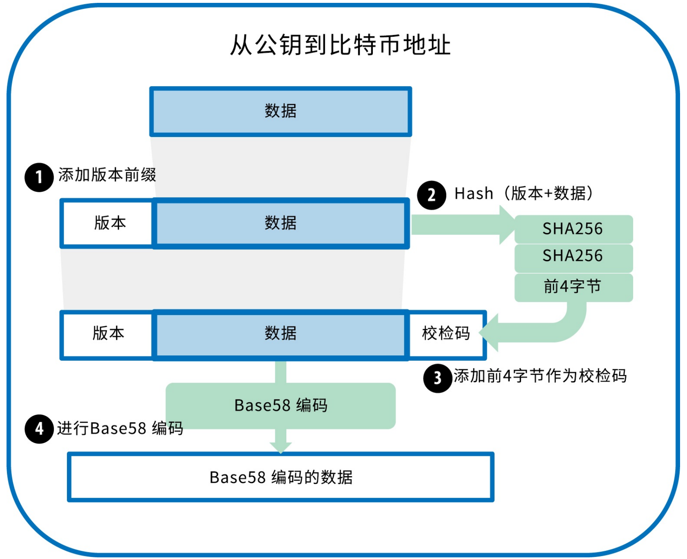
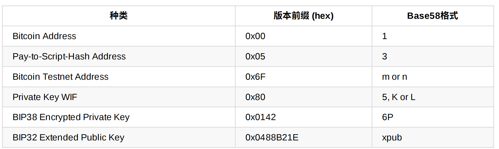
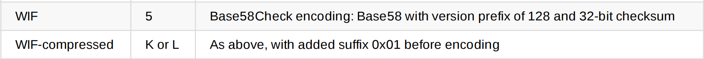

# Base58

Base64由52个大小写字母、10个数字、以及+和/组成，Base58是Base64编码的子集，其舍弃了容易混淆的4个字符：0，O，l(小写L)，I(大写I)以及+和/

## Base58Check

Base58Check是在Base58编码格式上增加了错误校验码来检查数据错误，校验码长4个字节，从需要编码的数据的哈希值中得到；在对数据求哈希值前还需对数据添加一个版本字节的前缀用于明确需要编码的数据类型，例如Bitcoin地址前缀是0x0，私钥编码前缀为0x80

```python
Checksum = SHA256(SHA256(prefix+data))
```

在产生的32个字节的哈希中，只取前4个字节作为校验码，因此Base58Check在编码时一共需要对三部分组成的数据进行编码：前缀、数据、校验码



## Bitcoin编码前缀



