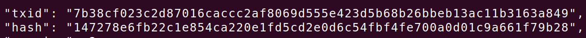

# txid和hash区别

1.在Bitcoin中有些交易的txid和hash值相同，有些交易的txid和hash值不同，这是为什么？

> 对于segwit交易，那么计算txid的过程不包括witness data，但是计算hash的过程包括witness data(ScriptSig)
> 对于非segwit交易，那么txid和hash值相同，计算过程都包括witness data

2.对于transacion中的input中使用的txid还是hash呢？

> txid

3.那为什么对于segwit交易计算txid需要把witness data排除在外呢？

> 因为对于延展性攻击来讲，攻击者可以改变签名的形式而更改交易的hash，当受害者发送一笔交易A1后，攻击者将签名更改导致hash发生变化成为交易A2，最后如果交易A2成功上链，那么受害者就会误以为转账失败，就会再次发送转账交易，攻击者就可以多次收款