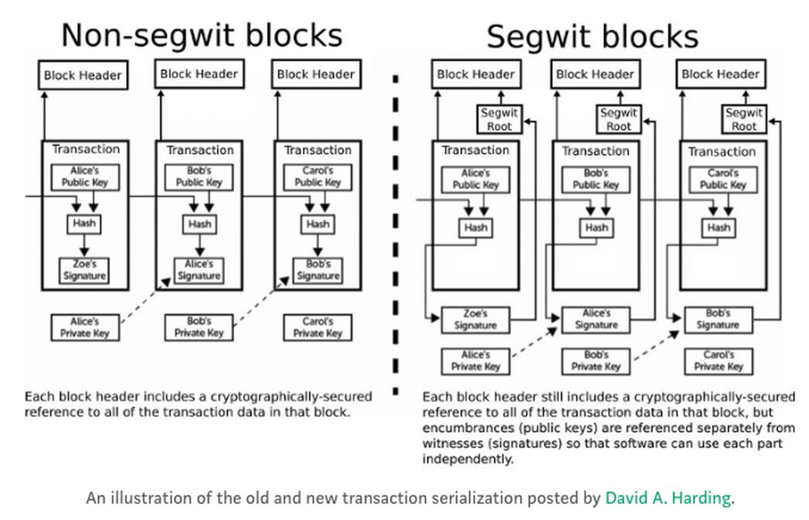

# 隔离见证

隔离见证，其中见证翻译为witness，就是ScriptSig，1个transaction中有多个input和多个output，每个input中都有ScriptSig，每个output中都有ScriptPubKey，隔离见证的意思就是把ScriptSig拿出来放到区块的末尾，也就是说，没有隔离见证block = block_header+transactions，有了隔离见证block = block_header+transactions+ScriptSig


对于老版本的节点，区块大小限制为1M，区块大小计算方式为:

```python
block_size = block_header + transactions_size
Block_size <= 1M
```

因此将witness放到区块末尾可以让区块装载更多的交易


对于新版本的节点，引入了block weight概念，限制为4M，block weight计算方式为:

block_weight = (block_header + transactions_size) * 4 + witness_size

Block_weight <= 4M



#### 引用

[深入解析隔离见证](https://blog.csdn.net/chunlongyu/article/details/80433375)