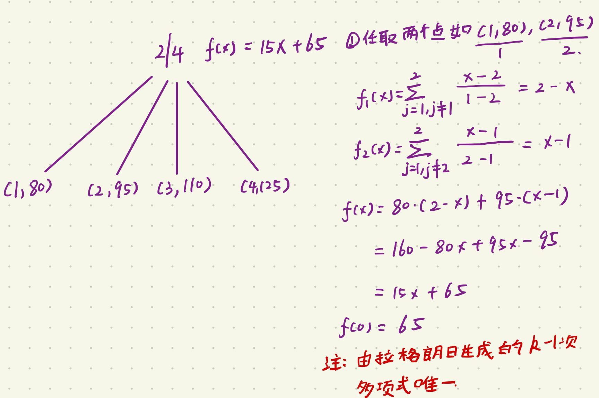

# Shamir's Secret Sharing Algorithm

Shamir's secret sharing algorithm is an algorithm in cryptography created by Adi Shamir. The main aim of this algorithm is to divide secret that needs to be encrypted into various unique parts.

## Algorithm

* $S$ is the secret that we wish to encode.
* It is divided into N parts: $S_1, S_2, ..., S_n$.
* After dividing it, a number $K$ is chosen by the user in order to decrypt the parts and find the original secret.
* It is chosen in such a way that if we know less than $K$ parts, then we will not be able to find the secret $S$. The secret $S$ can not be reconstructed with $K-1$ parts or fewer.
* If we know $K$ or more parts from $S_1, S_2, ..., S_n$, then we can compute/reconstructed out secret code  $S$ easily. This is conventionally called (K, N) threshold scheme.

## Example

Let the secret code $S = 65$, $N = 4$, $K = 2$.

* Initially, in order to encrypt the secret code, we build a polynomial of degree $K-1$
* Therefore, let the polynomial be $y = ax + b$. Here, the constant part $b$ is our secret code.
* Let a be any random number, say $a=15$.
* Therefore, for this polynomial $y=15x + 65$. We generate $N=4$ points from it.
* Let those 4 points be (1, 80), (2, 95), (3, 110), (4, 125). Clearly, we can generate the initial polynomial from any two of these points and in the resulting polynomial, the constant term $b$ is the required secret code.

## Reference

[Shamir’s Secret Sharing Algorithm | Cryptography](https://www.geeksforgeeks.org/shamirs-secret-sharing-algorithm-cryptography/)

[如何直观地理解拉格朗日插值法？](https://www.zhihu.com/question/58333118)

