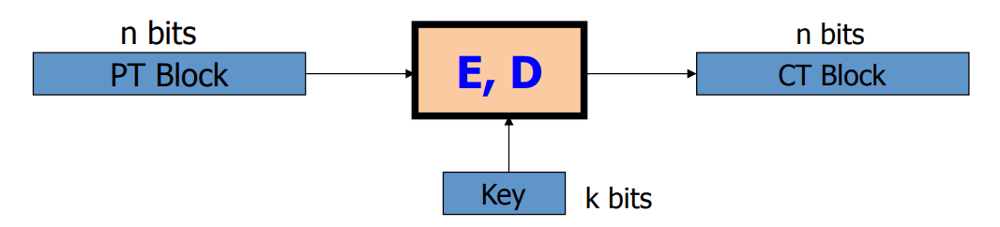
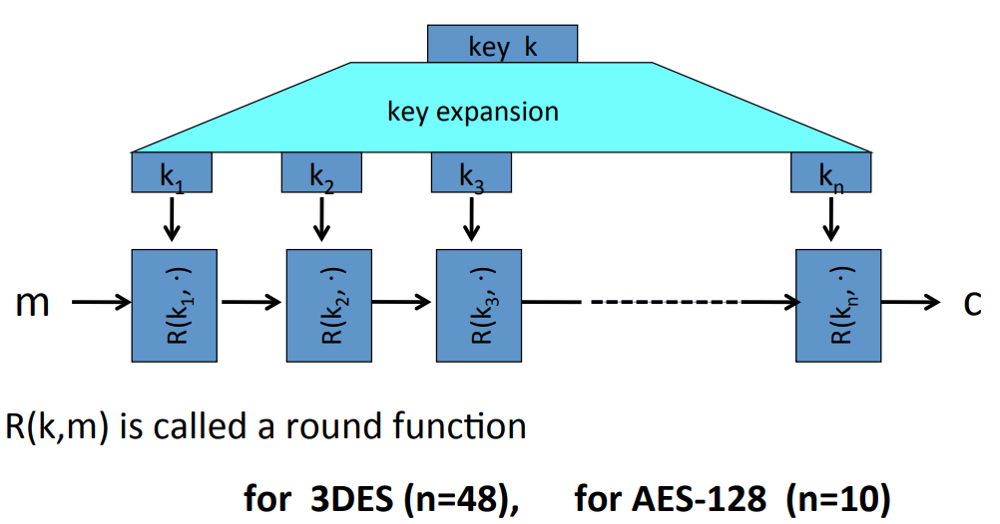
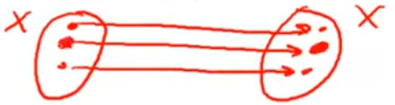
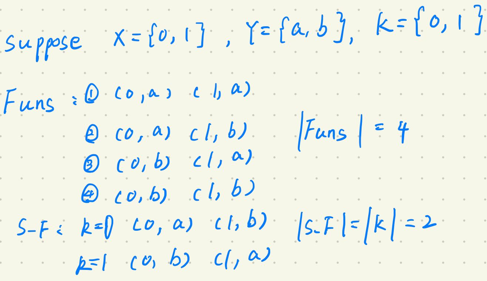
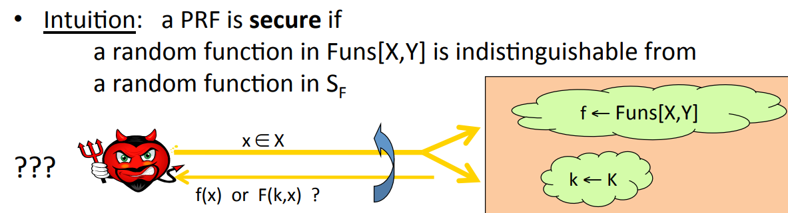

# Block Cipher

A block cipher is made up of two algorithms, E and D. The point of the block cipher is it takes an N bit plain text as input, and it outputs exactly the same number of bits.

Block ciphers are typically built by iteration. They take in as input a key $k$, and the first thing it happens to the key is that it gets expanded into a sequence of keys $k_1$ to $k_n$ called round keys. The way the cipher uses these round keys is by iteratively encrypting the message again and again using what's called a round function $R$. It takes as input the round key and the current state of the message. Different cipher has different number of rounds, and they have different round functions.

## PRPs VS PRFs

**A pseudorandom function(PRF)** is defined over a key sapce, an input space, and an output space($K, X, Y$). It is a function that takes a key in $K$ and an element in $X$ and outputs an element in $Y$. The requirement is that there's an efficient way to evaluate the function.
$$
F: K \times X \to Y
$$

**A pseudorandom permutation(PRP)** is defined over a key space, and a set ($K, X$). What it does is it takes an element in the key space, an element in $X$, and output a element in $X$. As usual, the function $E$ should be easy to evaluate. And once we fix the key $k$, it's important that $E$ be one to one. In other words, every element in $X$ gets mapped to exactly one element in $X$. And then because it's one to one, it's also invertible. So given some output there's only one input that maps to that output.
$$
E: K \times X \to X
$$

**Example**
$$
AES: K \times X \to X \; \text{where } K = X = \{0, 1\}^{128} \\
3DES: K \times x \to x \; \text{where } X=\{0, 1\}^{64}, K=\{0, 1\}^{168}
$$
In fact a PRP is a PRF that has more structure. In particular, a PRP is a PRF where the input space and the output space the same.

## Secure PRFs

Let $F: K \times X \to Y$ be a PRF, and 
$$
\begin{cases}
Funs[X, Y]: \; \text{the set of all functions from X to Y} \\
S_F: \; \{F(k, \cdot)\} \; \text{s.t.} k \in K \} \subseteq Funs[X, Y]
\end{cases}
$$
For example, suppose $X = \{0, 1\}^1,  Y=\{a, b\}, K=\{0, 1\}^1$ , then 

A PRF is secure if a random function in $Funs[X, Y]$ is indistinguishable from a random function in $S_F$.

An adversary who's trying to distinguish truly random function from a pseudo-random function. In the top cloud, we're choosing a truly random function. In the bottom cloud, we're just choosing a random key for a pseudo-random funtion. The adversary is gonna submit points in $x \in X$. He's gonna do this again and again. He will submit $x_1, x_2, x_3,...$ and then for each one of those q  ueries, we are gonna give hime either the value of the truly random function at the point $x$, or the value of pseudorandom function at the point $x$. So the adversary doesn't know which ones he's getting. And we say the PRF is secure if this adversary can't tell the difference. He can't tell whether he's interacting with a truly random function or interacting with a pseudo random function.

### Example

1.Let $F: K \times X \to \{0, 1\}^{128}$ be a secure PRF. Is the following $G$ a secure PRF? 
$$
G(k, x) = \begin{cases}
			0^{128} \; \text{if } x = 0 \\
			F(k, x) \; \text{otherwise}
		 \end{cases}
$$
No, because adversary can query the function at $x = 0$. For a random function, the probability that the result is gonna be 0 is $\frac{1}{2^{128}}$. Whereas for the pseudo-random function, he's always gonna get 0.

2.Let $X = \{0, 1\}$. Perms[X] contains two functions. Consider the following PRP: key space $K = \{0, 1\}$, input space $X = \{0, 1\}$, PRP defined as: $E(k, x) = x \oplus k$. Is this a secure PRP? Yes, becase a random choice of key here is identical to a random choice of function. As a result, the two distributions, either pseudo-random or random are identical. So clearly, an adversary can't distinguish the two distributions.

3.Consider the 1-bit PRP from the previous question: $E(k, x) = x \oplus k$, is it a secure PRF? No, because $Funx[X, X]$ contains 4 functions. A attacker can query the result of $x=0$ and $x=1$, if $f(0) = f(1)$ then output 1, else output 0. The advantage of this attacker is $Adv_{PRF}[A, E] = |Pr[W_0] - Pr[W_1]| = | 0 - 1/2 | = \frac{1}{2}$

PRPs believed to be secure: 3DES, AES

## Application: PRF => PRG

Let $F: K \times \{0, 1\}^n \to \{0, 1\}^n$ be a secure PRF. Then the following $G: K \to \{0, 1\}^{nt}$ is a secure PRG.
$$
G(k) = F(k, 0) || F(k, 1) || ... || F(k, t)
$$
A key property of this generator is that it's parallelizable. So this is an example of a parallelizable stream cipher.

Why is this generator secure? The security of generator falls directly from the PRF property. The reaon is that this PRF by definition is indistinguishable from a truly random function. So in other words, if I take this generator and instead I define a generator using a truly random function, then the output of the generator using the truly random function would be indistinguishable from the output of the generator using a pseudorandom function. That is the essence of the security property of a PRF. And so with a truly random function, a generator produces truly random outpus, and is there for a perfectly secure generator. We argue that when we replace the PRF with a truly random function, the construction is secure, and that says that the construction with a pseudorandom function is also secure.

## PRF Switching Lemma

Any secure PRP is also a secure PRF, if $|X|$ is sufficiently large.

**Lemma:** Let $E$ be a PRP over $(K, X)$, Then for any q-query adversary $A$: $|Adv_{PRF}[A, E] - Adv_{PRP}[A, E]| \lt \frac{q^2}{2|X|}$. In other words, suppose $|X|$ is large so that $q^2 / 2|X|$ is negligible. Then:
$$
Adv_{PRP}[A, E] \; \text{negligible} \to Adv_{PRF}[A, E] \; \text{negligible}
$$
