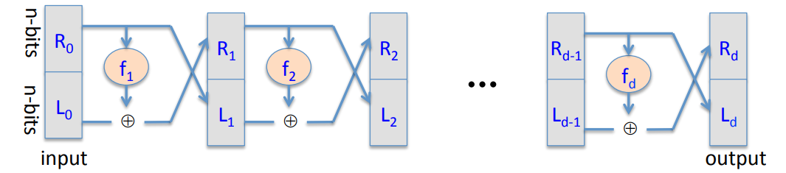

# DES(Data Encryption Standard)

## Feistel Network

Given functions $f_1,..., f_d: \{0, 1\}^n \to \{0, 1\}^n$.

**Goal**: Build an invertible function out of $d$ functions $F: \{0, 1\}^{2n} \to \{0, 1\}^{2n}$.

There are two blocks of n bits. In other words, the input is actually 2n bits. The R and L stand for right and left. If we follow the R inputs, it gets copied into the L output without any change at all. However, the L inputs is changed somewhat. What happens is, the R inputs is fit into the function $f_1$ and the result is then XORed with $L_0$ and that becomes the new $R_1$.

$$
L_i = R_{i-1} \\
R_i = f_i(R_{i-1}) \oplus L_0
$$
**Claim**: for all $f_1,..., f_d: \{0, 1\}^n \to \{0, 1\}^n$, Feistel network $F: \{0, 1\}^{2n} \to \{0, 1\}^{2n}$ is invertible.

**Proof**: Let's look at one round of a Feistel network. Suppose the input that we're given is $R_{i+1}, L_{i+1}$ and we want to compute $R_i, L_i$. So we want to compute the round in the reverse direction.

$$
R_{i_1} = L_i \\
L_{i-1} = R_i \oplus f_i(L_i)
$$
**Theorem**: Let $f: K \times \{0, 1\}^n \to \{0, 1\}^n$ a secure PRF. So it's indistinguishable from random. Then it turns out that if you use this function in three rounds of a Feistel network, what you end up with is a secure pseudo random permutation. In other words, what you end up with is an invertible function that is indistinguishable from a truly random invertible function.

## DES

DES ia a 16 round Feistel network, so there are functions $f_1, ..., f_{16}: \{0, 1\}^{32} \to \{0, 1\}^{32}$ that map 32 bits to 32 bits. And as a result, the DES itself acts on 64 bit blocks, $2 \times 32$. All the sixteen round function in DES are actually all derived from a single function $F$. Just used with different keys.
$$
f_i(x) = F(k_i, x)
$$
Suppose you have a 64 bit input, the first thing it does is this initial permutation that just permutes the 64 bits around. This is not for security reasons, this is just specified in the standard. Then we go into the sixteen round Feistel network which uses the function $f_1$ to $f_{16}$ as specified before. Then we have another permutation called the final permutation, which just the inverse of the initial permutation. There's a key expansion step, the 56-bit DES key is expanded into these rounds keys $k_1, ..., k_{16}$, where each round key is 48 bits.

### Function F

It takes 32 bit value $x$ as input, remember this is $R_0, ..., R_{14}$ and so on. And then it takes also a 48 bit round key $k_i$. The first thing it does is goes through an expansion box, which takes 32 bits and maps them into 48 bits. All the expansion box does is just replicate some bits and move other bits around. The next thing we do is we compute an XOR with the round key. The 48 bits are broken into 8 groups of 6 bits, and they go into what are called S boxes. The S box is a map, 6 bits to 4 bits. So the output of the S boxes are 32 bits. And finally this is fed into another permutation which just maps the bits around. So it just permutes the 32 bits around and that's the final 32 bit output of this $F$ function.

### S box

These S boxes are just functions from 6 bits to 4 bits. They are just implemented as a look up table. For example, if you want to look at the output that corresponds to "011011".  Then you look at the first and last bit "01", and then look at the middle 4 bits "1101", and you see that the output is 1001.

Image the S boxes were linear. Image that these 6 bix inputs literally were just XORed with one another in different ways to produce the 4 bit outputs. 
$$
S_i(x_1, x_2,..., x_6) = (x_2 \oplus x_3, x_1 \oplus x_4 \oplus x_5, x_1 \oplus x_6, x_2 \oplus x_3 \oplus x_6)
$$
Another way of writing that is that we can write S box as a matrix vector product. This is why we say that in this case the S boxes are completely linear.
$$
S_i(x) = A_i \cdot x \; (mod 2)
$$

If the S boxes were linear, then DES would be totally insecure. The reason is that if the S boxes are linear, then all that DES does is just compute XOR of various things and permute and shuffle bits around, which means that as a result, all of DES is just a linear function. In other words, there will be a matrix $B$ that has width 832 and length 64. Then write the 64 bit message plus the sixteen round keys(48bits) as one long vector. Then when you compute these matrix vector products, you get the different bits of ciphertext. So there's 64 bit of these rows and as a result, you get 64 bits of ciphertext.

The S boxes are the only nonlinear part of DES. So if the S boxes were liner, then the entire circuit is linear and therefor can be expressed as this matrix. For example, if you did the XOR of three outputs of DES, we would see the following
$$
DES(k, m_1) \oplus DES(k, m_2) \oplus DES(k, m_3) \\
B \cdot \begin{pmatrix}
			m_1 \\
			k
		\end{pmatrix} \oplus B \cdot \begin{pmatrix}
										m_2 \\
										k
									 \end{pmatrix} \oplus B \cdot \begin{pmatrix}
									 								m_3 \\
									 								k
									 							  \end{pmatrix} =
\begin{pmatrix}
	m_1 \oplus m_2 \oplus m_3 \\
	k \oplus k \oplus k
\end{pmatrix}
$$
This is not a relation that is going to hold for a random function. A random function is not going to satisfy this equality. Ans so you get a very easy test to tell you that DES is not a random function.

**Choosing the X-boxes and P-box**

If you choose the S boxes at random, it turns out they'll tend to be somewhat close to linear functions, so the designers of DES specified a number of rules they use for choosing the S boxes:

1.No output should be close to a linear function of the input bits. In other words, there is no function that agrees with a large fraction if the outputs of the S box.

2.S-boxes are 4-to-1 maps. Every output of the S-boxes have four pre-images and so on and so forth.