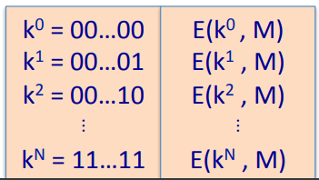

# Exhaustive Search Attacks

**Goal**: Given a few input output pairs $(m_i, c_i = E(k, m_i)) i=1,...3$ find key k.

**Lemma**: Suppose DES is an ideal cipher(DES is made up of random invertible functions, in other words, for every key, DES implements a random invertible function, since there are $2^{56}$  keys in DES, we're going to pretend like DES is a collection of $2^{56}$ functions that are invertible from $\{0, 1\}^{64}$ to $ \{0, 1\}^{64} $), then $\forall m, c$ there is at most 1 key such that $c = DES(k, m)$ with probability $\geq 1 - \frac{1}{256} \approx 99.5\%$.

**Proof**: We just need find the probability that all $k' \in K$, there exists 
$$
Pr[k' \neq k: DES(k, m) = DES(k', m)] \leq \sum_{k' \in K} Pr[DES=(k, m) = DES(k', m)] = \frac{1}{2^{64}} \times 2^{56} = \frac{1}{256}
$$
So the probability of that there is at most one key is $1 - \frac{1}{256}$.

Fow 2 DES pairs ($m_1, c_1 = DES(k, m_1), (m_2, c_2 = DES(k, m_2))$), the probability of that there is at most one key is $ 1 - \frac{1}{72} $.
$$
\begin{align}
Pr[k' \neq k: DES(k, m_1) = DES(k', m_1) \and DES(k, m_2) = DES(k', m_2)] \leq  \\
\sum_{k' \in K} Pr[DES(k, m_1) = DES(k', m_1) \and DES(k, m_2) = DES(k', m_2)]  \\
&= \frac{1}{2^{64}} \times \frac{1}{2^{64}} \times \frac{1}{2^{56}} \\ 
&= \frac{1}{2^{72}}
\end{align}
$$
Which means two DES pairs are enough for exhaustive key seach(determine which is the really key $k$ rather than $k'$).

## DES Challenge

**Goal**: Given message $m_1, m_2, m_3$ and cipher text $c_1, c_2, c_3$, find $k \in \{0, 1\}^{56}$ such that $DES(k, m_i) = c_i$.

56-bit ciphers are totally dead.

## Strengtheing DES

### Triple-DES

Let $E: K \times M \to M$ be a block cipher, Define $3E: K^3 \times M \to M$ as $3E((k_1, k_2, k_3), m)$.

Why do we have to have a D in the middle? You notice what happens if you set up $k_1 = k_2 = k_3$, what happens if all three keys are the same? You would just get normal DES out. So it's just a hack so that if you have a hardware implementation of Triple DES, you can set all three keys to be the same, and you will get a hardware implementation.

For 3DES, the key size that's 3 time 56, which is 168 bits. Unfortunately, the cipher is three times slower than DES. In fact, there is simple attack that runs in time $2^{118}$.

Why did triple DES repeat the cipher 3 times. Why not repeat the cipher just two times? What's wrong with 2 DES?

Define $2E((k_1, k_2), m) = E(k_1, E(k_2, m))$. The key length for 2 DES is 112.

Suppose I'm given a bunch of inputs, $M=(m1, ..., m_{10}), C=(c_1,...,c_{10})$. My goal is to find keys, you know, a pair of keys $k_1, k_2$, such that $c_i = E(k_1, E(k_2, m_i))$. I can apply the decryption algorithm, and then what I'll get is that I'm really looking for keys $k_1, k_2$ that satisfy this equation here. We can launch an attack called the meet-in-the-middle. The first thing we're going to do is we're going to build a table. The first step is to build a table that for all possible values of $k_2$, encrypts $m$ under that value.

Then we compute the decryption of $c$ under all possible keys $k_1$. Then for each possible decryption, we check, is the decryption in the table? If it is in the table, then we found $k_1, k_2$.

The running time of meet-in-the-middle attack: We had to build a table and sort it $2^{56} log(2^{56})$, and then for all possible decryptions, we had to do a search through the table $2^{56}log(2^{56})$. So $2^{56} log(2^{56}) + 2^{56} log(2^{56}) < 2^{63}$.

This is the same attack applies to 3 DES, whose the running time is $2^{118}$.

### DESX

Let $E: K \times M \to M$ be a block cipher. Define $EX$ as $EX((k_1, k_2, k_3), m) = k_1 \oplus E(k_2, m\oplus k_3)$. For DESX, the key size if $64+56+64=184$. Butt a meet-in-the-middle attack in time is $2^{120}$.

Note $k_1 \oplus E(k_2, m)$ and $E(k_2, m \oplus k_1)$ does nothing.