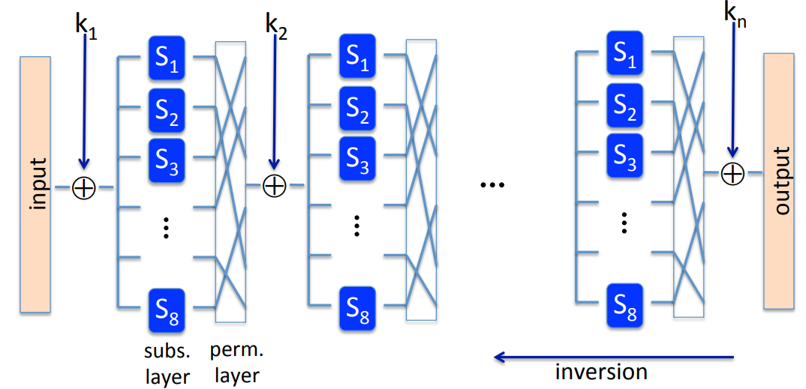
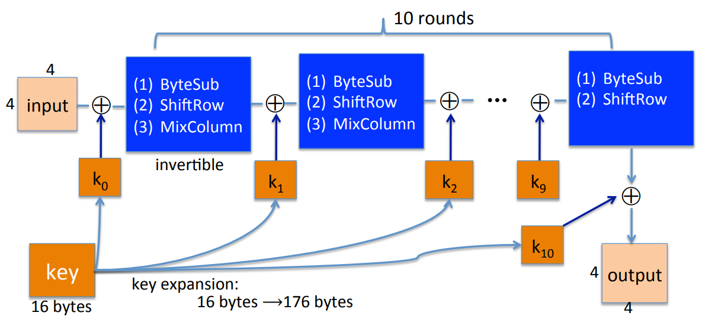
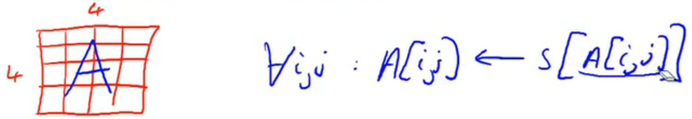
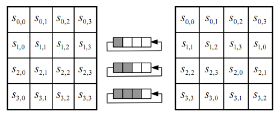
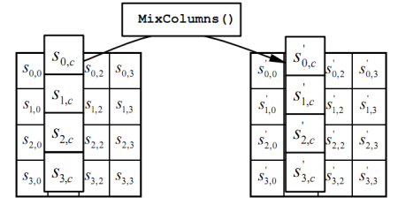

# AES 

The key size if 128 bits and it has three possible key sizes: 128, 192, 256. The assumption is that the larger the key size is, the more secure the block cipher is, and the slower the cipher becomes.

## Substitution Permutation Network

In every round of the substitution permutation network, where the first thing we do is we XOR the current state with a round key. Then we go through a substitution layer, where blocks of data are replaced with other blocks based on what the substitution table says. Then go through a permutation layer where bits are permuted and shuffled around. In fact, every step in this network needs to be reversible, so that the whole thing is reversible.

AES operates on a 128 bit block which is 16 bytes. What we do with AES is we write those sixteen bytes as a $4 \times 4$ matrix. Each cell is the matrix contains one byte. Then we start with the first round. So we XOR with the first round key and then apply a certain function which includes substitutions and permutations and other operations on the state. We do it 10 times, and in the last round, the mix column step is actually missing. And finally, we XOR with the last round key and outcomes the output. The long key themselves come from a sixteen byte AES key using key expansion.

### ByteSub

The way byte substitution works is that is' one S box containing 256 bytes. What it does is it applies the S box to every byte in the current state. In other words, the current state is a $4 \times 4$ table. And to each element in this table, we apply the S box.

### ShiftRows

It is just a permuation.

### MixColumns

We apply a linear transformation to each one of these columns. So there's a certain matrix that multiplies each one of there columns and it becomes the next column.

