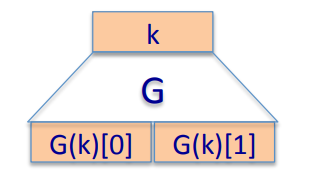
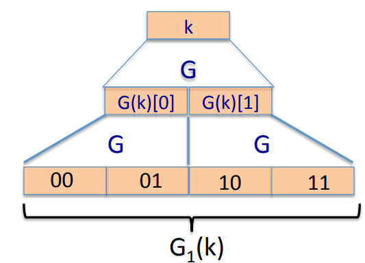
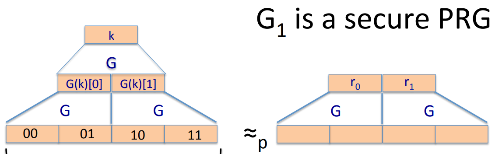
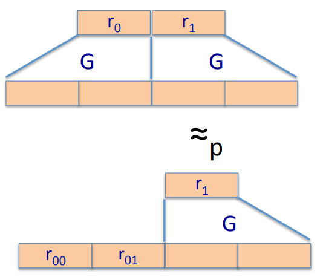
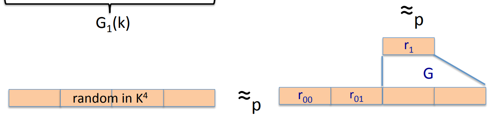
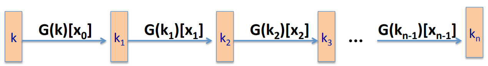

# Block Cipher from PRGs

## Can we build a PRF from a PRG?

Let $G: K \to K^2$ be secure PRG.  The security of this PRG means that the output is indistinguishable from a random element.

Define 1-bit PRF $F: K \times \{0, 1\} \to K$ as $F(k, x \in \{0, 1\}) = G(k)[x]$.

**Theorem:** If $G$ is a secure PRG then $F$ is a secure PRF.

Define $G_1: K \to K^4$ as $G_1(k) = G(G(k)[0]) \; || \; G(G(k)[1])$.  And we get  a 2-bit PRF:
$$
F(k, x \in \{0, 1\}^2) = G_1(k)[x]
$$

$G_1$ is a secure PRG.

**Proof**: We know that the generator is a secure generator, therefor in fact the output of the first level is indistinguishable from random. In other words, if we replace the first level by truly random strings, these two are truly random picked in the key space, then no efficient adversary should be able to distinguish these two distributions. In fact, if you could distinguish these two distributions, it's easy to show that you would break the original PRG. So we might as well just put random there, and no efficient adversary can distinguish the resulting two distributions.

Now we can do the same thing again to the left hand size. In other words, we can replace these two pseudo random outputs, by truly random outputs. And finally we're gonna do this one last time. We're gonna replace the right hand size by a truly random pair, and we get a distribution that is really made of 4 independent blocks.

**Extending more**: Let $G: K \to K^2$, define PRF $F: K \times \{0, 1\}^n \to K$ as for input $x =x_0 x_1...x_n \in \{0, 1\}^n$ do:

Can we build a secure PRP from a secure PRG? Yes, if you use this PRF in three rounds of a Feistel network, what you end up with is a secure PRP.