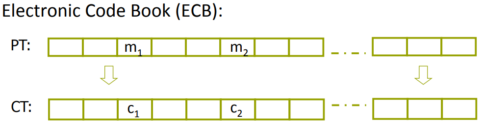
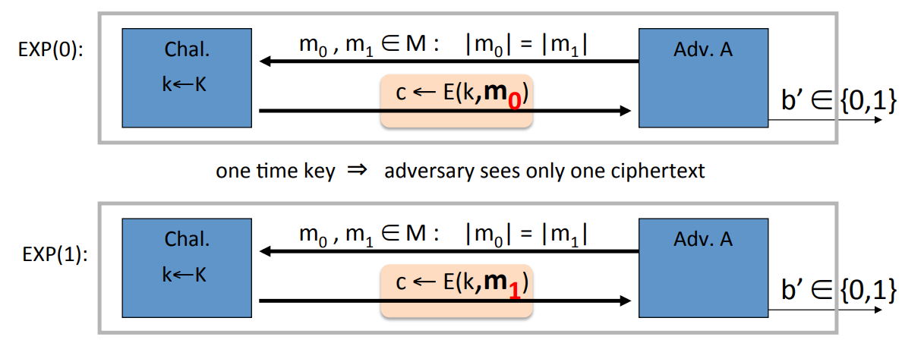
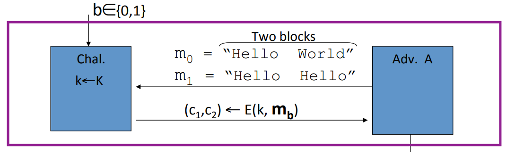
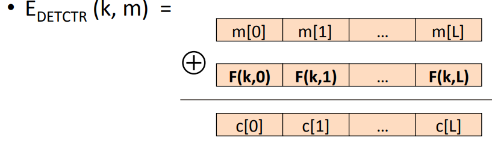
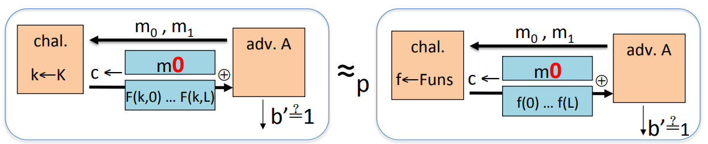
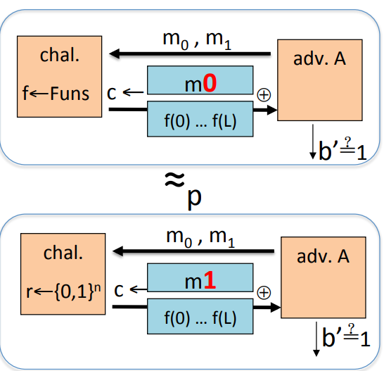
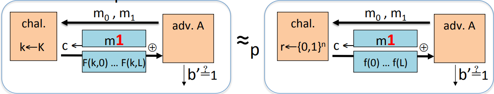
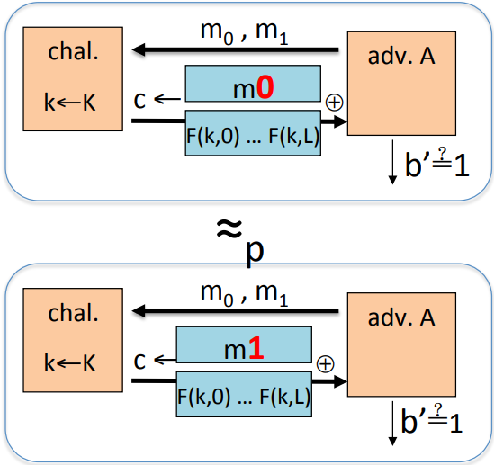

# One Time Key

**Adversary's power:** Adv sees only one ciphertext.

**Adversary's goal**: Learn infomation about PT from CT(break semantic security).

## Incorrect Use of a PRP

### Electronic Code Book

We take out message, break it into blocks, each block as big as the block's cipher block. Then we encrypt each block separately. So the problem is that if two blocks are equal, then the resulting ciphertest is also going to be equal. So an attacker who looks at the ciphertext, even though he might now know what's actually written in these blocks, we'll know that these two blocks are equal.

How to correctly use block ciphers to encrypt long messages?

## Semantic Security(one -time key)

The adversary outputs two messages, $m_0$ and $m_1$, and then he gets either the encryption of $m_0$ or the encryption of $m_1$. These are two different experiments. Out goal is that the adversary can't distinguish between these two experiments $Adv_{ss}[A, OTP] = |Pr[EXP(0) = 1] - Pr[EXP(1) = 1] \leq \epsilon$.

## ECB is not Semantically Secure

Suppose we're the adversary, so we would output two messages $m_0 =$ "Hello World​" and $m_1 = $ "Hello Hello". The challenger is going to encrypt either $m_0$ or $m_1$. Either way we are gonna get two blocks back. So the cipher text contains two blocks. The first block is going to be an encryption of the world "Hello" and the second block is gonna be either an encryption of the world "Hello" or the word "World". And if the two cipher text blocks are the same, then the adversary knows that he received an encryption of the message "Hello Hello" and as a difference he knows he received an encryption of the message "Hello World" .

## Deterministic Counter Mode

In a deterministic counter mode, we build a stream cipher out of the block cipher. Suppose we have a PRF $F$. We could think of AES when we say PRF. We'll evaluate AES at the point $0, 1,...., L$. This will generate a pseudo random pad. And we will XOR that with all the message blocks and recover the ciphertext as a result.

**Theorem:** For any $L \gt 0$, if F is a secure PRF over (K, X, X) then $E_{DETCTR}$ is  semantically secure cipher over $(K, X^L, X^L)$. Inparticular, for any efficient adversary $A$ attacking $E_{DETCTR}$, there exists an efficient PRF adversary $B$ such that(reference to [semantic_security](9_Semantic Security.md)):
$$
Adv_{SS}[A, E_{DETCTR}] = 2 \cdot Adv_{PRF}[B, F]
$$
**Proof**: When the adversary is given the encryption of the message $m_0$ and $m_1$. We wanna argue these two distributions are computationally indistinguishable. If instead of a PRF, we use a trully random function. Then because of the PRF, the adversary cannot distinguish these two experiments. A PRF is indistinguishable from a truly random function, therefore when we replace the PRF with a trully random function, the adversary is going to behave the same.

Because $f$ is truly random function, the pad here is a truly one time pad, and therefore no adversary can distinguish an encryption of $m_0$ from an encryption of $m_1$ under the one time pad. So the following two distributions are the same.

And similarly again when we go back from a truly ranfom function to a PRF, because the PRF is secure, the adversary can't distinguish these two following distribution.

So we have proven that the distribution of these two encryption of the message $m_0$ and $m_1$ under pseudo random function is computationally indistinguishable.

