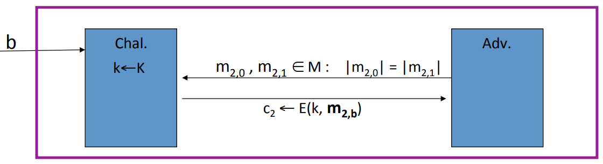

# Security for Many-Time Key

## Semantic Security for Many-Time Key

**Adversary's Power**: Chosen-PlainText Attack(CPA). In other words, the adversary can obtain the encryption of arbitrary messages of his choice.

**Adversary's Goal**: Break sematic security.

The challenger is gonna choose a random key $k$. And now the adversary gets to query the challenger. The adversary begins by submitting a semantic security query, namely, he submits two messages $m_{1, 0}$ and $m_{1, 1}$ with the same length. Then the adversary receives the encryption of oen of those messages, either of $m_{1,0}$ or of $m_{1, 1}$. In experiment 0, he receives the encryption of $m_{1,0}$ and in experiment 1, he receives the encryption of $m_1$.

The adversary can now repeat this query again.

In fact, he can issue up to Q queries of this type.

The adversary's goal is whether he's in experiment 0 or in experiment 1. In other words, whether he was constantly receiving the encryption of the left message or the encryption of the right message. Now the chosen plain text attack is captured by the fact that if the attacker wants the encryption of a particular message $m$. What he could do is use query J, where in this query $J$, he'll set both the $m_{j, 0}$ and $m_{j, 1}$ is the same $c = E(k, m)$. So this is exactly what we meant by a CPA, where the adversary can submit a message $m$ and receive the encryption of $m$ of his choice. If for all efficient adversaries, they cannot distinguish the experiment 0 from experiment 1, then E is semantic security under CPA.

## Ciphers Insecure under CPA

Deterministic counter mode or the one time pad are insecure under a chosen plain text attack.

Suppose we have an encryption scheme that always outputs the same cipher text for a particular message $m$. In other words, if I ask the encryption scheme to encrypt the message $m$. And then I ask the encryption scheme to encrypt the message $m$ again. If In both cases, the encryption scheme outputs the same cypher text, then that system cannot possibly be secure under a chosen plain text attack.

The attacker is gonna to output the same message $m_0$ twice. Then the attacker is given $c_0$ which is the encryption of $m_0$. So this was his chosen plain text query where he actually received the encryption of the message $m_0$ of his choice. And now he's going to break the semantic security. So what he does is he outputs two messages, $m_0$ and $m_1$ of the same length, and he's going to be given the encryption of $m_b$. Therefore, if $b = 0$, then $c = c_0$. As a result, his advantage in winning this game is 1. Meaning that the system can't be possibly be CPA secure.

## Randomized Encryption

The encryption algorithm itself is going to choose some random string during the encryption process and it is going to encrypt the message $m$ using that random string. In other words, a particular message, for example $m_0$, isn't just going to be mapped to one cipher text, but it's going to be mapped to a whole ball of cipher texts. Where on every encryption, we output 1 point in this ball. In this way, since the encryption algorithm uses randomness, if we encrypt the same message twice, with high probability we'll get different ciphertext. Unfortunately this means that the cipher text necessarily has to be longer than the plain text because somehow the randomness that was used to generate the cipher text is now encoded somehow in the cipher text(Roughly speaking: CT-Size = PT-Size + "the number of random bits").

## Nonce-Based Encryption

In a nonce based encryption system, the encryption algorithm actually takes 3 inputs rather than 2. As usual it takes the key and the message. Bu it also takes an additional input called a nonce. And similarly, the decryption algorithm also takes the nonce as input, and then produces the resulting decrypted plain text. This nonce is a public value, the only requirement is that the pair $(k, n)$ is only used to encrypt a single message. There are two ways to change it. One way to change it is by choosing a new random key for every message. And the other way is to keep using the same key all the time but then we must choose a new nonce for every message.

**Nonce is a counter**: The simplest option is simply to make the nonce be a counter.

**Pick nonce at random**: Assuming the nonce space is sufficiently large so that with high probability the nonce will never repeat for the life of the key.

### CPA security for nonce-based encryption

System should be secure when nonces are chosen adversarially.

The attacker gets to submit pairs of message $m_{i, 0}$ and $m_{i, 1}$ with the same length. And he gets to supply the nonce. In response, the adversary is given the encryption of either $ m_{i,0} $  or $ m_{i, 1} $. The adversary's gol is to tell whether he was given the encryption of the left plain text or the right plain text. As before, the adversary gets to iterate these queries and he can issue as many queries as he wants, we usually let $q$ denote the number of queries that the adversary issues. Although the adversary gets to choose the nonces, he's restricted to choosing distinct nonces. The reason we force hime to choose distinct nonces is because that's the requirement in practice. Even if the adversary fools Alice into encrypting multiple messages for him, Alice will never use the same nonce. As a result, the adversary will never see messages encrypted using the same nonces. And therefore, even in the game, we require that all nonce be distinct. And then as usual, we say that the system is a nonce based encryption that's semantically secure under a chosen plain text attack if the adversary cannot distinguish experiment 0 from experiment 1.

**Example:** Let $F: K \times R \to M$ be a secure PRF. Let $r = 0$ initially. For $m \in M$ define $E(k, m) = [r++, output (r, F(k, r) \oplus m)]$. Is E CPA secure nonce-based encryption? Yes, but only if $R$ is large enough so r never repeats.

**Proof**: Because the PRF is secure, we know that this encryption system is indistinguishable from using a truly random function. In other words, if we apply a truly random function to the counter and XOR the results with the plain text $m$. But now, since the nonce $r$ never repeats, every time we compute this $f(r)$, we get a truly random uniform and independent string so that we're actually encrypting every message using the one time pad. And as a result, all the adversary gets to see in both experiments are basically just a pair of random strings. So both the experiment 0 and experiment 1, the adversary gets to see exactly the same distribution. 
$$
E(k, m) = [r, F(k, r) \oplus m] \approx (r, f(r) \oplus m)
$$

