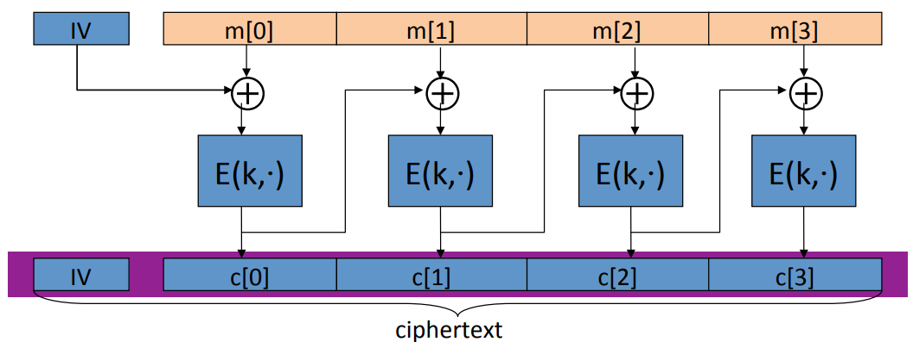
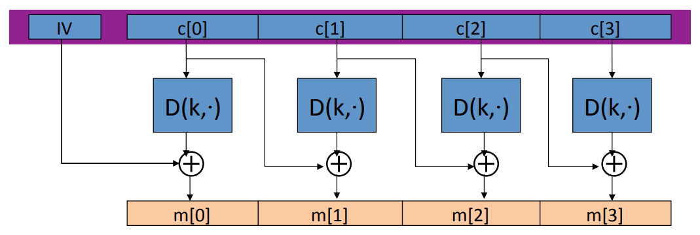
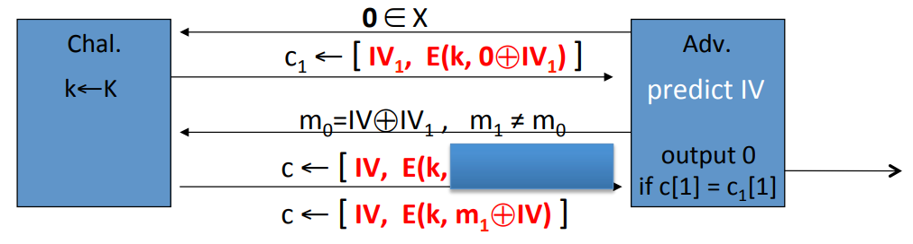
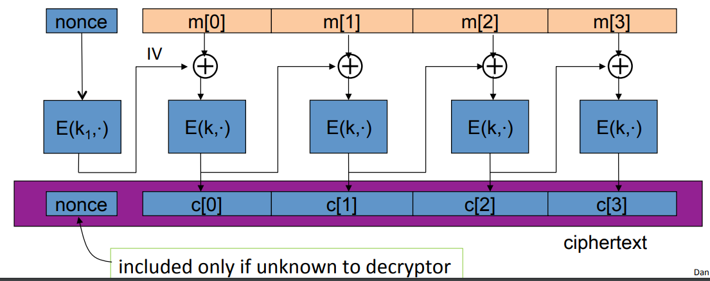

# CBC

Cipher block chaining is a way of using a block cipher to get chosen plaintext security. Suppose we have a cipher$(E, D)$,  when encrypt the message $m$, the encryption algorithm is going to choose a random $IV$ that's exacty one block of the block cipher. So $IV$ is one cypher block. So in the case of AES, the $IV$ would be 16 bytes. And then we're gonna run through the algorithm, the $IV$ is gonna be XORed to the first plain text block. And then the result is gonna be encrypted using the block cipher and output of the first block of the ciphertext. Then we use the first block of cipher text to XOR the second block of the plaintext. And the encryption of that becomes the second ciphertext block. And the final ciphertext is going to be the $IV$ that we chose along with all the ciphertext blocks.

How do we decrypt the results of CBC encryption?

Given the first ciphertext block, the decryption is almost the same with encryption except the XOR is on the bottom, instead of top.

## CPA Analysis

**Theorem**: For any $L \gt 0$, if E is a secure PRP over $(K, X)$, then $E_{CBC}$ is a semantic security under CPA over $(K, X^L, X^{L+1})$. In particular, for a q-query adversary $A$ attacking $E_{CBC}$, there exists a PRP adversary $B$ such that:
$$
Adv_{CPA}[A, E_{CBC}] \leq 2 \cdot Adv_{PRP}[B, E] + 2q^2L^2 / |X|
$$
NOTE: CBC is only secure as long as $q^2L^2 << |X|$. $L$ is the length of the messages that we're encrypting. $q$ is the number of ciphertexts that the adversary gets to see under the CPA attack. But in real like, $q$ is the number of times that we have used the key K to encrypt messages.

Suppose we want the adversary's advantage to be less than $\frac{1}{2^{32}}$. This means that $q^2L^2 / |x|$ had better be less than $\frac{1}{2^{32}}$. For AES, $|X| = 2^{128}$, then $qL \lt 2^{48}$. This means that after we use a particular key to encrypt $2^{48}$ blocks, we have to change the key.

3DES has much a shorter block $|X| = 2^{64}$, then $qL \lt 2^{16}$. What this means is having to replace the key after encrypting about $1/2$MB data.

## Attack On CBC 

Suppose that given a encryption in a message that attacker can actually predict that $IV$ which will be used for the next message. The first thing the adversary is going to do is to ask for the encryption of a one block message. In particular that one block is going to be 0. So what the adversary then gets back is the encryption of the message 0 $c_1 = [IV_1, E(k, 0 \oplus IV_1)]$. Next the adversary is going to issue his semantic security challenge and the message $m_0$ is going to be $IV_1 \oplus IV$, where $IV$ is the predicted initial value, message $m_1 \neq m_0$. When the adversary receives the encryption of $m_0$,  he is actually receiving the block cipher encryption of $IV_1$ which is the same as the encryption of 0. So the advantage of this adversary is going to be 1.

## Nonce-based CBC

In this mode, the $IV$ is replaced by non random but unique nonce, for example $1, 2,..., 5$ could all be used as a nonce. Then we're going to use $k_1$ to encrypt the nonce and use $k$ to encrypt the message block.

If you just directly use the nonce in CBC encryption. In other words, use the nonce as the $IV$. Then the non-random nonce would not be CPA secure. And if $k = k_1$, that is also not gonna be CPA secure and can lead to significant attacks.

## Padding

What to do when the message is not a multiple of the block cipher block length? And the answer is if we add a pad to the last block so it becomes as long as sixteen bytes, as long as the AES block size. A pad with $n$ bytes, then what you do is write the number $n$, $n$ times. When the decrypter receives the message, what he does is he looks at the last byte of the last block. Suppose that value is 5, then he removes the last 5 bytes. Now the question is what do we do if in fact the message is a multiple of 16 bytes? We still add a dummy block that's contains 16 bytes, each one contain the number 16.