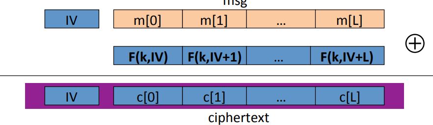
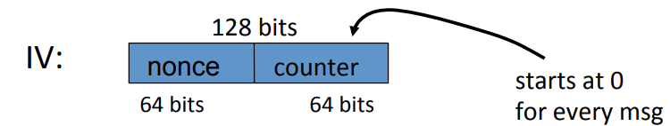
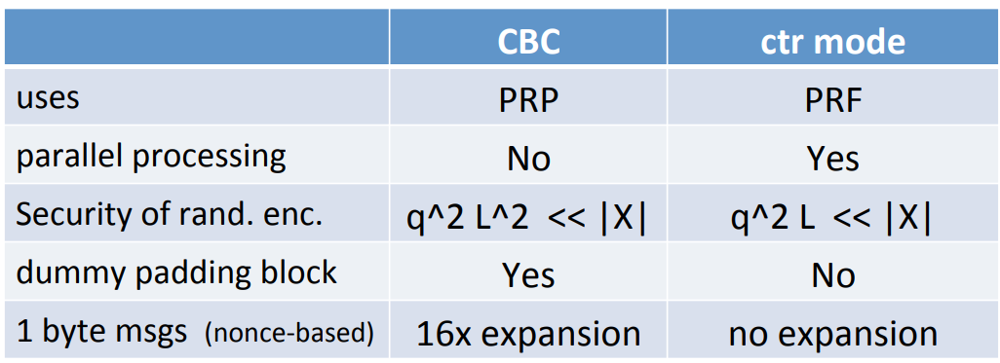

# CTR

Unlike CBC, randomized counter mode uses a secure PRF. It's enough for counter mode to just use a PRF because we're never going to be inverting this function $f: K \times \{0, 1\}^n \to \{0, 1\}^n $. The way the encryption algorithm works in counter mode is it starts off by choosing a random $IV$, then we start counting. The first encryption is of $IV$ then $IV+1$ up to $IV + L$. So we generate this random pad. We XOR the result with the message, and that gives us the cipher text.

## Nonce-Base CTR

The $IV$ is not truly random, but rather, is just a nonce which could be a counter. You can split the $IV$ in two. The left 64 bits as the nonce, so the counter say would count from 0 to $2^{64}$. The right 64 bits would be doing the counting inside of the counter modes encryption. The only restriction is that you encrypt at most $2^{64}$ blocks using one particular nonce.

## CPA Analysis

**Theorem**: For any $L \gt 0$, if $F$ is a secure PRF over $(K, X, X)$ then $E_{CTR}$ is a semantic security under CPA over $(K, X^L, X^{L+1})$. In particular, for a q-query adversary $A$ attacking $E_{CTR}$ there exists a PRF adversary $B$ such that:
$$
Adv_{CPA}[A, E_{CTR}] \leq 2 \cdot Adv_{PRF}[B, F] + 2q^2L/|X|
$$
Note: CTR-mode only secure as long as $q^L << |X|$. Where $q$ is the number of messages encrypted under a particular key. And $L$ is the maximum length of those messages.

Suppose we want the adversary's advantage to be $\frac{1}{2^{32}}$. So for AES, $|X| = 2^{128}$, then $qL^{1/2} \lt 2^{48}$. As a result, if you're encrypting messages that have $2^{32}$ blocks, you have to replace your secret key.

## CTR VS CBC

