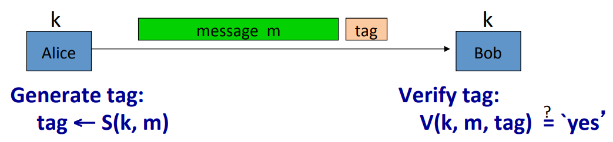
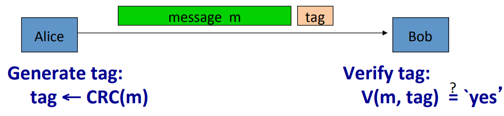
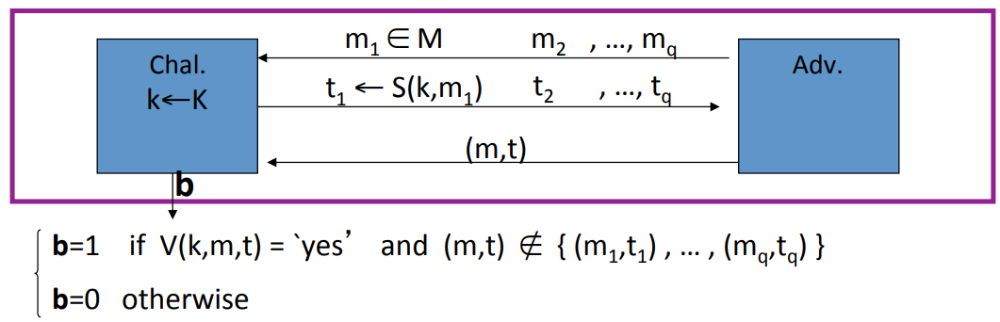
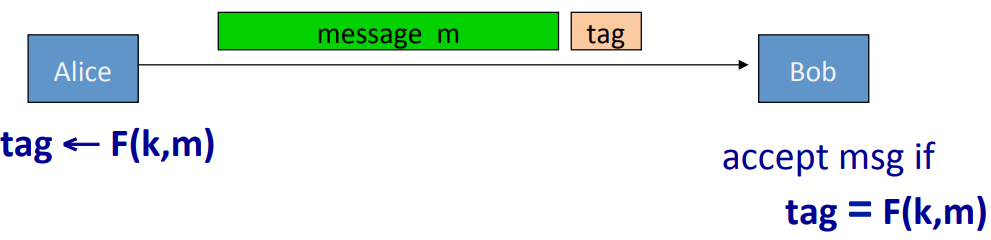
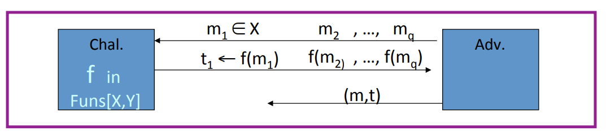

# MAC(Message Authentication Code)

**Goal**: Provide integrity without any confidentiality.

Alice and Bob have a shared key $K$, which is not known to the attacker, but known to both of them. Alice use MAC signing algorithm$S$ which takes as input the key and the message to produces a short tag. Then, she appends the tag to the message and sends the combination of the two to Bob. Bob receives the message and tag. And then he runs what's called a MAC verification algorithm $V$ on this tag. So the MAC verification algorithm takes as input the key, the message, and the tag and it outputs yes or no depending on whether the message is valid or whether it's been tampered with.

**Definition**: The MAC consists of two algorithms, a signing algorithm and a verification algorithm($I = (S, V)$). As usual, they're defined over a key space, a message space, and a tag space($K, M, T$).  The only requirement is that for every $k$ in the key space and for every message $m$ in the message space, if I sign a message using a particular key and then I verify the tag using the same key, I shall get yes in response.

## Integrity Requires a Secret Key

So consider CRC. Instead of using a key to generate the tag, Alice uses a CRC algorithm which is keyless. Doesn't take any key to generate a tag. And then she appends this tag to the message. She sends it over to Bob. Bob will verify that the CRC is still correct. In other words, Bob will still verify the tag is equal to CRC($m$). The problem with this is this is very easy for attacker to defeat. In other words, an attacker can very easily modify the message and fool Bob into thinking that the new message is a valid one. The way the attacker will do it is he'll cancel the message in the tag. He'll simply produce his own message $m'$ and compute his own CRC on $m'$. And then send the concatenation of the two over to Bob. Bob will run the verification algorithm, verification will work properly because $CRC(m')$ is a valid CRC. And as a result, Bob would think that this message came from Alice but in fact it's been completely modified by the attacker and had nothing to do with the original message that Alice sent.

## Secure MACs

**Attacker's Goal**: Existential forgery. Produce some new valid message/tag pair (m, t).

**Attacker's Power**: Chosen message attack. For $m_1, ..., m_q$ attacker is given $t_i \leftarrow S(k, m_i)$.

**Secure MACs' Goal:**

* Attacker cannot produce a valid tag for a new message.
* Given $(m, t)$, attacker cannot even produce $(m, t')$ for $t \neq t'$.

Let's define it as usual using a more precise game. We have two algorithms $S$ and $V$, and we have an adversary $A$, and the game proceeds as follows. The challenger as usual just chooses a random key for the MAC and the adversary does his chosen message attack. So he submits $m_1$ to the challenger and receives the tag on that message $m_1$. Then he submits $m_2$ to the challenger and receives a tag on $m_2$. He can submit $q$ messages to the adversary and receives $q$ tags on all those messages. Then the adversary goes ahead and tries to do an existential forgery. Namely, he outputs a message tag pair, a new message tag. We say that he wins the game, in other words $b = 1$ means that he wins the game if the message tag pair is a valid message tag pair. In other words we say that the attacker lost the game, namely $b = 0$. We define the advantage of an adversary as the probability that the challenger outputs 1 in this game. We say that the MAC system is secure if for all efficient adversaries, the advantage is negligible. In other words, no efficient adversary can win this game with non negligible probability.

### Example

1.Let $(S, V)$ be a MAC. Suppose an attacker is able to find $m_0 \neq m_1$ such that $S(k, m_0) = S(k, m_1)$ for $1/2$ of the keys in $K$. Can this MAC be secure? No, the attacker can ask for the tag on the message $m_0$, then he will receive $(m_0, t)$ from the challenger and in fact $t$ would be a valid tag for message $m_0$ and then what he would output as his existential forgery is $(m_1, t)$. And as a result, the attacker wins the game with advantage $1/2$. So we conclue that this MAC is not secure.

2.Let $(S, V)$ be a MAC. Suppose $S(k, m)$ is always 5 bits long. Can this MAC be secure? No, because the attacker can simply guess the tag, so what he would do is he wouldn't ask any chosen message attacks. All he would do is he would output an existential forgery as follows. He would just choose a random tag. So choose a random tag $t$ at random in $\{0, 1\}^5$. And then he would just output his existential forgery ($m_0, t$). And now with probability of $\frac{1}{2^5}$, this tag will be a valid tag for the $m_0$. And so the adversary's advantage is $1/32$.

## MACs Based on PRFs

For a PRF $F: K \times X \to Y$, define a MAC $I_F = (S, V)$ as: $S(k, m) = F(k, m)$, $V(k, m, t)$ output yes if $t = F(k, m)$ and no otherwise.

### Security

**Theorem**: If $F: K \times X \to Y$ is a secure PRF and $1/|Y|$ is negligible then $I_F$ is a secure MAC. In particular, for every efficient MAC adversary $A$ attacking $I_F$, there exists an efficient PRF adversary $B$ attacking F such that
$$
Adv_{MAC}[A, I_F] \leq Adv_PRF[B, F] + 1/|Y|
$$
$I_F$ is secure as long as $|Y|$ is large, for example $|Y| = 2^{80}$.

**Proof**: Suppose $f: X \to Y$ is a truly random function. Then MAC adversary $A$ must win the following game. The adversary give a message $m_1$ to the challenger. What he gets back is tag which just happens to be the function evaluated at the point $m_1$. And then the adversary gets to choose a message $m_2$ and he obtains the tag from $m_2$. And he can choose messages $m_3,...,m_q$ and obtains all the corresponding tags. Now his goal is produce a message tag pair $(m, t), m \notin \{m_1, ..., m_q\}$. And $A$ wins if $t = f(m)$. However, for a truly random function, the value of the function at $m$ is independent of its value at the points $m_1$ to $m_q$. So the best the adversary can do at predicting the value of the function at the point $m$ is just guess the value. Because he has no information about $f$ of $m$. And as a result, his advantage of this adversary is $1/|Y|$. In other words, the tag that he produced will be correct with probability exactly $1/|Y|$. Because the function $F(k, x)$ is a pseudo random function, the adversary is gonna behave the same whether we give him the truly random function or the pseudo random function. The adversary can't tell the difference and as a result even if we use a pseudo random function, the adversary is gonna have advantages at most $1/|Y|$ in winning the game.

**Examples**: A MAC for 16-byte messages.

How to convert Small-MAC into a Big-MAC? Two main constructions used in practice: CBC-MAC, HMAC.

### Truncating MACs based on PRFs

**Lemma**: Suppose $F: K \times X \to \{0, 1\}^n$ is a secure PRF. Then so is $F_t(k, m) = F(k, m)[1...t]$ for all $1 \leq t \leq n$.

If $(S, V)$ is a MAC based on a secure PRF outputting n-bit tags, the truncated MAC outputting w bits is secure as long as $1/2^w$ is still negligible.