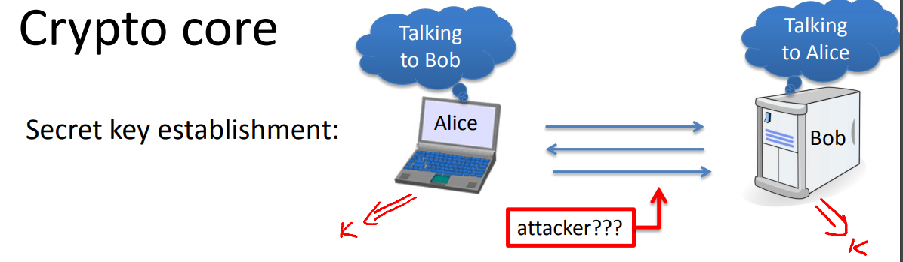
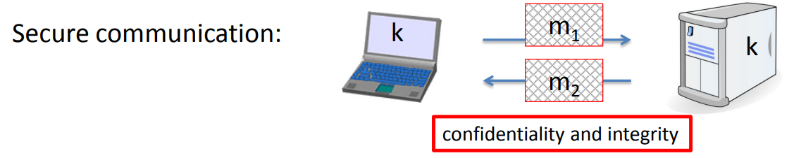
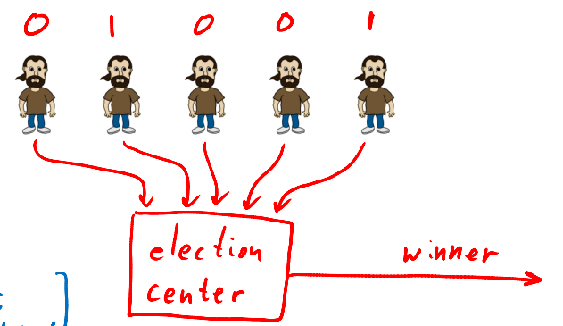
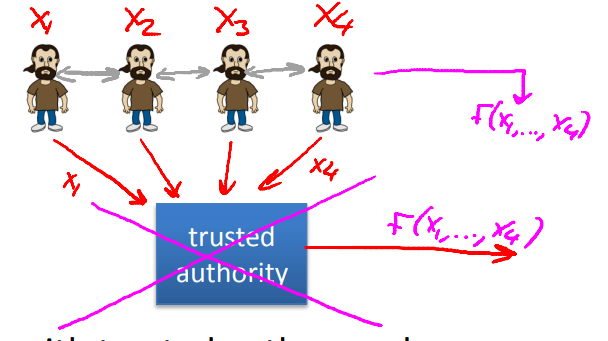

# What is cryptography

## Crypto core

**secret key establishment**: key establishment essentially amounts to Alice and Bob sending messages to one another such that at the end of this protocol, there's a shared key that they both agree on, shared key K, and beyond that, Alice would know that she's talking to Bob and Bob would know that he's talking to Alice. But a poor attacker who listens in on this conversation has no idea what the shared key is.

**secure communication**: an attacker can't figure out what messages are being sent back and forth, furthermore, an attacker cannot even tamper with this traffic without being detected.

## Crypto can do much more

**Digital signatures**: making the digital signature via function of the content being signed.

**Anomymous communication**: Alice sends her messages to Bob through a sequence of proxies, these messages get encrypted and decrypted appropriately so that Bob has no idea who he talked to and the proxies themselves don't even know that Alice is talking to Bob.

## Protocols

### Elections

Each party send the encryption of their votes to the election center, in such a way that at the end of the election, the election center is able to compute and output the winner of the election. However, othen than the winner of the election, nothing else is revealed about the individual votes. The individual votes otherwise remain completely private.

### Private auctions

Every bidder has his own bid that he wants to bid. We'd like to do is enable the participants to figure out who the highest bidder is and how much he's supposed to pay, but other than that, all other information about the individual bids should remain secret. For example, the actual amount that the highest bidder bid should remain secret. The only thing that should become public is the second highest bid and the identity of the highest bidder.

### Secure multi-party computation

> There is a very central theorem in crypto. That says that any computation you'd like to do, any function F you'd like to compute, that you can compute with a trusted authority, you can also do without a trusted authority.

The participants have a secret inputs. Then what they would like to do is compute some sort of a function of their inputs. So, in the case of an election, the inputs would be the votes, the function is a majority; In the case of an auction, the inputs would be the secret bids, the function happens to be the second highest, largest number.  What the parties are gonna do, is they're gonna talk to one another using some protocol. Such that at the end of the protocol all of a sudden the value of the function becomes known to everybody. And yet nothing other than the value of the function revealed.

## A rigorous science

Modern cryptography is a very scuebce. And in fact, every concept we're gonna describe is gonna follow three very rigorous steps:

* Precisely specify threat model: For example, we're gonna define exactly what does it mean for a signature to be unforgeable.
* Propose a construction.
* Prove that breaking construction under threat mode will solve an underlying hard problem.