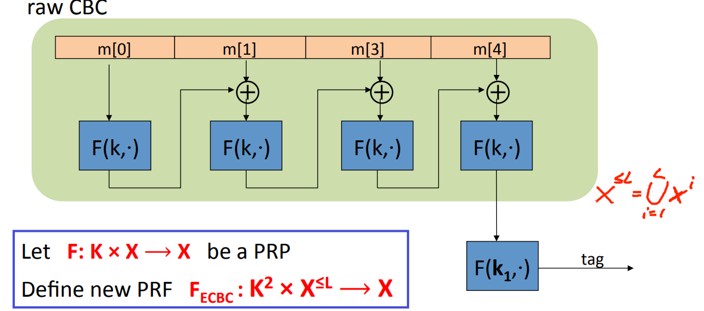
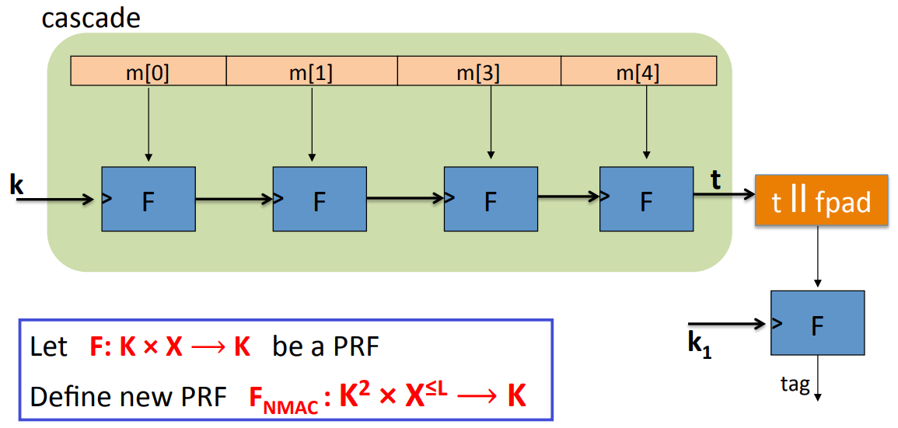

# CBC-MAC and NAMC

**Goal**: Given a PRF for short messages(AES) construct a PRF for long messages.

## CBC-MAC(ECBC)

Let $F: K \times X \to X$ be a PRP. Define new PRF $F_{ECBC}: K^2 \times X^{\leq L} \to X$.

ECBC uses a PRF that takes messages in the set $X = \{0, 1\}^n$ and outputs messages in the same set $X$. And what we're going to building is a PRF that takes pairs of keys and messages(the length of messages up to L blocks) and also outputs tag in $X$.

We start by taking messages and breaking it into blocks, each block is as long as a block of the underlying function $f$. And then run through the CBC chain except that we don't output intermediate values. We just encrypt the first block and then feed the results into the XOR with the second block and then feed that into $f$ again. Finally we get a value, which is called the CBC outputs of this long chain. Then infact we do one more encryption step. This step is done using an independent key $k_1$, which is different and chosen independently of the key $k$. And finally the output gives us the tag.

The function that's defined without this last encryption step is called the raw CBC function. Raw CBC is not a secure MAC.

Suppose the attacker is given the raw CBC value for a particular message $m$. And now, the attacker wants to extend and compute the MAC on some message $ m || w $. The attacker can break the security of MAC by using the chosen message attack. In the attack, the adversary is going to start by requesting the tag on a particular message $m$ that's a one-block. Then the adversary can get the tag $t = F(k, m)$. And now I claim that he can define his message $m || (m \oplus t)$ which contains two blocks. The first block is $m$, and the second block is $t \oplus m$. And I claim that the value $t$ that he just received is a valid tag for this two block message.
$$
t = F(k, m) \\
F(k, (m || (m \oplus t))) = F(k, F(k, m) \oplus (m\oplus t)) = F(k, m)
$$

## Nested MAC(NMAC)

Let $F: K \times X \to K$ be a PRF. Define new PRF $F_{NMAC}: K^2 \times X^{\leq L} \to K$.

The NMAC starts from PRF, as before, takes inputs in $X$, but outputs elements in the key space $K$. And remember that for CBC, the output has to be in $X$. Here, the output needs to be in the key space $K$. And again, we obtain the PRF $F_{NMAC}$ which takes pairs of keys as inputs. Again, it can process variable length messages up to $L$ blocks. And the output is an element in the key space $K$.

We take out message, and break it into blocks. Each block is as big as the block length of the underlying PRF. And now we take our key and we feed our key as the key input into the function $F$. And the message block is given as the data input into the function $F$. What comes out is the key for the next block of NMAC​. The final output is gonna be an element  $t$in $K$. Then what we do is need to map this element $t$ into the set $X$. What we do is we simply append fixed pad. fpad is called a fixed pad that gets appended to this tag $t$. And then we feed the element into $F$ again. There's an independent key $k_1$ that's being used for the last encryption step. The last tag is an element of $K$ which we output as the output of the  NMAC.

The function that's defined without last encryption step is called a cascade. Cascade is not secure MAC.

The reason is that if you're given the output of the cascade function applied to a message $m$. I can derive from it the cascade applied to the message $m || w$ for any message $w$.

## Analysis

**Theorem**: For any $L \gt 0$, for every efficient $q-$query PRF adversary $A$ attacking $F_{ECBC}$ or $F_{NMAC}$, there exists an efficient adversary $B$ such that:
$$
Adv_{PRF}[A, F_{ECBC}] \leq Adv_{PRP}[B, F] + 2q^2/|X| \\
Adv_{PRF}[A, F_{NMAC}] \leq q \cdot L \cdot Adv_{PRF}[B, F] + q^2/2|K|
$$
Note: CBC-MAC is secure as long as $q << |X|^{1/2}$. HMAC is secure as long as $q << |K|^{1/2}$. Where $q$ is the number of messages that are MACed with particular key.

Suppose the adversary has an advantage of less than $\frac{1}{2^{32}}$ in distinguishing the PRF from a truly random function. Suppose this is our goal $Adv_{PRF}[A, F_{ECBC} \leq \frac{1}{2^{32}}]$. Then $q^2 / |X| \lt \frac{1}{2^{32}}$. For AES $|X| = 2^{128}$, then $q \lt 2^{48}$. This means that after MACing $2^{48}$ messages, you have to change your key. Otherwise, you won't achieve the security level. For 3DES $|X| = 2^{64}$, then $q \lt 2^{16}$. This means after MACing $2^{16}$ message, you have to change your key.

## Attack

After signing $|X|^{1/2}$ messages with ECBC-MAC or $|K|^{1/2}$ messages with NMAC, the MACs become insecure.

Suppose the underlying PRF $F$ is a PRP(e.g. AES). Then both PRFs(ECBC and NMAC) have the following extension property:
$$
\forall x, y, w: F_{BIG}(k, x) = F_{BIG}(k, y) \to F_{BIG}(k, x||w) = F_{BIG}(k, y||w)
$$
Where $F_{BIG}$ means that it's a PRF for large messages, which is either $F_{ECBC}$ or $F_{NMAC}$.

The attack would work as follows. Suppose I issued $\sqrt{Y}$ chosen message queries. So for AES, the value of $Y$ is $\{0, 1\}^{128}$. So this would mean that I would be asking $2^{64}$ message queries. Well, I'll obtain $2^{64}$ messages MAC pairs. There's a good chance that two of them are the same. So I'm gonna look for two distinct messages $m_u$ and $m_v$ which the corresponding MACs are the same(Birthday Paradox) $t_u = t_v$. And as a result, what I can do is I can extend $m_u$ with arbitrary word $w$ and ask for the tag for the word $m_u || w$. Because $m_u$ and $m_v$ to have the same MAC $t = F_{BIG}(k, m_u || w) = F_{BIG}(k, m_v || w)$, once I konw that the tag for the $m_u || w$, I also the the output for $m_v || w$.