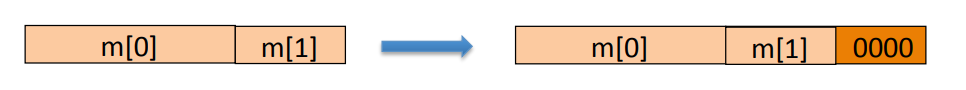
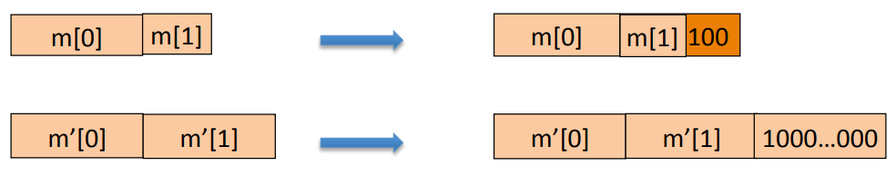
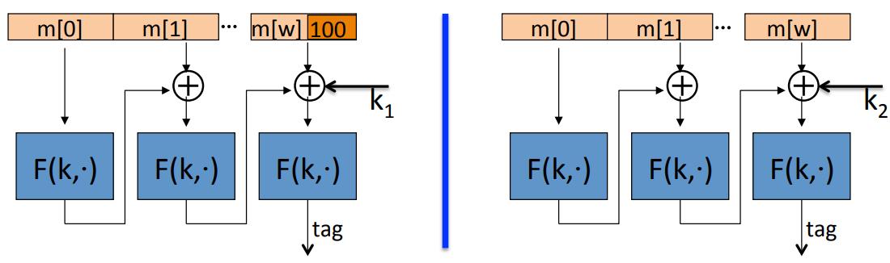

# MAC Padding

## CBC MAC padding

**Bad Idea**: pad m with 0. In other words, we take the last block and just add 0 to it until the last block becomes as long as  one full block size.

Is the resulting MAC secure? No, Because the message $m$ and the message $m || 0$ happen to have exactly the same pad. And as a result, once we plug in both $m$ and $m || 0$ in ECBC, we'll get the same tag out.

For security, padding must be invertible. In other words, it should be the case that two distinct message always map to two distinct padded messages.
$$
m_0 \neq m_1 \to pad(m_0) \neq pad(m_1)
$$
**ISO**: pad with "100...00". Add new dummy block if needed. The "1" indicates beginning of pad.

To see that this padding is invertible, all we do is describe the inversion algorithm which simply is gonna scan the message from right to left, until it hits the first "1" and then it's gonna remove all the bits to the right of this one including the "1".

What do we do if the original length is already the multiple of a block size? In that case, it' really very important that we add an extra dummy block which contains the pad 100. Because if we didn't add the dummy block, the pad would be not invertible.

If there is a padding scheme that never needs to add a dummy block?

## CMAC

CMAC uses thre keys $key = (k, k_1, k_2)$. Sometimes this is called a three key construction. The first key $k$ is used in the CBC algorithm. And then the keys $k_1$ and $k_2$ are used just for the padding scheme at the last block. In the CMAC standard, $k_1$ and $k_2$ are derived from $k$ by some sort of a pseudo random generator. The way CMAC works is as follows.  If the message happens to not be a multiple of a block length, then we append the ISO padding to it. But then we also XOR this last block with a secret key $k_1$. If the message is a multiple of the block length, we don't append anything to it. But we XOR it with a different key $k_2$. So it turns out just by doing that, it's now impossible to apply the extension attacks that we could do on the cascade function and on raw CBC.

