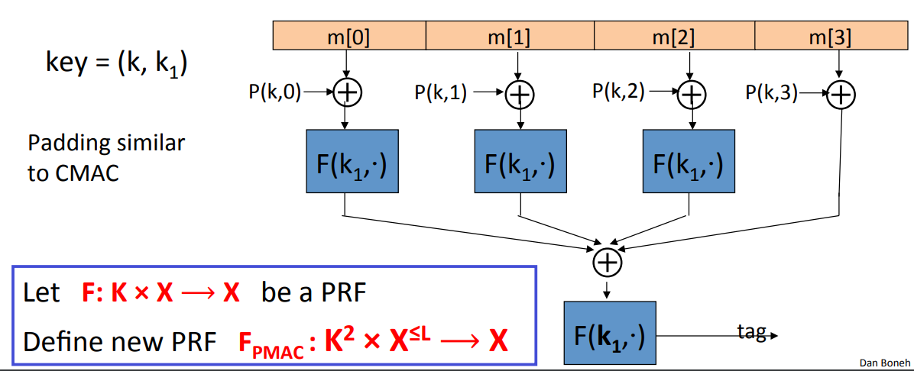
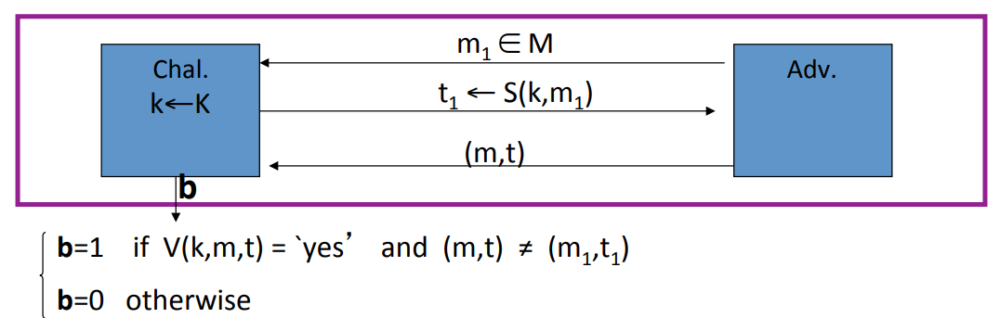

# A Parallel MAC(PMAC)

Let $F: K \times X \to X$ be a PRF. Define new PRF $F_{PMAC}: K^2 \times X^{\leq L} \to X$.

It uses an underlying PRF to construct a PRF for much larger messages. The construction works as follows. We take out message and break it into blocks. And then we process each block independently of the other. So the first thing we do is we evaluate some function $P$ and we XOR the result into the first message block, and then we apply our function $F$ using a key $k_1$. We do the same for each one of the message blocks and we can do it parallel. And we collect all these results into some final XOR and then we encrypt one more time to get the final tag value. Now for a technical reason, actually on the very last one, we don't need to apply the PRF $F$.

What the function $P$ is for and what it does?

Imagine that the function $P$ isn't actually there. Then the resulting MAC is completely insecure and the reason is that no order is enforced between the message blocks. In particular, if I swap two message blocks that doesn't change the value of the final tag. So what this function $P$ tries to do is enforce order on these blocks. And you notice that the function, first of all, it's a keyed function. So it takes a key as input. And second of all, it takes the block number as input. In other words, the value of the function is different for each one of the blocks.

## Analysis

**Theorem**: For any $L \gt 0$, if $F$ is a secure PRF over ($K, X, X$) then $F_{PMAC}$ is a secure PRF over $(K, X^{\leq L}, X)$. For every efficient $q-$query PRF adversary $A$ attacking $F_{PMAC}$, there exists an efficient PRF adversary $B$ such that:
$$
Adv_{PRF}[A, F_{PMAC}] \leq Adv_{PRF}[B, F] + 2q^2L^2 / |X|
$$
Note: PMAC is secure as long as $qL << |X|^{1/2}$. Where $q$ is the number of messages that are MAC-ed using a particular key. And $L$ is the maximum length of all those messages.

## PMAC is incremental

Suppose the function $F$ that's used to construct PMAC is not just a PRF. But, in fact, a permutation, PRP. So we can actually invert it when we need to. Now suppose we've already computed the MAC for a particularly long message $m$. And suppose just 1 message block of $m$ changes. So here, $m[1] \to m'[1]$. But the remaining message blocks all remain the same. It turns out, with PMAC, if we only change 1 block, or a small number of blocks. We can recompute the value of the tag for the new message very quickly.
$$
F^{-1}(k_1, tag) \oplus F(k_1, m[1] \oplus P(k, 1)) \oplus F(k_1, m'[1] \oplus P(k, 1))
$$

## One Time MAC

Imagine we wanna build a MAC that is only used for integrity of a single message. In other words, every time we compute the integrity of a particular message, we also change the key. So that any particular key is used only for integrity of one message.

We define the security game as follows. The attacker only allow to do one chosen message attack. So he gets to submit one message query, and he is given the tag corresponding to that one message query. And now his goal is to forge a message tag pair. We say that a one time MAC is secure because no adversay can win this game.

One-time MAC can be secure against all adversaries and faster than PRF-based MACs.

**Example**: The first step is to pick a prime that's slightly larger than block size. In this case, we're going to use 128-bit blocks, so Let $q$ be $q=2^{128} + 51$. And the key is going to be a pair($key = (k, a)$) of random numbers in the range $[1, q]$. Now we're given a message so we're given a message $msg = (m[1],...,m[L])$. The MAC is defined as follows. The first thing we do is we take our message blocks and construct the polynomial out of them. So if there are $L$ blocks in our message, we're going to construct the polynomial of degree $L$ and the constant term of the polynomial is set to 0 $P_{msg}(x) = m[L] \cdot X^L + ... + m[1] \cdot x$. Then what we do is we take the polynomial that corresponds to the message, we evaluate it at the point $k$ and then add the value $a$.
$$
S(key, msg) = P_{msg}(k) + a \; (mod \; q)
$$
It is a one time secure MAC. Given $S(key, msg_1)$, the adversary has no information about $S(key, msg_2)$.

## Convert One-Time MAC to Many-Time MAC

Let $(S, V)$ be a secure one-time MAC over $(K_I, M, \{0, 1\}^n)$. Let $F: K_F \times \{0, 1\}^n \to \{0, 1\}^n$ be secure PRF. Let's now define a general construction for a MAC. These MACs are called Carter-Wegman MACs that works as follows. We apple the one time MAC to the message $m$ and then we're going to encrypt the results using the PRF. In other words, we choose a random $r$ and then we compute a one time pad from this $r$ by applying the PRF to it. And then we XOR the result with the one time MAC.
$$
CW((k_1, k_2), m) = (r, F(k_1, r) \oplus S(k_2, m)) \; \; \text{for random} r \leftarrow \{0, 1\}^n
$$
**Theorem**: If $(S, V)$ is a secure one-time MAC and $F$ is a secure PRF then $CW$ is a secure MAC outputting tags in $\{0, 1\}^{2n}$.

In WC MAC, nonce $r$ is chosen afresh every time the tag is computed. And so if you try to compute a tag for the same message twice each time, you'll choose a different $r$ and as a result you'll get different tags both times.