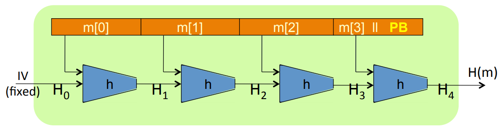
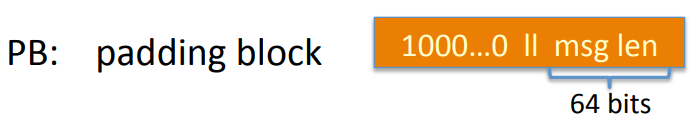
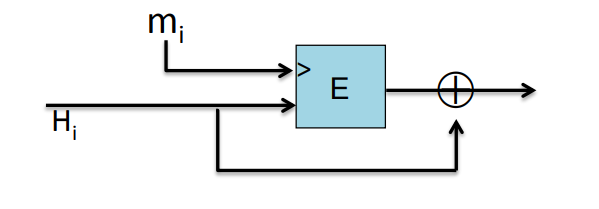
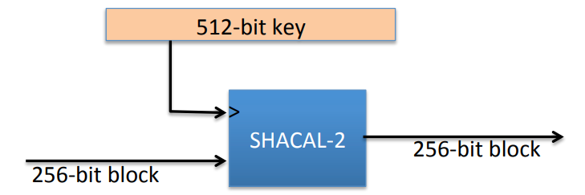

# The Merkle-Damgard Paradigm

**Goal:** Given collision resistance function for short messages, construct collision resistance function for long messages.

Given collision resistant hash function $h: T \times X \to T$ for small sized inputs, we can obtain resistant hash function $H: X^{\leq L} \to T$.

Take a message $M$ and break this message into blocks. And use a fixed value called the $IV$ which is embedded in the code and in the standards. Then apply the small compression function $h$ to the first message block along with this $IV$. What comes out of that is called chaining variable that's gonna be fed into the next compression function which compresses the next block along with the previous chaining variable and outputs the next chaining variable. And then the final message block, what we would do is that apend padding block(PB), after padding block, we compress the last chaining variable with the last message block and the output is the actual output of the hash function.

Padding block is a sequence of $100...00$ that denotes the end of the actual meesage block. And encode the message length in this padding block. The message length field is fixed to be 64 bits. So in all the SHA hash function, the maximum message length is $2^{64} - 1$. If there's no space for the padding block in the last block of the message, then we're gonna have to ass another dummy block and stick the padding block.

**Theorem:** If $h$ is collision resistant then so is $H$.

**Proof**: If collision on $H$, then collision on $h$.

Suppose $H(M) = H(M')$, we build collision for $h$. Let's assign names to the chain variables when we hash $M$ versus when we hash $M'$:
$$
IV = H_0, H_1,...., H_t, H_{t+1} = H(M) \\
IV = H_0', H_1',...., H_r', H_{r+1}' = H(M')
$$
Because $H(M) = H(M')$, then $H_{t+1} = H_{r+1}'$.
$$
h(H_t, M_t || PB) = H_{t+1} = H_{r+1}' = h(H_r', M_r' || PB')
$$
If the arguments to the compression function are distinct, then we get a collision for little $h$, and then we are done.
$$
H_t \neq H_r' \text{ or } M_t \neq M_r' \text{ or } PB \neq PB'
$$
Suppose $H_t = H_r'$ and $M_t = M_r'$ and $PB = PB'$. For $PB = PB'$, there exist $len(M) = len(M')$ and $t = r$. For $H_t = H_r'$, there exists:
$$
h(H_{t-1}, M_{t-1}) = H_{t} = H_{t}' = h(H_{t-1}', M_{t-1}')
$$
if $H_{t-1} \neq H_{t-1}'$ or $M_{t-1} \neq M_{t-1}'$, then we are done.

Suppose $H_{t-1} = H_{t-1}'$ and $M_{t-1} = M_{t-1}'$, then we can continue to iterate. In other words, we can apply the same argument to $H_{t-1}$ and $H_{t-1}'$. And iterate to the beginning of the message, one of two things must hold, either we find the collision for the compression function or it so happens that all the message blocks of $M$ and $M'$ which means the $M = M'$. Because $M$ and $M'$ are a collision for the function $H$, so $M \neq M'$. As a result, we find a collision for the compression function $h$.

## Construct Compression Function from a Block Cipher

Let $E: K \times \{0, 1\}^n \to \{0, 1\}^n$ a block cihper. The Davies-Meyer compression function:
$$
h(H, m) = E(m, H) \oplus H
$$

**Theorem:** Suppose E is an ideal cipher(collection of |K| random permutations), finding a collision $h(H, m) = h(H', m')$ takes $O(2^{n/2})$ evaluations of $( E, D )$.

### Other Block Cipher  Constructions

Let $E: \{0, 1\}^n \times \{0, 1\}^n \to \{0, 1\}^n$ for simplicity, **Miyaguchi-Preneel**:
$$
h(H, m) = E(m, H) oplus H \oplus m \\
h(H, m) = E(H \oplus m, m) \oplus m
$$

#### SHA\-256

SHA-256 is a Merkel-Damgard construction. It uses a Davies-Mayer compression function, the underlying block cipher is SHACAL-2.

#### Provable Compression Functions

Choose a random 2000-bit prime $p$ and random $1 \leq u, v \leq p$, for $m, h \in \{0, ...., p-1\}$ define $h(H, m)=u^H \cdot  v^m (mod \; p)$

**Fact:** Finding collision for $h$ is as hard as solving discrete-log  modulo $p$. But this function is very slow.