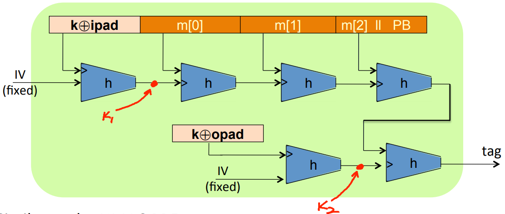
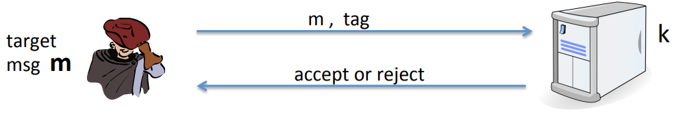

# HMAC

Can we use the large hash function to construct a MAC directly without having to rely on a PRF.

**example:** Let $H: X^{\leq L}$ a collision resistance Merkle-Damgard Hash function, $S(k, m) = H(k || m)$ is insecure becasue given $H(k || m)$ can compute $H(k || m || PB || w)$ for any $w$.

Building a MAC out of a hash function:
$$
HMAC: S(k, m) = H(k \oplus opad, H(k \oplus ipad || m))
$$


The main difference between HMAC and NMAC is that $k \oplus ipad$ and $k \oplus opad$ are dependent. 

HMAC is assumed to be a secure PRF:

* Can be proven under certain PRF assumptions about $h$.
* Security bounds similar to NMAC: Need $q^2 / |T|$ to be negligible $q << |T|^{1/2}$.

## Timing Attacks on MAC verification

```python
def verify(k, m, sig):
    return HMAC(k, m) == sig;
```

The problem: "==" implemented as a byte-by-byte comparison, comparator returns false when first inequality found.



To compute tag for target message $m$ do:

1. Query server with random tag.
2. Loop over all possible first bytes and query server. Stop when verification takes a little longer than in step 1.
3. Repeat for all tag bytes until valid tag found.

**Defense 1**

```python
return false if sig has wrong length
result = 0
for x, y in zip(HMAC(k, m), sig):
    result |= ord(x) ^ ord(y)
return result == 0
```

**Defense 2**

```python
def verify(k, m, sig):
    mac = HMAC(k, m)
    return HMAC(k, mac) == HMAC(k, sig)
```


