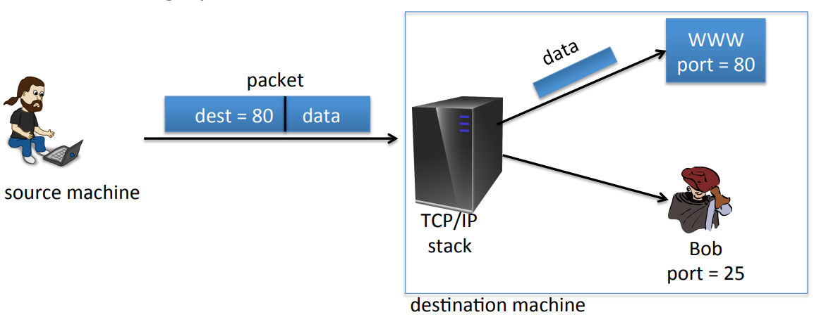
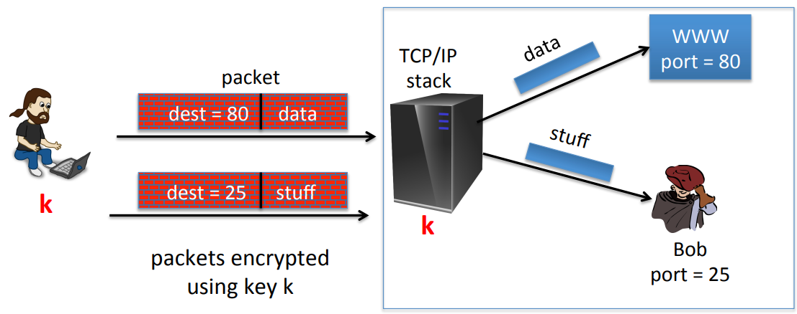
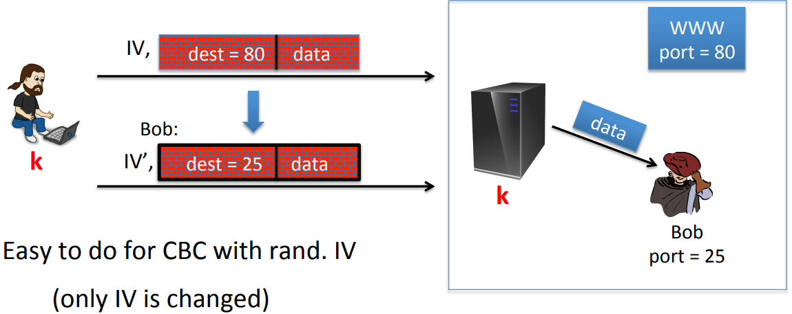
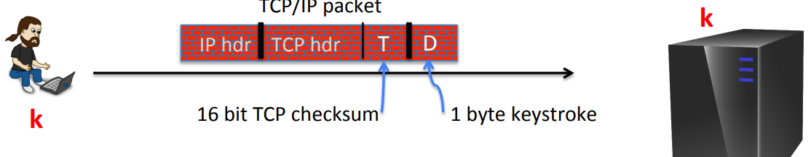
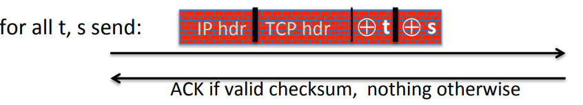

# Active Attacks on CPA-Secure Encryption

**Confidentiality**: Security against chosen plaintext attacks only provides security against eavesdropping only.

**Integrity**: Provide message integrity where the message itself is not confidential, just make sure that the message is not modified while it's en route.

**Authenticated Encryption Goal:** Ensuring both confidentiality and integrity.

## Sample tampering Attacks

There is a server forwards packets to the appropriate place. For example, two processes listening to these packets, one is web server, another is user called Bob. When a packet, the tcp/ip stack looks at the destination port. If the destination port is 80, the stack forwards the packets to the web server, else if the destination port is 25, the stack forwards the packets to the Bob.

IPsec protocol encrypts these packets between the sender and the recipient. The sender and recipient have a shared key. When a packet arrives at the destination(stack), the stack will decrypt the packet and then look at the destination port and send it to the appropriate place.

Image the attacker(Bob) intercepts a certain packet that's intended for the web server. The attacker can actually receive the decryption of any packets that intended for port 25 because the TCP stack will decrypt packets for port 25 and send them to Bob. When attacker intercepts packet, he prevents packet from reaching the server, and instead he will modify the packet to make the destination port to be 25. When this packet arrives at the server, the destination port is 25, the stack will decrypt the packet and see that the destination is 25 and forward the data to Bob. So Bob is able to read data that is not intended for himself, but rather than is intended for the web server.

If the data is encrypted using a CBC encryption with a random $IV$, the way he's gonna do is changing the $IV$.
$$
(IV, c) = (IV,  IV \oplus E(k, 80)) \\
80 \oplus x = 25 \to x = 25 \oplus 80 \\
(IV', c) = (IV \oplus 25 \oplus 80, IV \oplus E(k, 80)) \\
$$

## An Attack Using only Network Access

There's a remote terminal application, where time the user hits a keystroke, an encrypted keystroke is sent to the server. Let's pretend that the encrypted keystroke is encrypted using counter mode. Every tcp/ip packet contains a checksum $T$,  and data $D$. If the server receives a packet that has the wrong checksum, it simply drops it on the floor and ignores it. 

Now the attacker wants to know what the keystroke was. The attacker is gonna intercept this packet and he's not gonna modify it, he's gonna send it to the server and record the packet. Later on, he's gonna modify the packet and send a modified packet to the server. What he's going to do is XOR the encrypted checksum field with a value $t$ and XOR the encrypted data field with a value $s$. He's going to do this for lots and lots of $t$ and $s$. And now the server is gonna to decrypt this modified packet. And the resulting packet is gonna have the checksum XORed with $t$ and the data XORed with $s$. If modified checksum is correct for this modified packet, the server will send an ACK back. If the modified checksum is incorrect for this modified packet, the server will just drop the packet on the floor and do nothing. And the attacker can simply observe look for an ACK packet or not, and in doing so, he learns whether this particular XOR of T and XOR of S pairs corresponds to a valid checksum or not. Finally the attacker can figure out what the value $d$ is.

