# Authenticated Encryption

**Definition:** An authenticated encryption system (E, D) is a cipher where:
$$
E: K \times M \times N \to C \\
D: K \times C \times N \to M \cup \{\bot\}
$$
When the decryption algorithm outputs the symbol $\bot$, it says that the cipher text is invalid and should be ignored. The only requirement is that $\bot$ is not in the message space so that in fact it is unique symbol that indicates that the cipher text should be rejected.

**Security:** The system must provide semantic security under a CPA attack, and **ciphertext integrity** that is mean attacker cann't create new ciphertexts that decrypt properly.

## Ciphertext Integrity

Let $(E, D)$ be a cipher with message space $M$. As usual, the challenger begins by choosing a random key $k$, and the adversary can submit messages of his choice, and receive the encryptions of those messages. His goal is to produce some new cipher text that's valid. The adversary win the game if this new cipher text decrypts correctly.

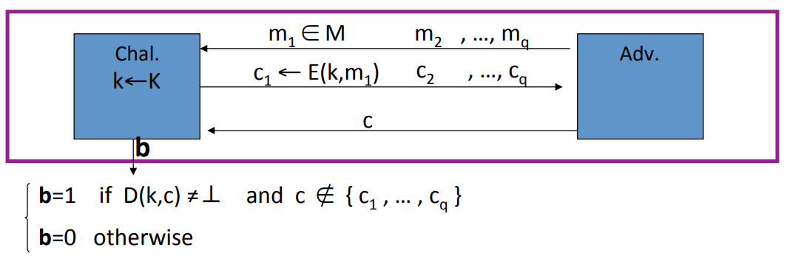

We define the adversary's advantage in the cipher text integrity game as the probability that the challenger outputs 1. In other words, If (E, D) has ciphertext integrity then for all efficient $A$, there exist:
$$
Adv_{cl}[A, E] = Pr[\text{Challenger Outputs 1}]  \text{ is negligible}
$$
**Example:** CBC with random $IV$ does not provide authenticated encryption, because $D(k, \cdot)$ never outputs $\bot$.

## Implication

**Authenticity**: Attacker cannot fool Bob into thinking a message was sent from Alice.

In other words, the attacker gets to interact with Alice, and get her to encrypt arbitrary messages of his choice. And the attacker's goal is to produce some cipher text that was not created by Alice. Because the attacker can't win the cipher text integrity game, he can't do this. What this means is, when Bob receives the cipher text that decrypts correctly under the decryption algorithm, he knows that the message must have come from someone who knows the secret key.

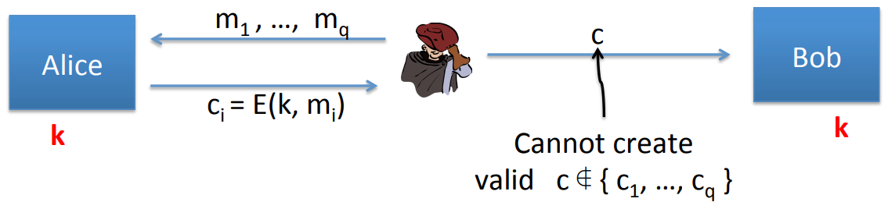

Note: Authenticated encryption doesn't defend against replay attacks.

**Security against chosen ciphertext attacks:** 

## Chosen Ciphertext 

### Example Chosen Ciphertext Attacks

1.Image a adversary has come ciphertext $c$ that he wants to decrypt. And what it can do is fool the decryption server into decrypting some cipher text but not the cipher text $c$.

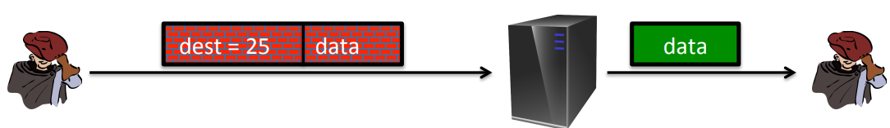

2.An adversary can learn something about the plaintext by submitting cipher texts to the decrypter. For example, the adversary submits encrypted TCP/IP packets to the decryption server, and if the decryption server sends back an ACK, the adversary learns that the decrypted plain text had a valid checksum.

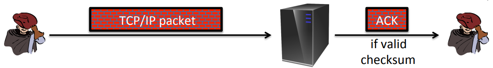

### Chosen Ciphertext Security

**Adversary's power:** both CPA and CCA:

* Can obtain the encryption of arbitrary messages of his choice.
* Can decrypt any ciphertext of his choice, other than challenge.

**Adversary's goal:** Break sematic security.

**Definition:** Define cipher $(E, D)$ over $(K, M, C)$. For $b=0, 1$ define EXP(b):

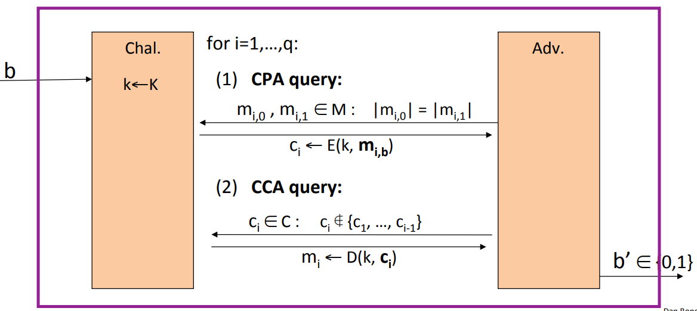

The challenger is gonna start off by choosing a random key $k$. And now the adversary is gonna submit queries to this challenger. Every query can be one of two types. It can be a chosen plain text query or it can be a chosen cipher text query. The only restriction is that the cipher text is not one of the cipher texts that were obtained as a result of a CPA query. As usual, his goal is to determine whether he is in experiment 0 or in experiment 1. The cipher E is CCA secure if for all efficient $A$:
$$
Adv_{CCA}[A, \text{E}] = |Pr[EXP(0)=1] - Pr[EXP(1)=1]| \text{ is negligible}
$$
**Example:** CBC with random $IV$ is not CCA-Secure.

The adversary is gonna submit two distinct messages $m_0$ and $m_1$. And what he's gonna get back is the CBC encryption $c$ of either $m_0$ or $m_1$. Then the attacker is gonna modify this cipher text $c$ into $c'$ by changing the $IV$. So he just takes the       $IV$ and XORs it with 1. As a result the adversary submit $c'$ as its chosen cipher text query. So he asks the challenger decrypt $c'$. Now the adversar receives $m_b \oplus 1$. He can tell whether he's in experiment 0 or in experiment 1. The advantage of this adversary is 1.

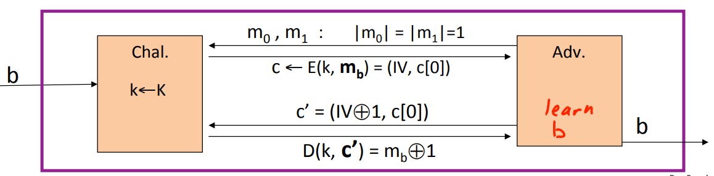

## Authenticated Encryption Satisfy CCA Security

**Theorem:** Let $(E, D)$ be a cipher that provides authenticated encryption. Then $(E, D)$ is CCA secure.

In particular, for any q-query(at most, q CPA queries and q chosen cipher text queries) efficient adversary $A$, there exist efficient adversary $B_1, B_2$ such that :
$$
Adv_{CCA}[A, E] \leq 2q \cdot Adv_{CL}[B_1, E] + Adv_{CPA}[B_2, E]
$$
**Proof:** We have two copies of the CCA game: experiment 0 and experiment 1. Our goal is show that these two experiments are indistinguishable.

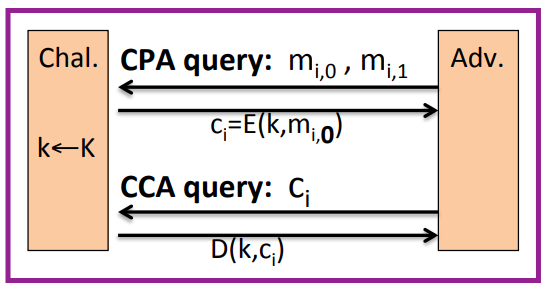

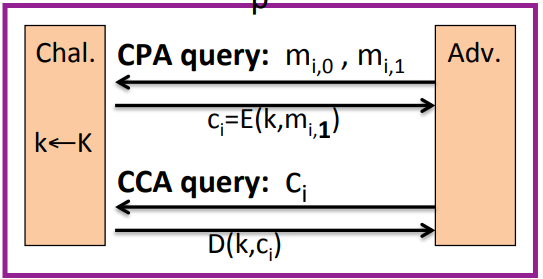

First, we're gonna change the challenger a little bit, so that instead of outputting the decryption of CCA queries, the challenger is just gonna always output $\bot$. These two games are indistinguishable, because the scheme has cipher text integrity, so the adversary cannot create a cipher text that's not in $[c_0, c_i]$ that decrypts to anything other than $ \bot $. 

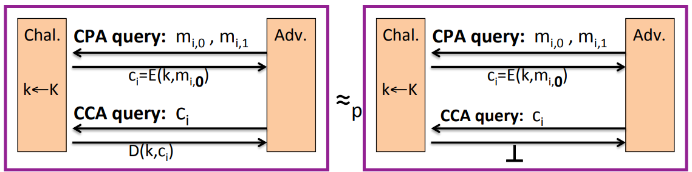

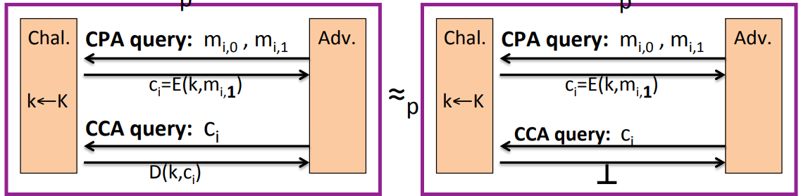

The chosen cipher text queries always respond in the same say, they're not giving the adversary any information. The adversary always knows that chosen cipher text queries  always gonna just respond $\bot$. So we can remove these queries.

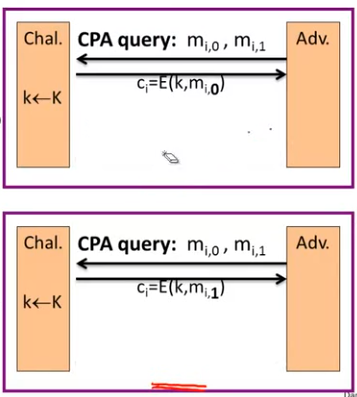

Because the scheme(authenticated encryption) is CPA secure, the adversary can't distinguish these two games.

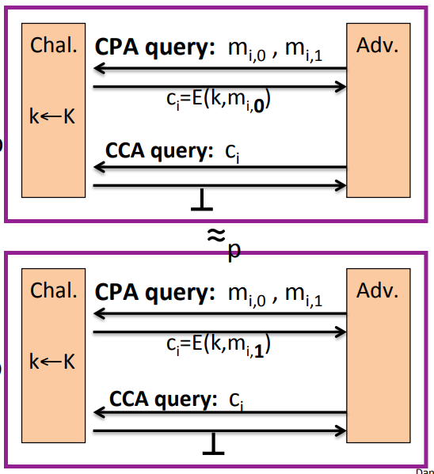

And we've proven that all of these games are equivalent.

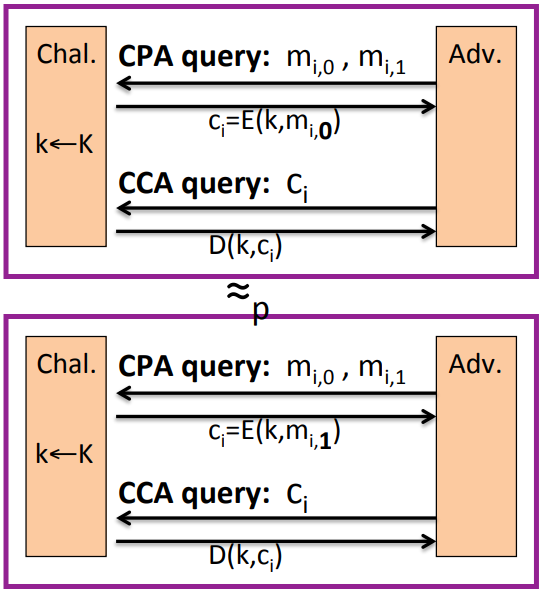