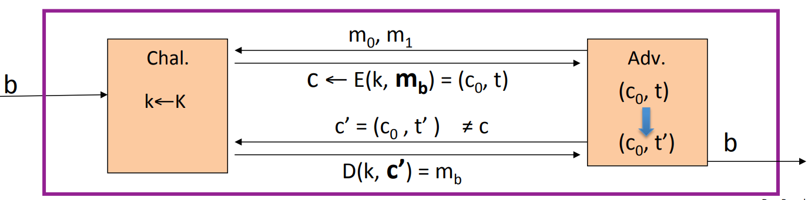

# Constructions from Cipher and MACs

## Combining MAC and ENC

There's a separate key for encryption $k_E$, and a separate key for MACing $k_I$. These two keys are independent of one another and both are generated at session setup time.

**SSL:** mac-then-encrypt, take the plain text $m$, and then you use MAC key $k_I$ to compute a tag for the plain text $m$. And then concatenate the tag to the message and then encrypt the concatenation of the message and the tag.

**IPsec:** encrypt-then-mac, take the message $m$, first encrypt the message and then compute a tag on the resulting cipher text.

**SSH:** encrypt-and-mac, take the message $m$, first encrypt the message and then compute a tag on the message.

Which one of these is secure?

For SSH, this way exists a problem, because MACs themselves are not designed to provide confidentiality. MACs are only designed for integrity.And In fact, there's nothing wrong with a MAC that as part of the tag outputs a few bits of the plain text. This would break CPA security, because some bits of the message are leaked in the cipher text.

For IPsec, it turns out the recommended method is IPsec method. Because it turns out no matter what CPA secure system and MAC key you use, the combination is always gonna provide authenticated encryption. Once we encrypt the message, the message contents is hidden inside the cipher text. Then compute a tag of the cipher text, this tag locks the cipher text and make sure no one can produce a different cipher text that would look valid.

For SSL, there are kind of pathological examples, where combining CPA secure encryption system with a secure MAC. And the result is vulnerable to a chosen ciphertext attack, so that it does not provide authenticated encryption.

**Theorems:** Let $(E, D)$ be a CPA secure cipher and $(S, V)$ be a secure MAC, then:

1.Encrypt-then-MAC: always provides authenticated encryption.

2.MAC-then-encrypt: may be insecure against CCA attacks. However, when $(E, D)$ is randomized counter mode or randomized CBC, then it turns out, for those particular CPA secure encryption schemes, MAC-then-Encrypt does provide authenticated encryption and therefore it is secure. If use randomized counter mode, then it's enough that MAC algorithm just be one time secure.

### Standards

**GCM:** CTR mode encryption then CW-MAC.

**CCM:** CBC-MAC then CTR mode encryption.

**EAX:** CTR mode encryption then CMAC.

All of these support AEAD(authenticated encryption with associated data). The idea between AEAD is that, the message that's provided to the encryption mode is not intended to be fully encrypted. Only part of the message is intended to be encrypted, but all of the message is intended to be authenticated. For example, for a network packet, there's a header and a paylaod, the header is not gonna be encrypted but the payload is encrypted. But both the header and the payload are authenticated.

## MAC Security-- an explanation

One of the requirements that followed from our definition of secure MACs meant that given a message-MAC pair on a message $m$, the attacker can not produce another tag on the same message $m$. It turns out if the MAC didn't have this property, then encrypt-then-MAC would not have ciphertext integrity.

 The adversary is gonna start by sending two messages $m_0$ and $m_1$. And he is gonna receive the encryption of them, either the encryption of $m_0$ or the encryption of $m_1$. Since we use encrypt-then-MAC, the adversary receives the cipher text $c_0$ and a MAC $t$ on $c_0$. Because the adversary can produce another MAC on the same message, so he's gonna produce another MAC $(c_0, t')$ on message $c_0$. Therefor, the adversary can submit a chosen ciphertext query $c'=(c_0, t')$ and this is a valid chosen cipher text query. The challenger then send back the $m_b$.

