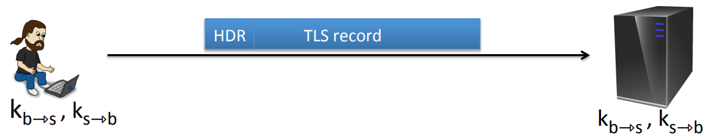
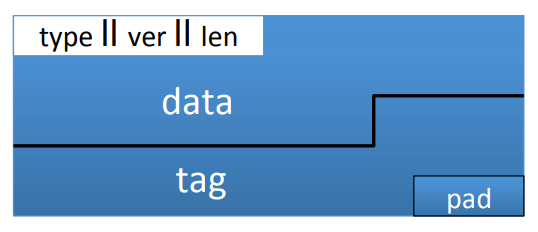
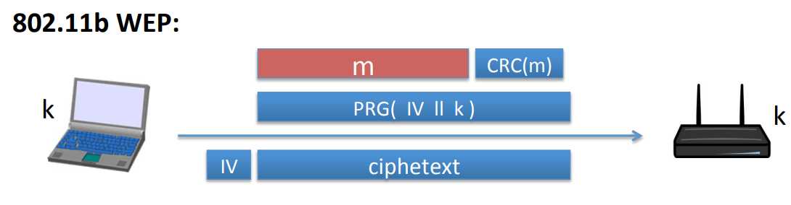
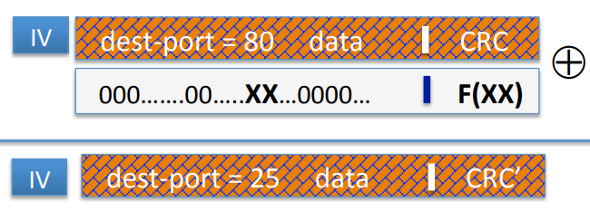

# TLS

In this protocol, every TLS record starts with a header followed by encrypted data(record). In TLS, the records are at most 16KB. TLS uses what's called unidirectional keys, meaning that there's one key from browser to server, and there's a separate key from server to browser.

The TLS record protocol uses stateful encryption, which means that the encryption of every packet is done using certain state that's maintainded inside of the browser and the server. Each side maintains two 64-bit counters: $ctr_{b \to s}$, $ctr_{s \to b}$. These counters are initialized to 0 when the session if first initialized, and they're incremented every time a record is sent.

The encryption using in TLS is AES-CBC and MACing is HMAC-SHA1. The key is made up of a MAC key and encryption key $k_{b \to s} = (k_{mac}, k_{enc})$.

A TLS packet begins with a header that contains the type of the packet, the version number for the protocol, and the length of the packet.

When encrypt data, a certain record, the encryption procedure works as follows $enc(k_{b \to s}, data, ctr_{b \to s})$:

* It would MAC the following data $tag \leftarrow S(k_{mac}, [++ctr_{b \to s} || header || data])$. Even though the value of the counter is included in the tag, the value of the counter is never in the record, the reason it doesn't need to be sent in the record is that the server on the other side already knows what the value of the counter needs to be. 
* The tag is concatenated to the data, and then pad $header || data || tag$ to AES block size.
* CBC encrypt with $k_{enc}$ and new random $IV$.
* Prepend header.

When receive a record, the decryption procedure works as follows $dec(k_{b \to s}, record, ctr_{b \to s})$:

* CBC decrypt record using $k_{enc}$.
* Check pad format. If it's not a right pad, TLS will send a bad record MAC alert message and terminate the connection. If the pad format is correct, then remov the pad.
* Check tag on $[++ctr_{b \to s} || header || data]$, if the MAC doesn't verify, it's gonna send an alert "bad record MAC" and tear down the connection. If the tag does verify, it's gonna remove the tag, remove the header, and the remaining part of the record is data.

## Bugs in older versions

**IV for CBC is predictable**: IV for next record is last ciphertext block of current record(chainde IV). Not CPA secure.

**Padding oracle:** During decryption, if pad is invalid it will send "decryption failed" alert else if mac is invalid it will send "bad_record_mac" alert.

## Bugs in 802.11b WEP

CRC checksum has a particular property. Mainly the CRC is linear. What that means is if I give you CRC of $m$, and I ask you to compute CRC  of $m \oplus p$, then it's very easy to do: 
$$
\forall m, p: CRC(m \oplus p) = CRC(m) \oplus F(p)
$$

Suppose the adversary intercepts a packet that's destined to the access point. Now the packet say it's destined for destination port 80, and the attacker knows that it's intended for destination port 80 and what he wants to do is modify the ciphertexts such that the destination port will be 25 instead of 80.

 What the attacker would do is he would XOR a certain value $x$ into the byte in the cipher text. When the cypher is decrypted, the palin text at this position will also be XORed by that certain value $x$. And as a result, after decryption the plain text at this position will be $80 \oplus 25 \oplus 80$, which gives us 25. And we can also easily correct the checksum even though the CRC checksum is encrypted. What we do is we XOR $F(x)$ into the cipher text at the place where the CRC is supposed to be and as a result, when the cipher text is decrypted, what will happen is we'll get the correct CRC check sum after decryption.
$$
80 ^ x = 25 \\
x = 25 \oplus 80 \\
$$
