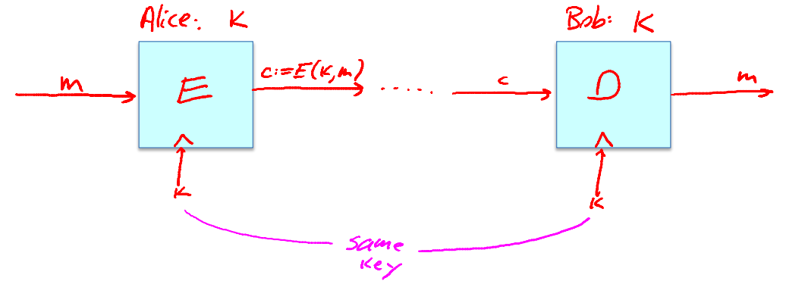
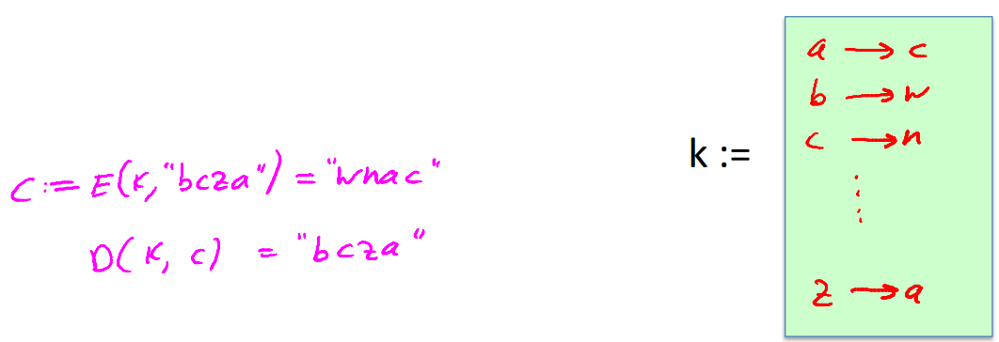
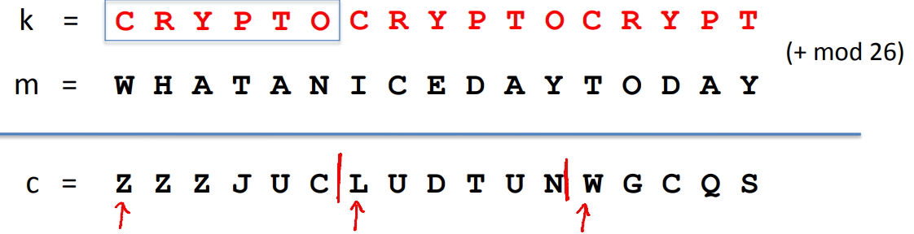

# Symmetric Encryption

Both encrypter and decrypted actually use the same key K

## Substitution cipher

A key for a substitution cipher is a substitution table that says how to map letters.

### How to break a substitution cipher?

1. Use frequency of English letters.
2. Use frequency of pairs of letters(\'he\', 'an\'\).

## Vigener cipher

In a Vigener cipher, the key is a word. To encrypt a message, replicate the key as many times as needed to cover the message. And then add the key letters to the message letters, modulo 26.

### How to break vigener cipher?

1. Suppose that we know the length of the key, here the key length is 6. We break the cipher into groups of six letters.  Then look at the first letter in each group, they're all encrypted using the same letter. So if we collect these letters then the most common letter among the set is likely to be the encryption of E. For the second,third... letter in every group of six characters and again, repeat the same exercise.
2. About the length of key, assume the key length is one, run step 1. Then assume the key length is two, run step1,.., until finally get a message.