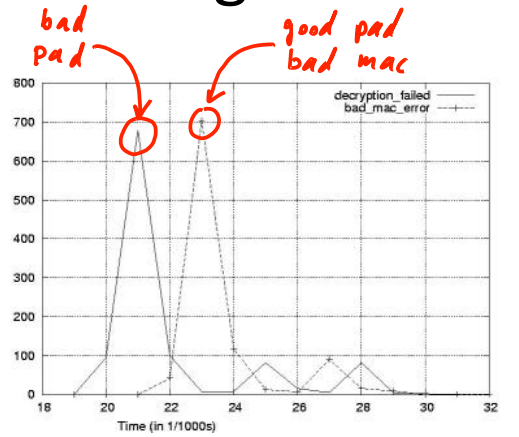

# CBC Paddings Attack

## TLS Record Protocol

Decryption: $dec(k_{b \to s}, record, ctr_{b \to s})$:

1. CBC decrypt record using $k_{enc}$.
2. Check pad format: abort if invalid.
3. Check tag on $[++ctr_{b \to s} || header || data]$.

Two types of error: **Padding error** and **MAC error**.

If an attacker can differentiate the two types of errors, the result is what we call the **padding oracle**. So if the pad is invalid, we'll see a pad error, whereas if the pad is valid we'll see a MAC error. As a result, the adversary can tell whether the last bytes in the decrypted have a valid pad or not.

Older versions of TLS leaked the type of error simply in the alert message that was sent back to the peer. Different types of alerts were sent depending on which type of error occurred. As soon as this attack came out, SSL implementation simply always reported the same type of error, so just looking at the alert type wouldn't tell the adversary which error occurred. Nevertheless, there was still a padding oracle.

**Using a padding Oracle:** Suppose attack has ciphertext $c=(c[0], c[1], c[2])$ and he wants $m[1]$.

First of all he's going to throw away $c_2$, so that last block is just $c_1$. Now suppose that he has a certain guess $g$ for the last byte of $m_1$. What the attacker will do is the following: he will XOR the value $g \oplus$0x01 into the last byte of the block $c_0$. When $c_1$ is decrypted, the last byte is gonna be XORed with this modified $c_0$, and the result the last byte of the plain text is gonna be also XORed with $g \oplus$0x01. If the guess $g$ for the last byte of $m_1$ is correct, the last byte of the plaintext that we'll get is just 0x01. If 0x01 is a well formed pad, therefor the pad is valid. And the padding oracle will say the pad is valid. If the guess is incorrect then we'll get a value here that's not equal to 1 and it's very likely that we have an invalid pad. Now we can simply repeat this again and again for $g$ from 0 to 255. And then we learn the last byte of $m_1$. And we can use the exact same process to learn the second last byte of $m_1$. We can iterate this again and again and since the length of the block is 16 bytes, so after 16 \* 256 queries, we get to learn $m[1]$.

## Attacking Non-Atomic Decryption

SSH uses encrypt-and-MAC, every SSH packet begins with a sequence number, and then the packet contains the packet length, the length of the CBC pad, the payload follows, then the CBC pad follows. The whole red packet is encrypted using CBC encryption, and then the entire clear packet is MACed. And the MAC is sent in the clear along with the packet.

Decryption:

1. decrypt packet length field only.
2. read as many packets as length specifies.
3. decrypt remaining ciphertext blocks.
4. check MAC tag and send error response if invalid.

Suppose an attacker intercepted a cipher text block $c=AES(k, m)$ and he wants $m$. The ciphertext is only one block length. He's gonna send a packet to the server that starts off as normal then he's going to inject his captured cipher text as the first cipher text block that's sent to the server. The server is gonna decrypt the first few bytes of this AES block and he's going to interpret the first few bytes as the length fields of the packet. Then the attacker is gonna feed the server 1 byte at a time. Eventually, the server will read as many bytes as the length field specifies at which point it will check that the MAC is valid. And the server will send a MAC error. But the attacker can learns how many bytes were sent at the time that it receives the MAC error from the server.

