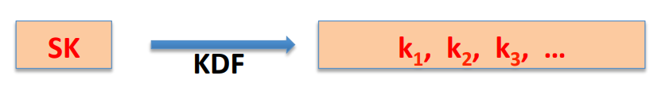
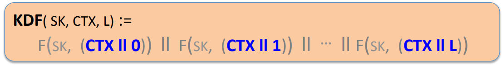
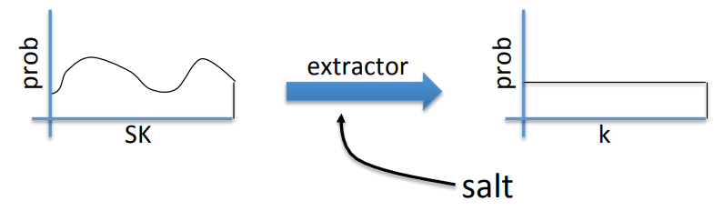

# Key Derivation

## Deriving Keys from One

**Typical Scenario:** A single source key(sk) is sampled from:

* Hardware random number generator.
* A key exchange protocol.

Need many keys to secure session: unidirectional keys.

**Goal:** Generate many keys from this one source key.

The way that's done is using a mechanism called a key derivation(**KDF**).

## When source key is uniform

Suppose a secure PRF $F: K \times X \to Y$. Suppose source key $sk$ is uniform in $K$. Then we can use it directly to generate keys. In this case, the KDF would work as follows. It takes as input the $sk$, parameter context $ctx$, and a length input $l$. It will evaluate the PRF on 0, 1,...., $l$ to generate all the keys.

The context string($ctx$) is a unique that identifies the application. Maybe you have SSh running as one process, a web server running as another process, and all of them need to have secret keys generated.This context variable tries to separate the two of them. Even if these two apps sample same $sk$ but they get independent keys.

## What if source key is not uniform?

If the source key $sk$ is not uniform key for pseudo random function then we can no longer assume that the output of the pseudo random function is indistinguishable from random.

Why would this source key not be uniform? For example, if you use a key exchange protocol, the key change protocols will generate a high entropy key. It's not going to be a uniform string.

### Extract-then-Expand Paradigm

The first step of the KDF is to extract a pseudo random key from the actual source key. An extractor is something that takes a bumpy distribution and makes it into a uniform distribution over the key space. Now extractors takes as input something called a **salt**, what it does is jumbles things around, so that no matter what the input distribution is, the output distribution is still going to be indistinguishable from random. And salt is a fixed non-secret string chosen at random.

Then we use it in a KDF to expand the key

## HKDF: a KDF from HMAC

In HKDF, HMAC is used both as the PRF for expanding and an extractor for extracting the initial pseudo-random key. 

In extract step, use salt as the HMAC key and the source key as HMAC data.
$$
k \to HMAC(salt, sk)
$$
 

Then use HMAC as a PRF to generate a session key.

## Password-Based KDF(PBKDF)

Passwords have relatively low entropy. As a result, there is simply not enough entropy to generate session keys out of a password.

Don't use HKDF, that's not what it's designed for, or the derived keys will be vulnerable to something called a dictionary attack. The PBKDF defend against this low entropy problem that results in a dictionary attack is by two means. First of all, they use a salt, a public, random value that's fixed forever. In addition, they also use what's called a slow hash function to make the guessing problem as hard as possible.

First of all, PBKDF hash the concatenation of the password and the salt. And then the hash itself is designed to be a very slow hash function. The way we build a slow hash function is by taking one hash function and iterate it many, many times. And the final output as the output of this KDF.
$$
H^{(c)}(pwd || salt)
$$
