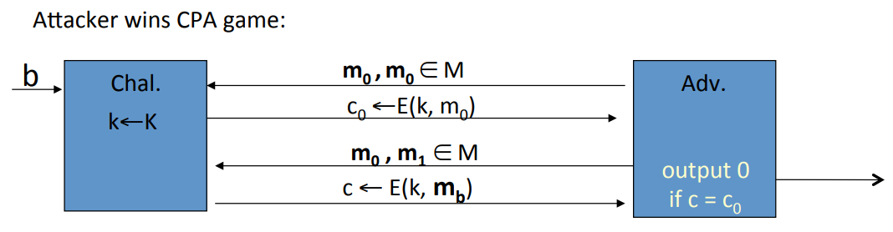
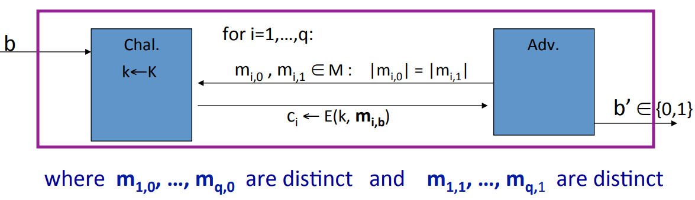
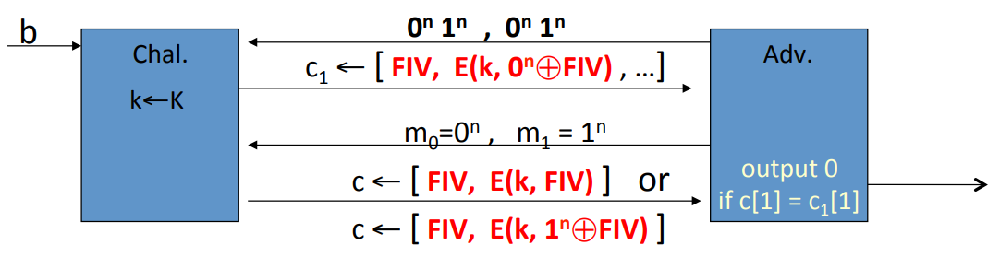
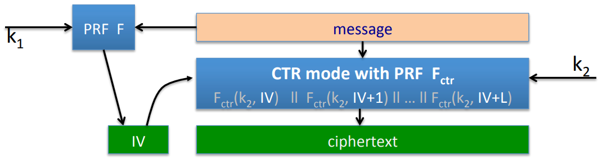
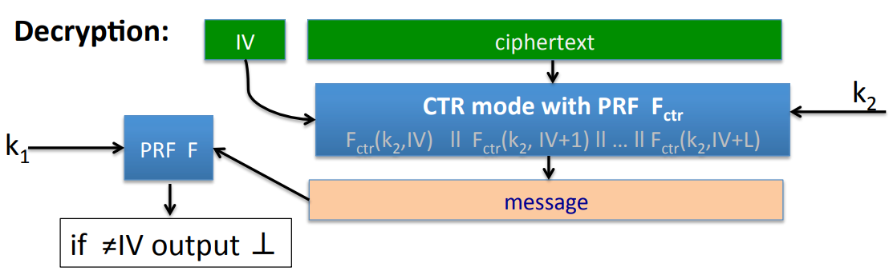
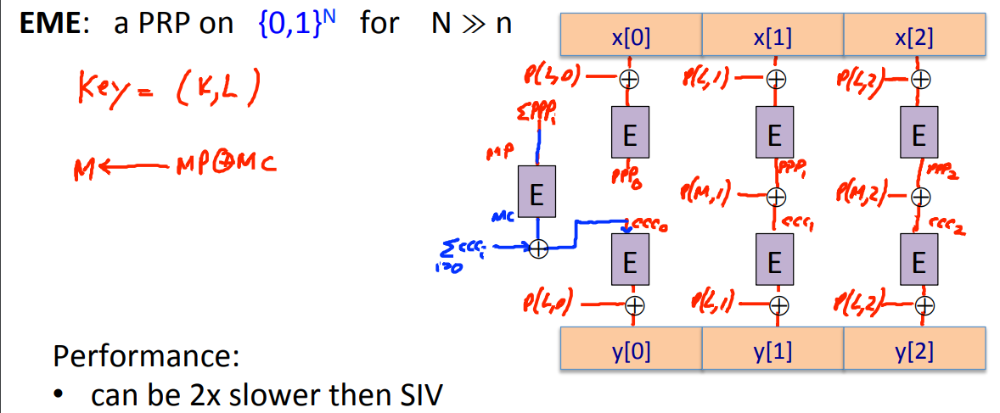
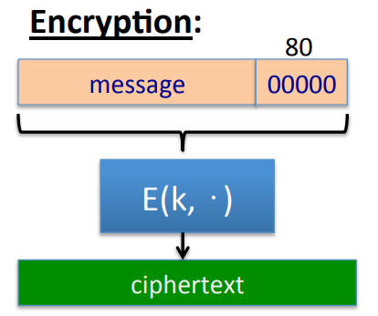
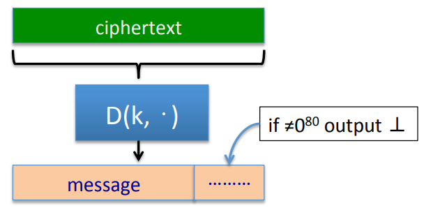

# Deterministic Encryption

 A deterministic encryption system will always map given message to exactly the same cipher. So if we encrypt the same message 3 times, every time we'll get the same cipher text.

**Problem:** Deterministic encryption cannot be CPA secure.

The attacker can look at two different cipher text and if he sees the same cipher text twice he knows that the underlying encrypted message must also be the same.

The adversary send two messages $m_0$ and $m_0$. He is gonna get the encryption of the message $m_0$. In the next step, he's gonna send the messages $m_0$ and $m_1$. Now he is either gonna get the encryption of $m_0$ or the encryption of $m_1$. Because the encryption is deterministic, this is very for the adversary to tell which experiment is.

**Solution:** Suppose encryptor never encrypts same message twice: the pair $(k, m)$ never repeats. This happens when encryptor:

* Chooses messages at random from a large msg space.
* Message structure ensures uniqueness( unique user ID).

## Deterministic CPA Security

E=($E, D$) is a cipher defined over ($K, M, C$). For $b=0, 1$ define $EXP(b)$ as:

Where the encryptor will never encrypt the same message multiple times using one key. As a result, the attacker can't ask for the encryption of the same message multiple times using the same key. E is  semantic encryption under deterministic CPA if for all efficient adversary $A$:
$$
Adv_{dCPA}[A, \text{E}] = |Pr[EXP(0)=1] - Pr[EXP(1)=1]| \; \text{is negligible}
$$
**Example:** The CBC with a fixed $IV$ is not deterministic CPA secure.

Let $E: K \times \{0, 1\}^n \to \{0, 1\}^n$ be a secure PRP used in CBC, The attacker first ask for the encryption of the message $0^n 1^n, 0^n 1^n$. In other words, the first block is all 0 and the second block is all 1. Then the adversary get the cipher text $c_1 = [FIV, E(k, 0 \oplus FIV), E(k, E(k, 0 \oplus FIV) \oplus 1)]$ of $0^n 1^n$. Then the adversary is gonna output two messages that a single block $m_0=0^n, m_1=1^n$. The attack will get $c = [FIV, E(k, FIV)]$ or $c=[FIV, E(k, 1 \oplus FIV)]$. So if $c = c_1$ then he knows $m_0$ is encrypted, else $m_1$ is encrypted.

## Construction

### SIV

Let ($E, D$) be a CPA-secure encryption $E(k, m; r) \to c$, where $r$ is a nonce used by the encryption. For example if we're using randomized counter mode, $r$ would be the random $IV$ that's used by randomized counter mode. In addition, let $ F: K \times M \to R $ be a secure PRF. So $r$ is a member of the big $R$ set.

The SIV works as follows. It's going to use two keys $k_1$ and $k_2$ to encrypt the message $m$. And what it does is the first thing is going to apply the pseudo random function $F$ to the message $m$ to derive randomness for the CPA secure encryption scheme E. And then it's going to encrypt the message $m$ using the randomness that it just derived.
$$
E_{det} ((k_1, k_2), =) = \begin{cases}
							r = F(k, m) \\
							c = E(k, m; r)
						  \end{cases}
$$
**Theorem:** E$_{det}$ is semantic security under deterministic CPA.

**Proof:** We apply the pseudo random function $F$ to distinct messages, then the random string that $F$ generates is going to look like just truly random strings. And as a result, the CPA secure encryption scheme E is always applied using truly random strings.

#### Ensuring Ciphertext Integrity

**Goal:** deterministic CPA security and ciphertext integrity $\to$ deterministic authenticated encryption.

Consider a SIV special case SIV-CTR where cipher is counter mode with random $IV$. First, we take our message and then apply a PRF to it, and that derives an $IV$. And then that $IV$ is going to be used to encrypt the message using randomized counter mode.

During decryption we're gonna add one more check, that's goint to provide ciphertext integrity. So we take input ciphertext that contains the $IV$ and the cipher text. The first thing we're going to do is we're going to decrypt the cipher text using the given $IV$, and that will give us candidate plain text. Now we're gonna reapply the PRF $F$ from the definition of SIV to this message. Now if a message is valid, we should be getting the same $IV$.

**Theorem:** If $F$ is a secure PRF and CTR from $F_{CTR}$ is CPA-secure, then SIV-CTR from $F,F_{ctr}$ provides DAE.

**Proof:** The system has deterministic CPA security, all we have to argue is just cipher text integrity.  

The adversary asks for the encryption of a bunch of messages of his choice. And he gets the resulting cipher text. And his goal is to produce a new valid cipher text. If that valid cipher text upon decryption, decrypts to some completely new message. Then when we plug this new into the $F$, we're just going to get some random $IV$ and it's very likely to hit the $IV$ that the adversary supplied in the cipher text that he output. Therefore, when the adversary outputs his forged cipher text, the message in that forged cipher text should be equal to one of the message in his chosen message queries.

### Just Use a PRP

Let $(E, D)$ be a secure PRP, $E: K \times X \to X$.

**Theorem:** ($E, D$) is semantical security under deterministic CPA.

**Proof:** Let $f: X \to X$ is a truly random invertible function. In $EXP(0)$, the attacker is gonna to submit a bunch of messages $m_{1, 0}, m_{2, 0}, ...., m_{q, 0}$, what's he gonna get is the evaluation of $f$ on the message $f(m_{1, 0}), ..., f(m_{q, 0})$. In deterministic CPA game, all these messages are distinct. In $EXP(1)$, he get $f(m_{1, 1}), ..., f(m_{q, 0})$. As a result, he can't distinguish $EXP(0)$ from $EXP(1)$. And since he can't do this for a truly random function, he also can't do this for the PRP.

### EME: constructing a wide block PRP

Let $(E, D)$ be a secure PRP, where $E: K \times \{0, 1\}^n \to \{0, 1\}^n$. Then EME is a PRP on $\{0, 1\}^N$ for $N >> n$.

EME uses two keys $k$ and $l$. We take message $x$ and break it into blocks. And then we XOR each block with a certain padding function $p$. Then we apply the PRP $E$ using the key $k$ to each of these blocks. The next thing we're gonna XOR all the encryption and get the result $MP$. Then encrypt $MP$ using $E$ and key $k$, the output of this encryption is $MC$. Then we XOR $MP$ and $MC$ and get another $M'$, which we use to derive one more pad. Then we get $ccc_0, ..., ccc_2$.

### PRP-based Deterministic Authenticated Encryption

**Goal:** deterministic CPA security and ciphertext integrity $\to$ DAE.

Take message and append a bunch of 0 to this message then apply the PRP.

When decrypt, look at these least significant bits of the resulting plain text and if they are not equal to 0, reject the cipher text.

Let $(E, D)$ be a secure PRP, where $E: K \times (X \times \{0, 1\}^n) \to X \times \{0, 1\}^n$.

**Theorem:** $1/2^n$ is negligible $\to$ PRP-based encryption provides DAE.