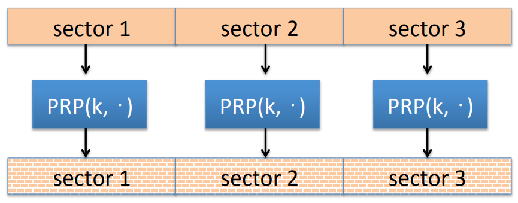
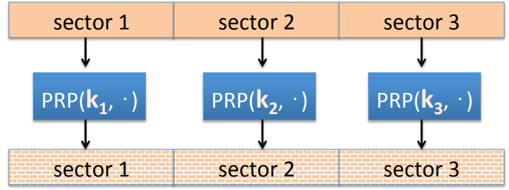
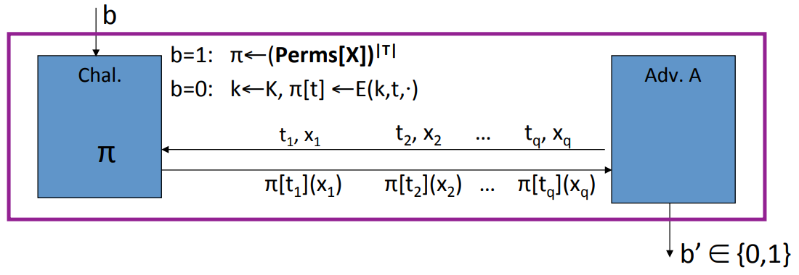
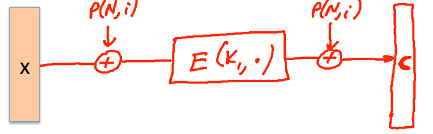
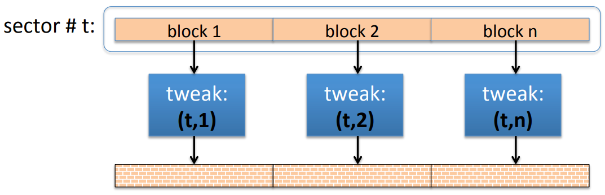

# Tweakable Encryption

Disk encryption problem is that each sector is 4kb, there is no space to expand. In this case, we have to use deterministic encryption because if encryption was randomized, there will be no place to store the randomness.

**Lemma:** if $(E, D)$ is a deterministic CPA secure cipher with $M = C$, then $(E, D)$ is a PRP.

We take our disk and break it into sectors. And now, if we encrypted every sector using PRP under the same key, there is a problem that if sector 1 and sector 3 have the same plain text, then the encrypted sector 1 would be equal to the encrypted sector 3. The attacker would learn that the corresponding plain texts are the same.

We can use a different key for every sector to avoid this problem.

## Tweakable Block Ciphers

**Goal:** Construct many PRPs from a key $k \in K$.

**Syntax:** $E, D: K \times T \times X \to X$. for every $t \in T$ and $k \in K$, $E(k, t, \cdot)$ is an invertible function on $x$, and indistinguish from random.

In a tweakable block cipher, the encryption algorithm take a key as input $k$, take a tweak as input $t$, take the data as input $x$. If we fix the key and the tweak, then we end up with an invertible function.

**Application:** Use sector number as the tweak, every sector gets its onw independent PRP.

**Security:** In experiment 1, we are gonna choose a truly random set of permutations. We're gonna choose as many permutations as there are tweaks. In experiment 0, we choose a random key $k \leftarrow K$, and we're gonna define our set of permutations as the ones defined by tweaks in the tweak space. And then the adversary gets to submit a tweak $t_1$ and $ x_1 $. And he gets to see the value of the permutation defined by the tweak $t_1$, evaluated at the point $x_1$. And his goal is to say whether he interacted with truly random permutations or pseudo random permutations.

E is a secure tweakable PRP if for all efficient $A$:
$$
Adv_{tPRP}[A, E] = |Pr[EXP(0)=1] - Pr[EXP(1)=1]| \; \text{is negligible}
$$

### Trivial Construction

Let $(E, D)$ be a secure PRP, $E: K \times X \to X$. The trivial tweakable construction: $E_{tweak}(k, t, x) = E(E(k, t), x)$.

### XTS tweakable block cipher

Let($E, D$) be a secure PRP, $E: K \times \{0, 1\}^n \to \{0, 1\}^n$. Then the XTS tweakable block cipher: $E_{tweak}((k_1, k_2), (t, i), x)$.

Where $N = E(k_2, t)$.

**Disk Encryption Using XTS**: Look at sector number $t$, and break it into blocks. And then block 1 gets encrypted with $(t, 1)$, block 2 gets encrypted with $(t, 2)$. And so every block gets its own PRP. Notice, this is a block level PRP. It's not a sector level PRP.

