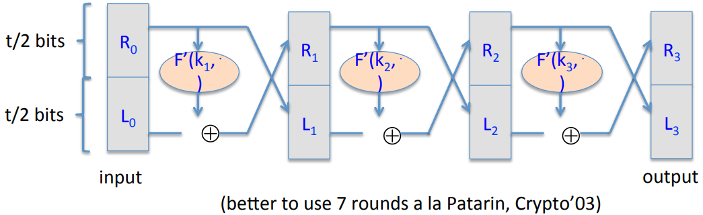

# Format Preserving Encryption

Given $0 \lt s \leq 2^n$, build a PRP on $\{0, ..., s-1\}$ from a secure PRF $F: K \times \{0, 1\}^n \to \{0, 1\}^n$.

Then to encrypt a credit card number:

1. map given credit card number to $\{0, ..., s-1\}$.
2. apply PRP to encrypt this credit card number.
3. map the output back to a credit card number.

The first thing to construction is shrink PRF from the set $\{0, 1\}^n$ to $\{0, 1\}^t$, where $2^{t-1} \lt s \leq 2^t$. Then we can use Luby-Rackoff with $F': K \times \{0, 1\}^{t/2} \to \{0, 1\}^{t/2}$ to construct a PRP.

The second thing is given PRP $E: K \times \{0, 1\}^t \to \{0, 1\}^t$. We build $E': K \times \{0, ..., s-1\} \to \{0, ..., s-1\}$. On input $x \in \{0, ..., s-1\}$ do $y \leftarrow E(k, y)$ until $y \in \{0, ..., s-1\}$ then output $y$.