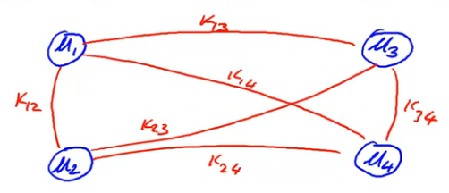
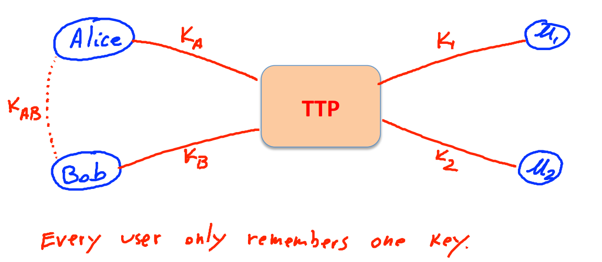
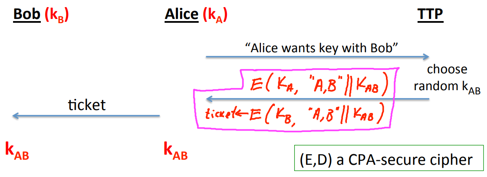
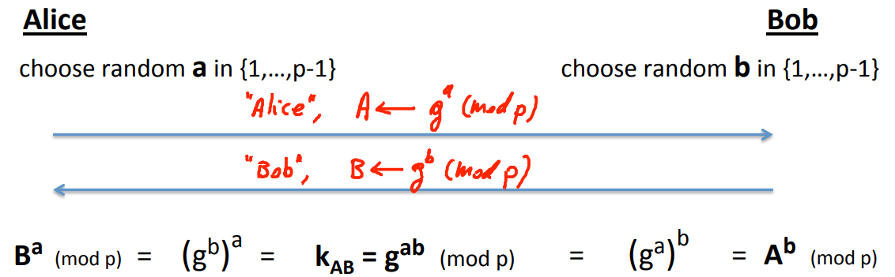
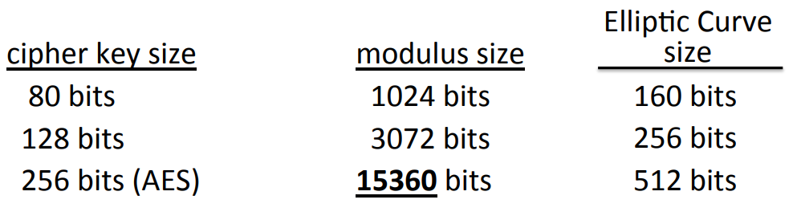
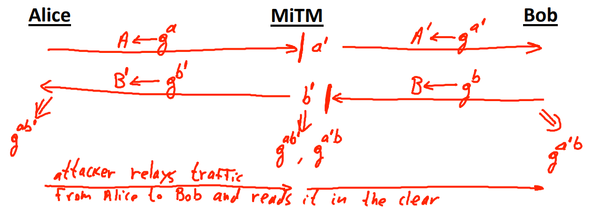
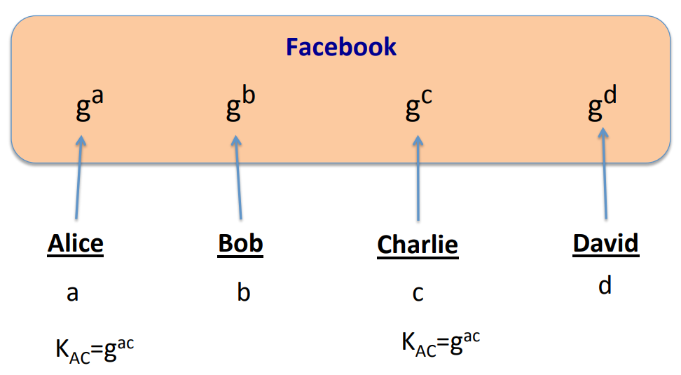
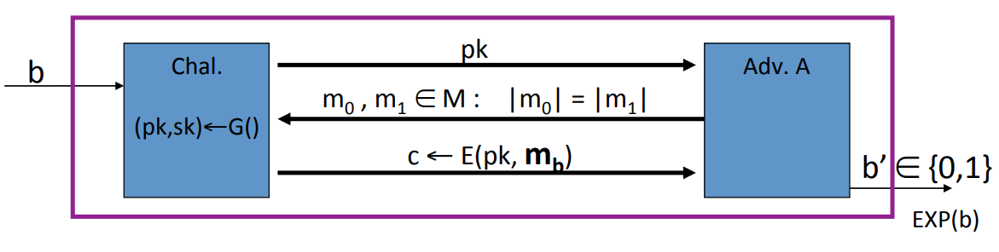
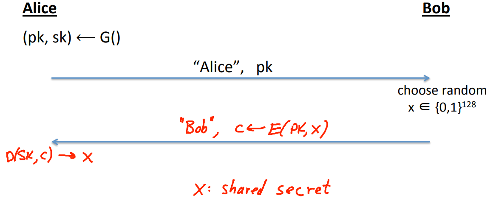
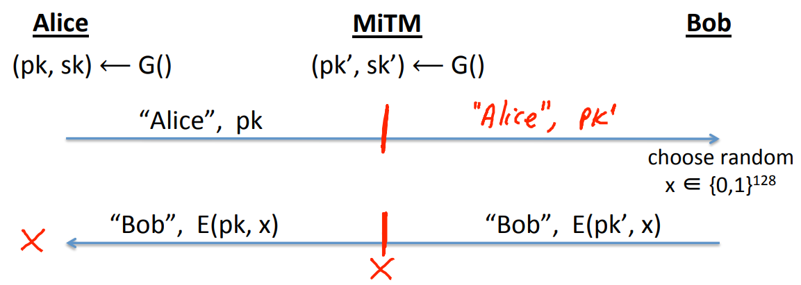

# Key Exchange

## Key Management

**Problem:** There a N users in the world, how do these users manage these secret keys that they're gonna use to communicate with one another?

**Solution 1:**  Suppose there are 4 users in the world, every pair of users will share a shared secret key.

**Disadvantage:** There are many shared keys that users have to manage.

**Solution 2:** Use the online trusted party(TTP), every user will share a single key with this trusted third party.

 Bob has a secret key $k_B$, and Alice  has a secret key $k_A$, which both of them are shared with a trusted third party. Alice is going to start by sending a message to the trusted third party, saying "hey, I want a secret key that's going to be shared with Bob". The TTP will choose a random secret key $k_{AB}$. TTP will send one message back to Alice, which is consists of two parts. The first part of the message is an encryption using Alice's secret key $E(k_A, ‘A, B’ || k_{AB})$. The other part of the message that the TTP sends to Alice is a ticket. This ticket is a message that's encrypted for Bob. In other words, the ticket is $ticket = E(k_{B}, 'A, B' || k_{AB})$. At a later time, when Alice wants to communicate securely with Bob what she will do is decrypt her part of the message and send ticket to Bob.

**Disadvantage:**

1. TTP must be online and available.
2. TTP knows all the session keys.
3. It is only secure against eavesdropping attack. For example, replay attacks.

## Merkle Puzzles

Suppose $n = 2^{32}$, when Alice and Bob want to share a key, do as follows:

1. Alice produce n puzzles:
   $$
   c_1 = E(k_1, 0), E(k_1, x_1), E(k_1, s_1) \\
   c_2 = E(k_2, 0), E(k_2, x_2), E(k_2, s_2) \\
   ... \\
   c_n = E(k_n, 0), E(k_n, x_n), E(k_n, s_n)
   $$
   Note that $x_i$ and $s_i$ are random number, $k_i$ is a 32-bit key.

2. Alice send these puzzles to Bob.

3. Bob randomly choose a puzzle $c_j$ and exhaustively search the key $k_j$, and then send $x_j$ to Alice.

4. Alice get $x_j$ and use secret key $s_j$ to communicate with Bob.

## Diffie-Hellman Protocol

Fix a large prime $p$, fix an integer $g$ in $[1, p]$. $p$ and $g$ are parameters of Diffie-Hellman protocol. They are chosen once and they're fixed forever. The protocol works as follows.

### Security

An eavesdropper sees $p, g,A=g^a (mod \; p)$ and $B = g^b (mod \; p)$.  Define $DH_g(g^a, g^b) = g^{ab} (mod \; p)$. How hard is the DH function $mod \; p$? Suppose $p$ is $n$ bits long. It turns out the best known algorithm for computing the DH function is GNFS whose running time is exponential in $e^{\sqrt[3]{n}}$.

 

### Main-In-The-Middle

### Non-Interactive Protocol

Suppose we have a whole bunch of users. Each one of them is going to choose a random secret value, and then on their Facebook profiles, they're gonna write down their contribution to the DH protocol $g^x$. If Alice and Charlie wanna set up a shared key they don't need to communicate at all. Alice would go and read Charlie's public profile. And Charlie would go and read Alice's public profile. And now, they immediately have a secret key.

Can we do this for more than two parties? In other words, we have four parties. All of them post their values of their Facebook profiles. And now we'd like to make it that just by reading Facebook profiles, can all of them set up a shared secret key? For n=2, this is just a DH protocol. For n=3, there's a known protocol called Joux. For $n \geq 4$, the problem is completely open.

## Public-key Encryption

Just like symmetric encryption, there's an encryption algorithm and a decryption algorithm. However, the encryption algorithm is given one key which is called public key. And the decryption algorithm is given one key which is called secret key. In addition, there is a randomized algorithm outputs a key pair $(pk, sk)$.

### Semantic Security

The challenger is gonna run the key generation algorithm to generate a public key and a secret key pair. He's gonna give public key to the adversary. The challenger keeps the secret key to himself. What the adversary will do is he will output two equal length message $m_0$ and $m_1$ as before and then the challenger will give him the encryption of $m_0$. or $m_1$. The adversary's goal is to guess which encryption he was given.

A public key system $(G, E, D)$ is semantically secure if the attacker cannot distinguish experiment 0 from experiment 1.
$$
Adv_{SS}[A, \text{E}] = |Pr[EXP(0) = 1] - Pr[EXP(1) = 1]| \lt \text{ngligible}
$$

### Establishing a Shared Secret

### Main-In-The-Middle

