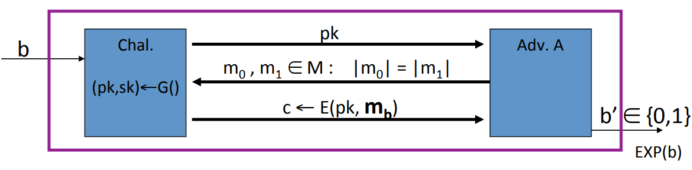
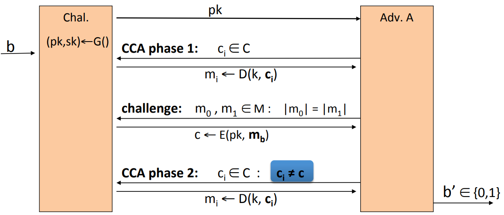
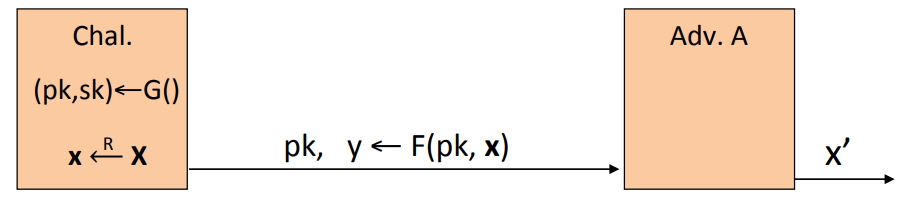
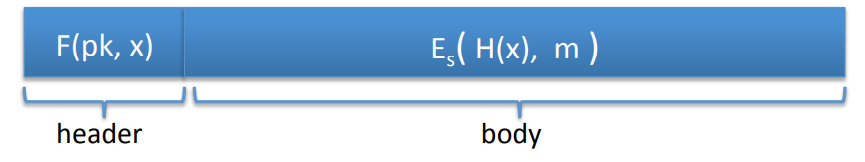

# Public Key Encryption

**Definition:** A public key encryption system is a triple of algorithms $(G, E, D)$.

* $G$: randomized algorithm, outputs a key pair $(pk, sk)$.
* $E(pk, m)$: randomized algorithm that takes $m \in M$ and outputs $c \in C$.
* $D(sk, c)$: deterministic algorithm that takes $c \in C$ and outputs $m \in M$ or $\bot$.

**Consistency:** $\forall (pk, sk)$ output by $G$: $\forall m \in M$: $D(sk, E(pk, m)) = m$.

**Security:** For $b=0, 1$ define experiments $EXP(0)$ and $EXP(1)$ as:

In either experiment the challenger is gonna generate a public and a secret key pair. He's gonna give the public key to the adversary. The adversary is gonna output two messages $m_0$ and $m_1$ of equal length and then what he gets back is either the encryption of $m_0$ or the encryption of $m_1$. And then the adversary is supposed to say which one did he get.

E=$(G, E, D)$ is semantic security if the attacker cann't distinguish experiment 0 from 1:
$$
Adv_{SS}[A, \text{E}] = |Pr[EXP(0)=1] - Pr[EXP(1)=1]| \lt \; \text{negligible}
$$

## Chosen Ciphertext Security

E=$(G, E, D)$ public key encryption over $(M, C)$. For $b=0, 1$ define $EXP(b)$:

The challenger begins by generating a public key and a secret key, and then gives the public key to the adversary. Then the adversary submits a bunch of ciphertexts and he gets the decryption of the ciphertexts. Then the adversary submits two equal length messages $m_0$ and $m_1$ and he receives in response the challenge ciphertext $c$. Then the adversary can continue to issue decryption requests. The adversary can submit any ciphertext of his choice except for the $c$. The adversary's goal is to say whether the challenge ciphertext is the encryption of $m_0$ or the encryption of $m_1$.

E=$(G, E, D)$ is CCA secure if for all efficient adversary $A$:
$$
Adv_{SS}[A, \text{E}] = |Pr[EXP(0)=1] - Pr[EXP(1)=1]| \lt \; \text{negligible}
$$

## Constructions

### Trapdoor Functions(TDF)

A trapdoof function $X \to Y$ is a triple of efficient algorithms $(G, F, F^{-1})$:

* $G()$: randomized algorithm outputs a key pair $(pk, sk)$.
* $F(pk, \cdot)$: deterministic algorithm that defines a function $X \to Y$.
* $F^{-1}(sk, \cdot):$ defines a function $Y \to X$ that inverts $F(pk, \cdot)$.

More precisely: $\forall (pk, sk)$ output by G: $\forall x \in X$: $F^{-1}(sk, F(pk, x)) = x$.

**Security:** $(G, F, F^{-1})$ is secure if $F(pk, \cdot)$ is a "one-way" function: can be evaluated, but cannot be inverted without $sk$.

The challenger generate a public key and a secret key. And then they will generate a random $x$.  And they will send the public key to the adversary and evaluate the function at the point $x$ and send the resulting $y$ also to the adversary. The adversary's goal is to invert the function at point $y$ and outputs $x'$.

$(G, F, F^{-1})$ is a secure TDF if for all efficient $A$:
$$
Adv_{OW}[A, F] = Pr[x=x'] \lt \text{negligible}
$$

### Public-Key Encryption from TDFs

* $(G, F, F^{-1})$: secure TDF $x \to y$.
* ($E_s, D_s$): symmetric authentication encryption defined over $(K, M, C)$.
* $H: X \to K $ a hash function

We construct a pub-key encryption system $(G, E, D)$:

* Key generation $G$: same as $G$ for TDF.

* $E(pk, m)$:
  $$
  x \stackrel{R}{\leftarrow} X, y \leftarrow F(pk, x) \\
  k \leftarrow H(x), c \leftarrow E_s(k, m) \\
  output (y, c)
  $$
  

* $D(sk, (y, c))$:
  $$
  x \leftarrow F^{-1}(sk, y) \\
  k \leftarrow H(x) \\
  m \leftarrow D_s(k, c)
  $$

**Security Theorem:** If $(G, F, F^{-1})$ is a secure TDF, $(E_s, D_s)$ provides authenticated encryption and $H: X \to K$ is a random oracle, then $(G, E, D)$ is $\text{CCA}^{ro}$ secure.