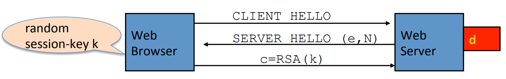

# RSA

Let $N = p \cdot q$ where $p, q$ are prime. $Z_N = \{0, 1, 2, ..., N-1\}$, $Z_N^{*} = \{\text{invertible elements in } Z_N \}$.

$x \in Z_N$ is invertible if and only if $gcd(x, N) = 1$. Number of elements in $Z_N^{*}$ is $\phi(N) = (p-1)(q-1)$.

Euler's theorem: $\forall x \in Z_N^{*}: x^{\phi(N)} = 1$.

## RSA trapdoor Permutation

* $G():$ choose random primes $p, q \approx 1024$ bits. Set $N=pq$. Choose integers $e, d$ such that $e \cdot d = 1 \; mod \; \phi(N)$. Output $pk = (N, e)$, $sk = (N, d)$.

* $F(pk, x): Z_N^* \to Z_N^*; RSA(x) = x^e \; mod \; N$.

* $F^{-1}(sk, y) = y^d = x^{ed} = x^{k \phi(N) + 1} = x^{k\phi(N)} \cdot x = x$

### RSA Assumption

For all efficient algorithms $A$:
$$
Pr[A(N, e, y) = y^{1/e}] \lt \text{negligible}
$$
Where $p, q \stackrel{R}{\leftarrow} \text{n-bit primes}, N \leftarrow pq, y \stackrel{R}{\leftarrow} Z_N^*$.

### RSA pub-key encryption

$(E_s, D_s):$ symmetric encryption scheme providing authenticated encryption.

$(H: Z_N \to K)$: where $K$ is key space of $(E_s, D_s)$.

* $G():$ generate RSA params: $pk = (N, e)$, $sk = (N, d)$.
* $E(pk, m):$
  1. Choose random x in $Z_N$.
  2. $y \leftarrow RSA(x) = x^e$, $k \leftarrow H(x)$.
  3. output $(y, E_s(k, m))$.
* $D(sk, (y, c)):$ output $D_s(H(RSA^{-1}(y)), c)$.

### Textbook RSA is Insecure

Encrypt: $c = m^e$.

Decrypt: $m = c^d$.

**Attack:** Web server has an RSA secret key $(N, d)$. A web browser who's trying to establish a secure session with the web server. The web browser starts off by sending this "client hello" messages. The web server responds with a "server hello" message that contains the server's public key $(N, e)$. Then the web browser will generate a random what's called a premaster secret $k$, it will encrypt the premaster secret and send the result in ciphertext over to the web server.

If $k$ is encrypted as $k^e$, then there is a attack. Suppose that $k$  is a 64-bit key. First of all, suppose it so happens that $k$ factors into a product of roughly equal sized numbers $k = k_1 \cdot k_2$. Both of them are less than $2^{34}$. Then there exists a meet-in-middle attack.
$$
k = k_1 \cdot k_2 \\
c = k^e \\
c / k_1^e = k_2^e  
$$

## iS RSA a One-Way Permutation?

To invert the RSA one-way function, attacker must compute: $x$ from $c = x^e$. How hard is computing e'th roots modulo N?

Best known algorithm:

1. factor N.
2. compute e'th roots modulo $p$ and $q$.

Is it true that in order to compute e'th roots modulo N, we have to factor the modulus $N$? To show that's not possible, we have to show a reduction:

1. Efficient algorithm for e'th roots mod N $\to$ efficient algorithm for factoring N.
2. Oldest problem in public key cryptography.