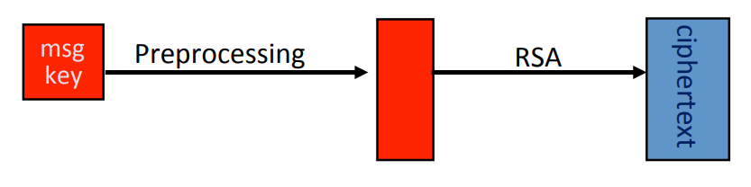
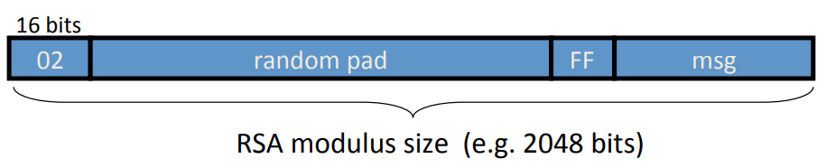
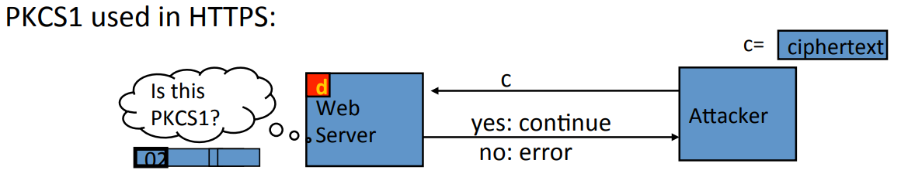
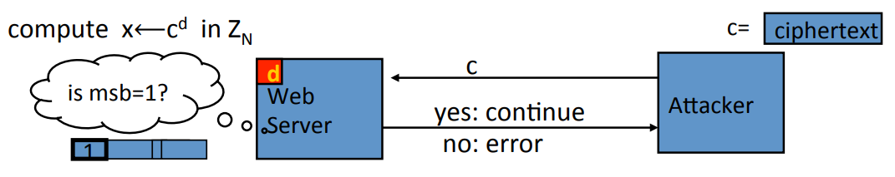
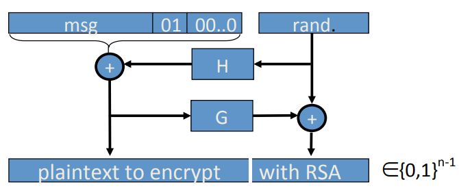

# PKCS 1(Public Key Cryptography Standard)

**RSA encryption in Practice:** The RSA system is given a symmetric encryption key to encrypt. And the way this key(128 bit) is encrypted is first expanded into the full modulo size(2048 bit), then apply the RSA function.

**PKCS1 v1.5 mode 2(2 represents encryption, 1 represents signatures)**: Take message that would be the 128-bit AES key for example, and put it as the least significant bits of the value that you are creating. The next thing is append "0xFF" to it. Then append the random pad that does not contain "0xFF". Finally at the very top, put the number "02" which indicates that this plain text has been encoded using PKCS1 mode 2. And then this whole value that just created is fed into the RSA function. 

**Attack On PKCS1**: Supposed the attacker intercepted a certain ciphertext, so the point is it's encoded using PKCS1 and then the result is fed into the RSA function. The attacker wants to decrypt the ciphertext. So the attacker can sends the ciphertext to the web server. The web server is gonna try and decrypt the ciphertext using its secret key. The first thing the web server it does after decryption is that it's gonna ask: is the decryption of the ciphertext PKCS1 encoded? In other words, it's gonna look at the most significant bits and ask: is this "02" in the most significant positions? If they are, it's gonna continue properly decrypting. If there is no "02", it's gonna announce an error.

To decrypt a given ciphertext $c$ do:

1. Choose $r \in Z_N$. Compute $c' \leftarrow r^e \cdot c = (r \cdot PKCS1(m))^e$.
2. Send $c'$ to web server and use response.

**Baby Bleichenbacher:** The attacker is able to send the ciphetext $c$. The web server is gonna use the secret key to decrypt but all the web server does is he asked is the most significant bit 1 or not. If the most significant bit is 1, the web server says yes. If not, the web server is no. 

Suppose $N = 2^n$, then:

1. sending $c$ reveals $msb(x)$.
2. sending $2^e \cdot c = (2x)^e$ reveals $msb(2x) = msb_2(x)$.
3. sending $4^e \cdot c = (4x)^e$ reveals $msb(4x) = msb_3(x)$.
4. ....and so on to reveal all of $x$.

**Defense:** If after you apply the RSA decryption, you get a plaintext that's not PKCS1 encoded. In other words, it doesn't start with "02". Then choose random string $r$ and continuous as nothing happened. So to be concrete you see if the PKCS 1 encoding is not correct, what you would do is you would just say the premaster secret is this random string. 

## PKCS1 v2.0: OAEP(Optimal Asymmetric Encryption Padding)

Take message that you wanna encrypt for example this could be the 128 bits AES key. And then append a short pad to it. Put a "01" in the beginning and then add a whole bunch of 0. And then choose a random value so that this whole string is as big as RSA modulus. Before apply the RSA function, take the random value and feed it into the hash function $H$. This hash function produces a value that's as big as the left hand side of your encoding. And XOR the outputs and feed the result into another hash function $G$. You XOR the output with that random value. And then finally, you get these two values that you concatenate together. 

**Theorem:** RSA is a trap-door permutation $\to$ RSA-OAEP is CCA secure when $H, G$ are random oracles.