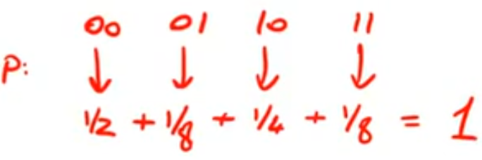
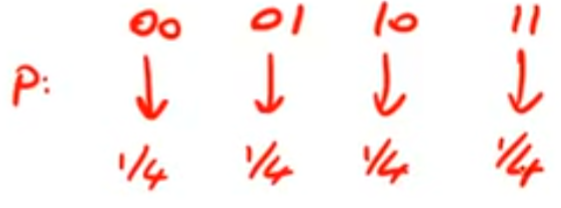
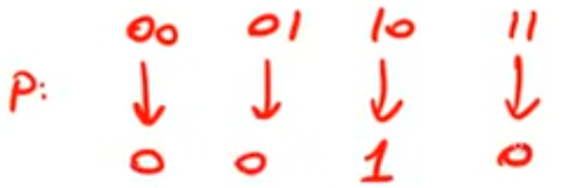
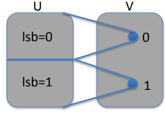
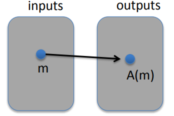
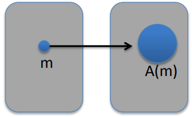
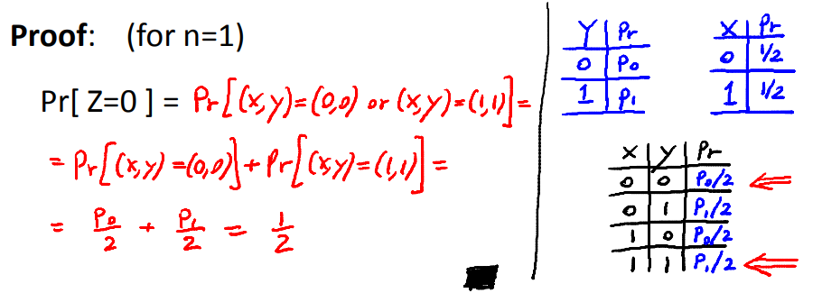
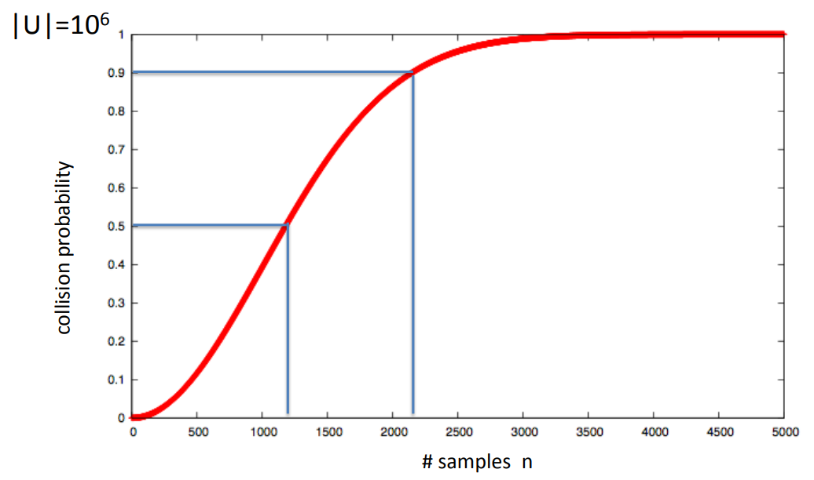

# Discrete Probility

A universe is going to be simply the set of all n bit strings which here is denoted by $U=\{0, 1\}^n$. For example the set $\{0, 1\}^2 = \{00, 01, 10, 11\}$ is the set of all two bit strings.

A probability distribution over this universe $U$ is simple a function which denote by $P$, what the function does is assigns to every element in the universe a number between zero and one $P: U \to [0, 1]$. This number is called the weight or the probability of that particular element in the universe. And the sum of all weights, sum up to one $\sum_{x \in U} P(x) = 1$.

**Uniform distribution**: Asign to every element in the universe, exactly the same weight.

**Point distribution at $x_0$**: It puts all the weight on a single point, namely $X_0$, and then other points in the universe, assign the weight zero.

## Events

Consider a subset $A$ of $U$, the probability of the subsets to be simply the sum of the weights of all the elements in the set $A$. The set $A$ us called an event, and the probability of the set A is called the probability that event.

### Example

$U = \{0, 1\}^8$,  $A = \{\text{al x in U such that } lsb_2(x) = 11 \} \subseteq U$ for the uniform distribution on $\{0, 1\}^8$, then $Pr[A] = 1/4$

## Union bound

For events $A_1$ and $A_2$, $Pr[A_1 \cup A_2] \leq Pr[A_1] + Pr[A_2]$.

If $A_1 \cap A_2 = \emptyset$, then $Pr[A_1 \cup A_2] = Pr[A_1] + Pr[A_2]$

### Example

$A_1 = \{ \text{all x in } \{0, 1\}^n, lsb_2(x) = 11 \}$, $A_2 = \{ \text{all x in } \{0, 1\}^n, msb_2(x) = 11 \}$, then $Pr[lsb_2(x) = 11 \; or \; msb_2(x) = 11] = Pr[A_1 \cup A_2] \leq 1/4 + 1/4 = 1/2$ 

## Random Variables

A random variable denote by $X$ , is a function, map the universe into some set $V$ and we say that this set $V$ is where the random variable takes its value $X: U \to V$.

### Example

Suppose we have a random variable $X$, and this random variable maps into the set $\{ 0, 1 \}$. So the values of this random variable are going to be either zero or one. How does it do it? Given a particular sample in the universe, a particular n bit string $y$, what the random variable will do is simply about the least significant bit of $y$.

$X:\{0, 1\}^n \to \{0, 1\}, \; X(y) = lsb(y) \in \{0, 1\}$

For the uniform distribution on $U$, $Pr[X=0] = 1/2$, $Pr[X = 1] = 1/2$.

### Uniform Random Variable

For the set of all N bit binary strings, denote a random variable r that's sample's uniformly from the set $U$ by a little arrow with a little R on top of it $r \stackrel{R}{\leftarrow} U$.
$$
\text{for all } a \in U: Pr[r = a] = 1/|U|
$$
Formally, r is the identity function $r(x) = x \; \text{for all x} \in U$.

## Randomized algorithms

### Deterministic algorithm

A algorithm takes particular input data, produce the same output. If we run the algorithm a hundred times on the same input, we'll always get the same output.

### Randomized algorithm

A algorithm takes the input data $M$, but it also has an implicit argument called $r$, where this $r$ is sampled a new every time the algorithm is run. And in particular this $r$ is sampled uniformly at random from the set of all N-bit strings.
$$
y \leftarrow A(m; r) \; \text{where } r \stackrel{R}{\leftarrow} \{0, 1\}^n
$$
So for a randomized algorithm, given a particular input $M$, it define a distribution over the set of all possible outputs of this algorithm.

#### Example

Suppose we have a randomized algorithm that takes as input a message $M$. And it also takes an implicit input which is random string. What the algorithm will do is simply encrypt the message $M$ using the random string as input. So this defines a random variable $y$. This random variable takes values that are encryptions of the message $M$. And this random variable is a distribution over the set of all possible encryptions of the message $M$ under a uniform key.
$$
A(m; k) = E(k, m), \; y \stackrel{R}{\leftarrow} A(m)
$$

## Independence

Two events $A$ and $B$ are independent of one another if when you know that event A happens, that tells you nothing about whether event B actually happened or not.

Formally, the probability of $A$ and $B$, namely, that both events happened, is actually equal to the probability of event $A$ times the probability of event $B$.
$$
Pr[A and B] = Pr[A] \cdot Pr[B]
$$
Now the same thing can be said for random variables. So suppose we have two random variables $x$ and $y$. They take values in some set $v$. Then we say that these random variables are independent if the probability that $x = a$, and $y = b$ is equal to the product of these two probabilities.

$\forall a, b \in V: \; Pr[X=a and Y=b] = Pr[X=a] \cdot Pr[Y=b]$

### Example

Suppose we randomly choose one element $r$ from the set $U=\{0, 1\}^2$ with equal probability $r \stackrel{R}{\leftarrow}U$. Define two random variables, $X$ is gonna be the least significant bit that was generated, and $Y$ is gonna be the most significant bit generated. So these random variables, $x$ and $y$, are independent of one another.
$$
Pr[X = 0 and Y = 0] = Pr[r = 00] = 1/4 = Pr[X=0] \cdot Pr[Y = 0]
$$

## XOR

Suppose we have a random variable $y$. That's distributed arbitrarily over $\{0, 1\}^b$. So we know nothing about the distribution of $y$. But now, suppose we have an independent random variable $x$ that happens to be uniformly distributed  over $\{0, 1\}^b$. So the random variable $z$ which is the XOR of $x$ and $y$, then no matter what distribution $y$ started with, $z$ is always going to be a uniform, random variable.

## Birthday Paradox

Let $r_1, ..., r_n \in U$ be independent, identically distributed random variables, when $n = 1.2 \times |U|^{1/2}$ then $Pr[\exists i \neq j: r_i = r_j] \geq 1/2$.

Suppose I choose $n$ random variables in universe $U$, these variables are independent of one another. If you choose roughly the square root of the size of $|U|$ elements, then there's a good chance that there are two elements that are the same. In other words, if you sample about square root a few times, then it's likely that two of your samples will be equal to one another.

### Example

1.Let $U = \{0, 1\}^{128}$, so the size of $U$ is $2^{128}$. If you sample around $2^{64}$ times from the set, this is about the square root of $U$, then it's likely that two of your sample messages will actually be the same.

2.Suppose we have a universe of about a million samples, then you can see that when we sample roughly 1200 times, the probability that we sample the same number is roughly half.

