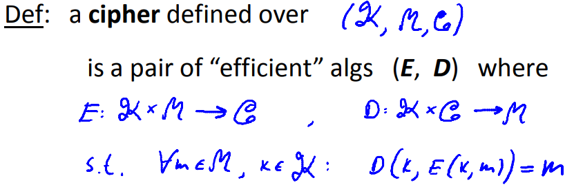

# The One Time Pad

## Symmetric Ciphers: definition

A cipher is made up of two "efficient" algorithms, a encryption algorithm E and a decryption algorithm D. In fact, a cipher is defined over a triple: the set of all possible keys K, the set of all possible messages M and the set of all possible ciphertexts C.

The only requirements is that these algorithms are consistent. They satisfy what's called the **correctness property**. So for every message in the message space, and every key in the key space, if i encrypt the message with the key $k$ then I decrypt using the same key $k$, I get back the original message.
$$
\forall m \in M, k \in K: D(k, E(k, m)) = m
$$
"Efficient" means different things to different people. If you're more inclined towards theory, efficient means runs in polynomial time. So algorithms E and D have to run in the size of their inputs. If you're more practically ubckubed, efficient means runs within a certain time period. For example, algorithm E might be required to take under a minute to encrypt a gigabyte data.

E is often a **randomized algorithm**(for details, refer to [Discrete Probability](./3_Discrete Probability.md)), as you encrypt your message, E is gonna generate random bits for itself, and it's going to use those random bits to actually encrypt the messages that are given to it.

## One Time Pad

For one time pad, the message space is the same as the ciphertext space which is just the set of all n bit binary strings $M = C = \{0, 1\}^n$. The key space is the same as the message space $K = M = C = \{0, 1\}^n$. So a key in the one time pad simply a random sequence of bits which is as long as one time pad.

A ciphertext c is the XOR of the k and m $c = k \oplus m$. Decrypt a ciphertext XORing the k and c again $m = c \oplus k$.

It's difficult to use one time pad in practice. The reason it's difficult to use is the keys are essentially as long as the message. So if Alice and Bob want to communicate securely, so Alice wants to send a message to Bob, before she begins sending the first bit of the message, she has to transmit a key to Bob that's as long as that message. Well, if she has a way to transmit a secure key to Bob that's as long as the message, she might as well use that same mechanism to  transmit the message itself.

## Information Theoretic Security

 **Basic idea**: If all you get to see is the cyphertext, then you should learn absolutely nothing about the plain text. In other words, the cyphertext should reveal no information about the plain text.

**Definition**: Suppose we have a cypher E D that's defined over triple K M and C just as before. We say the cypher has perfect secrecy if the following condition holds. For every two message $m_0$ and $m_1$ in the message space, the only requirement I'm gonna put on these messge is they have the same length $len(m_0) = len(m_1)$. And for every ciphertext in the C, if we pick a random key $k$ where k is uniform in K $k \stackrel{R}{\leftarrow} K$, if $Pr[E(k, m_0) = c] = Pr[E(k, m_1) = c]$, then we say the cipher has **perfect secrecy**.  What it says is that if I'm an attacker and I intercept a particular cyphertext c, then in reality, the probability that the cyphertext is the encryption of $M_0$ is exactly the same as the probability that it's the encryption of $m_1$. So if all I have the cyphertext c, I have no idea whether the cyphertext came from $m_0$ or the cyphertext came from $m_1$.