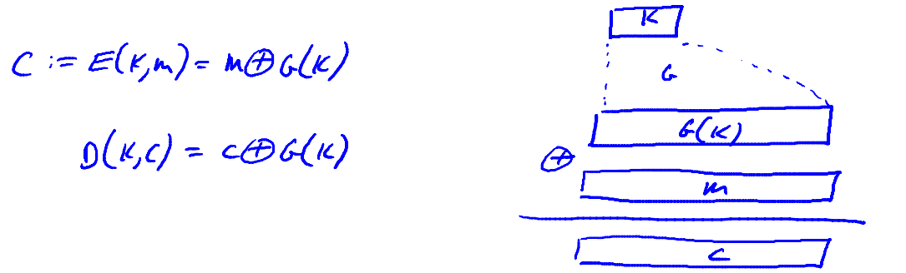
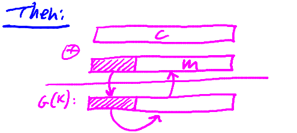
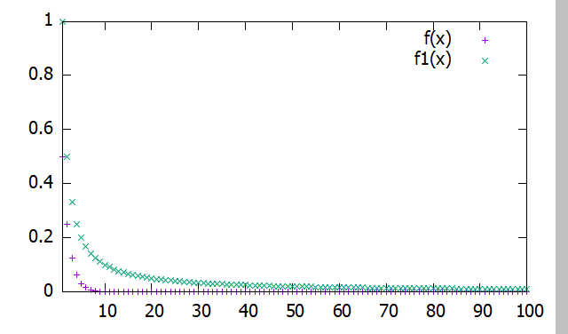
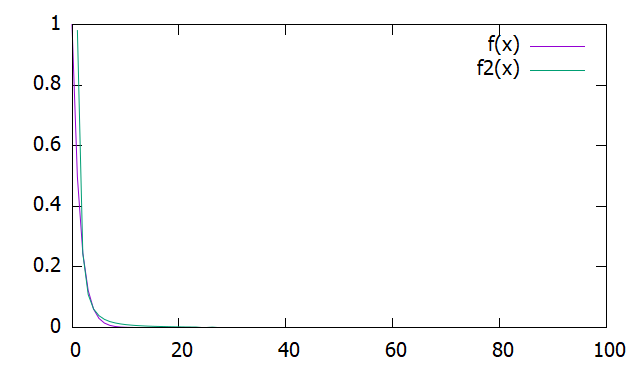
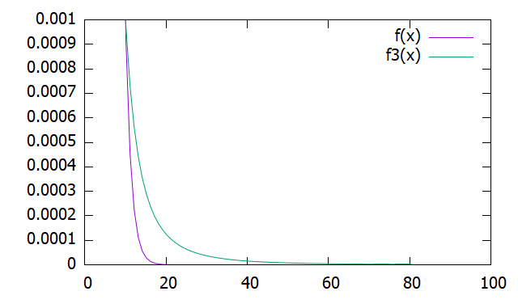

# Steam Cipher

The idea in stream cypher is rather than using a totally random key, it use a pseudo-random key.

## PRG(Pseudo-Random Generator)

It is just a efficient, deterministic function $G$, that takes a seed $\{0, 1\}^s$ and maps it to a much larger string which will denote by $\{0,1\}^n$. And the property is that $n$ must be much larger than $s$.
$$
G: \{0, 1\}^s \to \{0, 1\}^n
$$
The function $G$ itself has no more randomness, the only thing that's random here is the random seed. The Other property is that the output should **look random**.

### Stream Cipher

 We're gonna use the seed, as our key. Then we're gonna use the generator to expand the seed into a much larger pseudo random sequence. And then we're going to XOR the pseudo random sequence with the message and that's going to give us the cyphertext.

Stream cypher doesn't have perfect secrecy. Because in a perfectly secure cypher, the key must be as long as the message.

### Predictable

PRG is predictable. What that means is that there are some i, such that if I give you the first i bits of the outpus, there is some sort of efficient algorithm that will compute the rest of the string.
$$
\exists i: \; G(k)|_{1,...,i} \stackrel{efficient algorithm}{\longrightarrow} G(k)|_{i+1,...,n}
$$
If this is the case, then the stream cypher would not be secure.

**example**: Suppose an attacker intercepts a cypher text, the attacker knows that the initial part of the message happens to be some known value. For example, in the mail protocol, smtp, you know that every message starts with a word ”from:", this is a prefix that the adversary knows. He can XOR the cipher text with the words ”from:“, then get a prefix of the pseudo random sequence, and then he can predict the remainder of the pseudo random sequence.

Formally, We say that $G$ is predictable, if there exists an efficient algorithm called $A$. And there is a position $i \in [1, N-1]$ such that if we look at the probability over a random key. If I give this algorithm the first $i$ bytes of the output $G(k)$, the probability that it's able to predict the next bit of the outputs is greater than $1/2 - \epsilon$ for some non-**negligible epsilon** $\epsilon$(for example $\epsilon \geq \frac{1}{2^{30}}$).
$$
\exists A \; \text{ and } \; \exists 1 \leq i \leq n-1, Pr[A(G(k)|_{1,...i}) = G(K)|_{i+1}] \geq \frac{1}{2} + \epsilon
$$
**unpredictable**: for all $i$, there is no efficient algorithm $A$ that can predict the $i+1$ bit with the non neligible probability.

**example**: Suppose $G: K \to \{0, 1\}^n$ is such that for all $k: XOR(G(K)) = 1$, is $G$ predictable? yes, given the first $n-1$ bits I can predict the n'th bit.

### Weak PRGs Easy to Predict

**Linear Congruential Generator**: It has three parameters $a, b, p$. $a, b$ are integers and $P$ is a prime. Say $r[0]$ is the seed of generator $r[0] = seed$,  then $r[i] = (a \cdot r[i-1] + b) \; mod \; p$

## Negligible and Non-Negligible

**In practice:** $\epsilon$ is a scalar and 

* $\epsilon$ is non-neg: $\epsilon \geq \frac{1}{2^{30}}$.
* $\epsilon$ is negligible: $\epsilon \leq \frac{1}{2^{80}}$.

**In theory:** $\epsilon$ is a function $\epsilon: Z^{\geq 0} \to R^{\geq 0}$ and

* $\epsilon$ non-neg: $\exists d: \epsilon(\lambda) \geq \frac{1}{\lambda^d}$ for large $\lambda $. In other words, for many infinitely many values, the function is bigger than $\frac{1}{\lambda^d}$
* $\epsilon$ is negligible: $\forall d, \lambda \geq d: \epsilon(\lambda) \leq \frac{1}{\lambda^d}$

### Examples

1.$\epsilon(\lambda) = \frac{1}{2^{\lambda}}$ is neligible

$d = 1, f(\lambda) = \frac{1}{2^{\lambda}}, f1(\lambda) = \frac{1}{\lambda}$

$d = 2, f(\lambda) = \frac{1}{2^{\lambda}}, f1(\lambda) = \frac{1}{\lambda^2}$

$d = 2, f(\lambda) = \frac{1}{2^{\lambda}}, f1(\lambda) = \frac{1}{\lambda^3}$

2.$\epsilon(\lambda) = \frac{1}{\lambda^{1000}}$ is non-negligible, beacause we set $d = 1001$, $\epsilon(\lambda) \geq \frac{1}{\lambda^{1001}}$.

