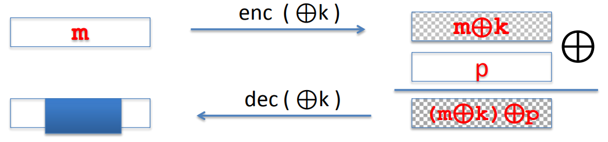

# Attacks on OTP and Stream Ciphers

## Two Time Pad

Never use stream cipher key more than once.
$$
C_1 = m_1 \oplus G(k) \\
c_2 = m_2 \oplus G(k) \\
m_1 \oplus m_2 = c_1 \oplus c_2
$$
If I give you $m_1 \oplus m_2$, you can actually recover those two messages completely, because English has enough redundancy.

### Example

1.**MS-PPTP**: The client and server both share a secret key, and they both send messages to one another. We'll denote the messages from the client by $m_1$, the message from the server by $s_1$. Now, the way PPTP works is, the entire interaction from the client to the server is considered as one stream. In other words, the messages $m_1,m_2, m_3$ are viewed as one long stream $m_1 || m_2 || m_3$. And all that stream is encrypted using the stream cipher with key $k$. The problem is, the same thing is happening also on the server side. In other words, all the messages from the server are also treated as one long stream $s_1 || s_2 || s_3$ and encrypted using the same pseudo-random seed.
$$
(m_1 || m_2 || m_3 || ..) \oplus PRG(k) \\
(s_1 || s_2 || s_3 || ..) \oplus PRG(k)
$$

In fact, we need to have one key for interaction between che client and server, and one  key for interaction between the server and the client.

2.**802.11b WEP**: In WEP, there's a client and access point. They both share a secret key $K$. And then, when they wanna transmit a message to one another, like client wants to send a frame containing the plain text $M$ to the access point, what he would do is first of all, he appends some sort of check sum to this pain text. Then using a stream cypher to encrypt the whole message where the stream cypher key is a concatenation of a value $IV$ and a long term key $K$. This $IV$ is a 24 bit string. You can image that it starts from zero and it's a counter that counts increments by one for every packet. The cypher text is the results of XOR between $ m || CRC(m)$ and $PRG(IV || k)$.

The problem is the $IV$ is only 24 bits long, which means there are only $2^{24}$ possible $IV$. Which means that after sixteen million frames are transmitted, the $IV$ has to cycle. Once it cycles after 16 million frames, we get a two time pad. Namely the $IV$ concatenated $K$ would be used to encrypt two different franes, and the attacker can then figure out the plain text of both frames.

The worst problem is in fact that on many 802.11 cards. If you powercycle the card, the $IV$ will reset back to zero. So after every powercycle, you'll be using the zero concatenated $K$ key to encrypt many times the same packets.

Every frame is encrypted using a different key is concatonation of $IV$ and $K$. If you look at the key for frame number one, it will be $1 || k$, the the key for frame number two is the concatenation of $2 || k$, the key for frame number three is the concatenation of $3 || k$. So the keys are very closely related to one another. For the PRG that's used in WEP, that PRG is called RC4, there an attack that shows after about $10^6$ frames, you can recover the secret key.

So WEP provides no security at all for two reasons. First of all, it can resolve in the two time pad. But more significantly, because these keys are so closely related, it's actually possible to recover the key by watching just a few ciphertexts.

A better way to do is take long term key, and then feed that directly through a PRG. So now we get a long stream of bits that look random, and then first segment could be used as key for frame number one. And then the second segment would be used as key for frame number two and so on and so forth.

3.**Dist Encryption**: Image we have a certain file and maybe the file begins with the words "To: Bob", and then the content of the file follows. When the file is stored on disk, the is going to get broken into blocks, and each block is encrypted. So an attacker looking at the disk has no idea what the contens of the message is. But now suppose that at a later time, user modifies the file, so now instread of saying "To: Bob", it says "To: Eve", and nothing else changes in the file, that's the only change that was made. When the user saves this modified file to disk, he's gonna reencrypt it again. Now an attacker looking at the disc, taking a snapshot of the disc before the edits. And then looking again at the disc after the edits. What he will see is that only thing that changed is this little segment here. Everything else looks exactly the same.

## No Integrity(OTP is malleable)

One time pad and stream cypher in general provide no integrity at all. All they do is they try to provide confidentiality when the key is only used once. Even worse than that it's actually very easy to modify cypher text and known effects on the corresponding plain text.

When an attacker intercept a cypher text,  he can modify the cypher text. He can XOR the cypher text with a certain value $P$, what's called a sub-permutation key, then the resulting cipher text then becomes $m \oplus k \oplus p$. So decryption becomes $m \oplus p$.

### Example

Suppose a user sends an email that starts with the word "From: Bobi", the attacker intercepts the corresponding cypher text, he doesn't know what the plain text is, but let's pretend that he actually knows that this message is actually from Bob. What he wants to do is he wants to modify the ciphertext so that the plain text would now look like it came from somebody else, from example Eve. He can XOR the cypher with "Bob $\oplus$ Eve".

