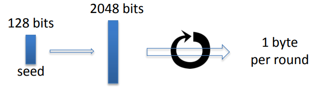
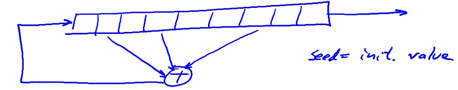
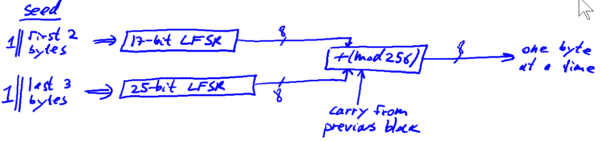
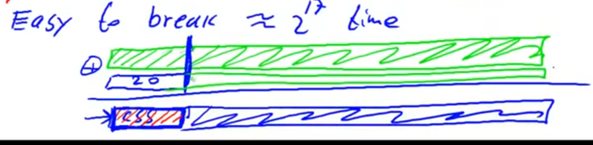
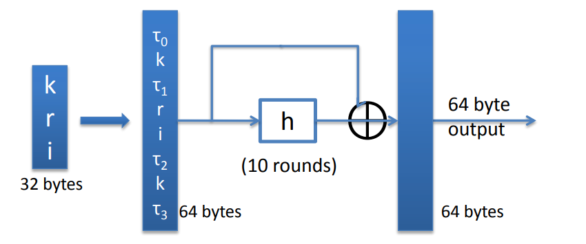

# Example Stream Ciphers

## RC4

RC4 takes a variable size seed, here I just gave as an example where it would take 128 bits as the seed size, which would then be used as the key for the stream cipher. The first thing it does is it expands the 128-bit secret key into 2048 bits, which are gonna be used as the internal state for the generator. And then, once it is done this expansion, it executes a very simple loop, where every literation of this loop outputs one byte of output.

### Weaknesses

1.Bias in initial(first round) output: $Pr[2^{nd} byte = 0] = 2/256$, if RC4 was completely random, the probability that the second byte happens to be equal to zero would be exactly $1/256$.

2.Probability of "00"(16 bits) is $\frac{1}{256^2} + \frac{1}{256^3}$, if you look at a very long output of RC4, it so happens that you're more likely to get the sequence "00". If RC4 was completely random, the probability of "00" would be exactly $\frac{1}{256^2}$.

3.Related key attacks, if one uses keys that are closely related to one another then it's actually possible to recover the root key.

## CSS(Content Scramble System)

CSS is used for encrypting DVD movies. The CSS stream cipher is based on something that hardware designers like. It is based on a mechanism called a linear feedback shift register. A linear feedback shift register(LFSR) is a register that consists of cells where each cell contains one bit. There are some taps into cerntain cells. These taps feed into an XOR and then at every clock cycle, the shift register shifts to the right. The last bit fakks off and the first bit becomes the result of this XOR. So the seed for this LFSR is the initial state of the LFSR.

The key for CSS is five bytes, namely 40 bits. CSS uses two LFSRs, one is 17-bit LFSR, in other words, the register contains 17bits. And the other one is a 25-bit LFSR. The seed for the encryption as follows. The value of the first  register is one concatenated the first two bytes of seed, the value of the second register is one concatenated the last three bytes of the seed.  These LFSRs are run for eight cycles, so they generate eight bits of output. And then they go through a adder that does addition modulo 256 with the carry from the previous block.

Suppose you intercept the encrypted movies that you want to decrypt. DVD movie is using MPEG files, so you know a prefix of the plain text. Let's just say maybe this is twenty bytes. We know if you XOR these two things together, what you'll get is the initial segment of the PRG. So we have the first twenty bytes of the output. Now we do the folloing. We try all $2^{17}$ possible values of the first LFSR. We're gonna run the first LFSR for 20 bytes for every possible values, and substract it from the 20 bytes that we got from the first LFSR, if out guess for the initial state of the first LFSR is correct, what we should get is the first 20 output of the second LFSR. It turns out that looking at a 20-byte sequence, it'svery easy to tell whether this 20-bytes sequence came from a 25-bit LFSR or not. If it didn't, then we know that out guess for the 17-bit LFSR was omcprrect and then we move on to the next guess for the 17-bit LFSR until we hit the right initial state for the 17-bit LFSR.If we get the 20-bytes that is in fact a possible output for a 25-bit LFSR. And then, not only will we have learned the correct initial state for the 17-bit LFSR, we will have also learned the correct initial state of the 25-bit LFSR.

## eStream

It takes as input both the key $k$ and the nonce $r$, so the pair $(k, r)$ never be used more than once. So the bottom line is that you canreuse the key. Because the nonce makes the pair unique.

### Salsa 20

Salsa takes either 128 or 256-bit keys. It also takes a nonce, which happens to be 64 bits. And then it'll generate a large output.
$$
Salsa20:\{0, 1\}^{128 \; or \; 256} \to \{0, 1\}^n
$$
It use the function $H$ to generate a large output. This function $H$ takes three inputs: the key $k$, the nonce $r$, and acounter that increments from step to step. The function works as follows:
$$
Salsa20(k, r) = H(k, (r, 0)) || H(k, (r, 1)) || ...
$$
1.We start off by expanding the states into 64 bytes, and we do that as follows. We stick a constant $T_0$ at the begining, which is four bytes. The spec for salsa gives you the value for $T_0$. Then we put $k$ in which is 16 bytes. Then we put another constant $T_1$ which is four bytes. Then we put the nonce which is 8 bytes. THen we put the index, that is the counter 0,1,..., which is 8 bytes. Then we put another constant $T_2$ which is 4 bytes. Then we put the key again, this is another 16 bytes. And finally we put the forth constant $T_3$ which is another four bytes.

2.Then what we do it we apply a function $h$, which maps 64 bytes to 64 bytes. It's completely invertible function, in other words, given the input you can get the output and given the output you can get back to the input. It applies this function 10 times.

3.The last thing what you do is addition the inputs and the final outpus. And finally you get the 64-byte output

