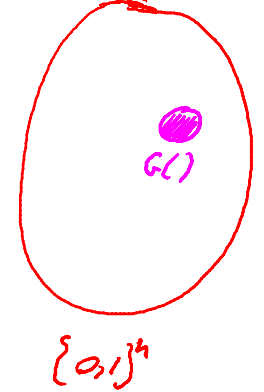

# PRG Security Defs

## Goal

Consider a PRG with keyspace $K$ that outpus N bit strings $G: K \to \{0, 1\}^n$. Out goal is to define what does it mean for the output of the generator to be indistinguishable from random. In other words, we're gonna define a distribution that is defined by choosing a ramdom k in the keyspace $k \stackrel{R}{\leftarrow}K$. In other words, choose uniformly from the set $K$, and then we output $G(k)$. And what we'd like to say is that this distribution of pseudo random strings is indistinguishable from a truly uniform distribution. 
$$
k \stackrel{R}{\leftarrow}K, output \; G(k) \text{ is indistinguishable from }
r \stackrel{R}{\leftarrow} \{0, 1\}^n
$$
If we draw a circle, all possible string in $\{0, 1\}^n$, then the uniform distribution can output any of these strings with equal probability. However, a pseudo-random distribution generated by this generator $G$, because the seed space is so small, the set of possible outputs is really samll, it's tiny inside of $\{0,1\}^n$. And this is really all that the generator can output. What we're arguing is that an adversary who looks at the output of the generator in this tiny set can't distinguish it from the output of the uniform distribution.

## Statistical test on $\{0, 1\}^n$

Define these statistical tests by $A$. The statistical test is an algorithm that take its input  $\{0, 1\}^n$, and simply outputs 0 or 1. For 0 we're gonna think of it as though the statistical test said, the input you gave me is not random. And for 1, we're going to think of it as saying that the input you gave me actually is random.

### Example

1.For a random string, the number of 0 is roughly equal to the number of 1 in that string. In other words, the statistical test is going to say 1 if and only if the number of 0 in the given string $x$ minus the number of 1 in the given string $x$ are not too far apart. In other words, the number of difference between the number of 0 and the number of 1, for example is less than $10 \cdot \sqrt{n}$.
$$
A(x) = 1 \text{ if } |num(0) - num(1)| \leq 10 \cdot \sqrt{n}
$$
2.The statistical test will say one if and only if the number of "00" inside of $x$ is roughly $\frac{n}{4}$. For example the difference between the number of "00" and $\frac{n}{4}$ less than $10 \cdot \sqrt{n}$.
$$
A(x) = 1 \; \text{if } num(00) - \frac{n}{4} \leq 10 \cdot \sqrt{n}
$$
3.The statistical test output one if and only if length of the biggest blocks what we'll call this the maximum run of 0(最长0的数量) inside of the string $x$ is roughly $ \log n $. In a random string, the expect the longest sequence of 0 to be roughly of length $\log n$. So, for example, the difference between the length of the longest sequence of 0 and $ \log n $ is less than $10 \cdot \log n$.
$$
A(x) = 1 \; \text{if the length of the longest sequence of 0 } \leq 10 \cdot \log n
$$

## Advantage

A generator $G: K \to \{0, 1\}^n$, the advantage of a statistical test on this generator as denoted by $Adv_{PRG}$, we the advantage of the statistical test $A$ relative to the generator $g$ is the difference between two quantities. The first quantity is how likely is this statistical test to output 1 when the input is the output of the pseudo random generator. The second quantity is how likely is this statistical test output 1 when the input is the output of the truly random string.
$$
Adv_{PRG} = |Pr[A(G(k)) = 1| - Pr[A(r) = 1]|, \text{ where } k \stackrel{R}{\leftarrow}K, r \stackrel{R}{\leftarrow} \{0, 1\}^n
$$
If the advantage happens to be close to 1, which means the statistical test $A$ behave differently when we gave it pseudo-random inputs from when we gave it truly random inputs. In other words, the statistical test could distinguish the output of the generator from random. However, if the advantage is close to 0, which means the statistical tests behaves pretty much the same on pseudo random inputs. In other words, it could not distinguish the generator from random.

### Example

1.If A statistical test always outputs 0, which means  it can't distinguish truly random random inputs from a pseudo random input.
$$
A(x) = 0 \to Adv_{PRG}[A, G] = 0
$$
2.Suppose we have a generator $G:K \to \{0, 1\}^n$ satisfies $msb(G(k)) = 1$ for $2/3$ of keys in $K$. Astatistical test says if $msb(x) = 1$, then it output 1. Then the advantage of this statistical test on the generator $G$ is $1/6$.
$$
Adv_{PRG} = |Pr[A(G(k)) = 1] - Pr[A(r) = 1]| = 1/6
$$
We will say that $A$ breaks the generator $G$ with advantage $1/6$.

## Secure PRGs

A generator $G$ is secure if no efficient statistical tests can distinguish its output from random. More precisely, what we'll say is that for all efficient tests, if I looked at the advantage of the statistical tests relative to $G$. This advantage is negligible.

Can we actually construct a generator and then prove that it is in fact a secure PRG? In other words, prove that no efficient statistical test can distinguish its output from random. And it turns out that the answer is we actually can't.

**Easy fact**: A secure PRG is unpredictable.

Then we're gonna say that if you give me a generator that is predictable, then is' insecure. Suppose $A$ is an efficient algorithm as follows:
$$
Pr[A(G(k)|_{1,..,i}) = G(k)|_{i+1}] = \frac{1}{2} + \epsilon \; \text{ where } \epsilon \; \text{is non-negligible}
$$
Define statistical test $B$ as follows. Given a string $x$, what it will do is it will simple run algorithm $A$ on the first $i$-bit of the string $x$ that it was given. And statistical test $B$ is simple is gonna ask was successful in predicting the $i+1$ bit of the string? If it was successful, then it's gonna output 1. And if it wasn't successful, then it's gonna output 0.
$$
B(x) = \begin{cases}
		1 \; \text{ where } A(x|_{1,...,i}) = x_{i+1} \\
		0 \; \text{otherwise}
	   \end{cases}
$$
Give $B$ a truly random string $r \stackrel{R}{\leftarrow} \{0, 1\}^n$, what is the probability that $B$ output 1? For a truly random string, the $i+1$ bit is totally independent of the first $i$-bits. So the probability is $1/2$.
$$
r \stackrel{R}{\leftarrow} \{0, 1\}^n \; Pr[B(r) = 1] = \frac{1}{2}
$$
Give $B$ a pseudo-random sequence $G(k): k \stackrel{R}{\leftarrow}K$, what is the probability that $B$ output 1? The probability is greater than $\frac{1}{2} + \epsilon$.
$$
G(k): k \stackrel{R}{\leftarrow}K \; Pr[B(G(k)) = 1] > \frac{1}{2} + \epsilon
$$
If we look at the advantage of the statistical test $B$ over the generator $G$, which is the difference between these two quantity that is clearly greater than $\epsilon$. What this means is that if algorithm $A$ is able to predict the next bit with advantange $\epsilon$, then algorithm $B$ is able to distinguish the output of the generator with advantage $\epsilon$.

**Theory**: An unpredictable PRG is secure. If $\forall i \in \{0,..., n-1\}$ PRG $G$ is unpredictable at position $i$, then $G$ is a secure PRG.

**Example**: Let $G:K \to \{0, 1\}^n$ be a PRG such that from the last $\frac{n}{2}$ bits of $G(K)$, it is easy to compute the first $\frac{n}{2}$ bits. Is $G$ predictable for some $i \in \{0,..., n-1\}$?

**Definition** Let $P_1$ and $P_2$ be two distributions over $\{0, 1\}^n$, we say that $P_1$ and $P_2$ are computationally indistinguishable(denoted $P_1 \approx_{p} P_2$) if $\forall$ efficient statistical test $A$ that:
$$
| Pr[A(k) = 1] - Pr[A(r) = 1] | \lt negligible \; \text{ where } k \leftarrow P_1, r \leftarrow P_2
$$
A PRG is secure if $\{k \stackrel{R}{\leftarrow}K: G(k) \approx_p uniform(\{0, 1\}^n)\}$